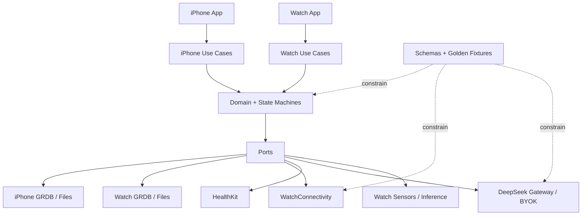

# Architecture Spine — FitnessAI

## Design Paradigm

FitnessAI is a **local-first hexagonal modular monolith**. Domain cores own truth and mutation policy behind ports; native SwiftUI presentation uses thin MVVM and explicit state machines; append-only revisions preserve user-authored facts. Integrations are adapters, never alternate owners of state.

## Invariants & Rules

### AD-1 — Dependency Direction [ADOPTED]

- **Binds:** Both app targets, shared package targets, and all adapters.
- **Prevents:** UI, database, device, or provider code defining incompatible business rules.
- **Rule:** Presentation invokes application use cases only. Domain targets depend on no SwiftUI, GRDB, HealthKit, WatchConnectivity, sensor, or AI-provider framework. Adapters implement ports and cannot bypass domain validation, state machines, approval, or revision policy. No generic Utils ownership sink is permitted.

### AD-2 — Durable Truth and Revisions [ADOPTED]

- **Binds:** Plans, Plan Revisions, Workout Sessions, Actual Sets, corrections, conflicts, approvals, outbox, and invalidations.
- **Prevents:** Partial saves, silent overwrite, duplicate facts, stale approval, and transient-state reconstruction.
- **Rule:** Every user or approved-AI mutation is a stable-ID, append-only revision committed atomically with its durable outbox and invalidations; UI success follows commit. Contracts define one normative revision DAG and effective-value reducer: revision/event ID, object ID, canonical field path or operation kind, parent/head set, author device, and resolution references. Incomparable writes to the same canonical field or entity operation conflict; a resolution cites every resolved head. Different-field edits may merge, but overlapping split/merge, insert/delete, reorder, completion, or Plan-topology branches never auto-collapse: all user facts remain visible until deterministic safe resolution or explicit iPhone choice. Missing parents remain pending. Device time and arrival order never decide truth. An active Workout Session holds an immutable Plan snapshot; normative golden fixtures bind iPhone, Watch, import, and future Kotlin reducers.

### AD-3 — Device Ownership and Capture Topology [ADOPTED]

- **Binds:** Phone-only sessions, paired sessions, offline capture, data placement, and device replacement.
- **Prevents:** Watch becoming a long-term archive, phone-only use becoming a second product, or disconnection losing facts.
- **Rule:** iPhone owns Plans, long-term records, complete correction/conflict resolution, Analysis, AI, Apple Health, and file exchange. Normally iPhone creates the globally unique shared session identity; a disconnected Watch with a complete cached Plan may create its own globally unique identity, which iPhone later adopts unchanged—sessions are never merged by time. Every fact retains its originating session ID and immutable Plan snapshot identity. Watch owns local sensor capture, active-session recovery, and offline facts; continuous workout capture uses an active `HKWorkoutSession` with workout processing, not `WKExtendedRuntimeSession` as a substitute, and maps runtime start/failure/pause/recovery/end to durable session states. Both devices may issue AD-2 corrections. Phone-only capture uses the same IDs, states, persistence, and Analysis. Watch retains only the latest compatible Plan, active/recoverable session, pending transfers, and minimum inference assets.

### AD-4 — Acknowledged, Causal Watch Synchronization [ADOPTED]

- **Binds:** Plan delivery, live edits, workout facts, sensor chunks, retries, and cleanup.
- **Prevents:** Treating reachability as durability, partial Plan activation, duplication, late rollback, and premature deletion.
- **Rule:** Important outbound content first enters a local outbox. Live messages accelerate reachable interaction; queued user-info carries durable structured events; application context carries only replaceable latest state; file transfer carries chunks. A persisted pairing epoch fences obsolete devices; replay identity is `(pairingEpoch, sourceDeviceId, messageId)`, and revoked-epoch facts are quarantined for explicit recovery. The normative transfer state machine carries manifest/chunk IDs, counts, sizes and digests, whole-object digest, causality and dependency/support versions; acknowledgements are `received`, `durablyCommitted`, `applied`, or `rejected(reason)`. Replay returns the prior result; missing chunks retry with bounded backoff. Only idempotent whole-object `applied` permits cleanup. A Plan and required dependencies commit and atomically replace the active revision only after compatibility negotiation. Capability handshake carries app/schema/model/evidence/control versions; the active-session automation set is frozen except emergency disable, and Watch is authoritative for sensor/model executability.

### AD-5 — Persistence, Protection, and Recovery [ADOPTED]

- **Binds:** Both databases, WAL/sidecars, chunks, migrations, secrets, startup, and retention.
- **Prevents:** Library coupling, unreadable-store replacement, backup leakage, lost unsent facts, and secret exposure.
- **Rule:** iPhone and Watch own separate SQLite stores behind GRDB ports. Critical writes transact fact, revision, outbox, and invalidation. Raw streams are protected files indexed by the store. Stores, sidecars, outbox, and chunks use Apple Data Protection completeUntilFirstUserAuthentication and are excluded from iCloud and ordinary backup; secrets use non-synchronizing device-local Keychain. An unreadable store is never replaced with an empty one. Unacknowledged facts are never auto-deleted. The seven-day safety window applies only to redundant Watch-side structured transfer copies after whole-object `applied`; iPhone-authoritative Plans, Sessions, Sets, corrections, approvals, and revisions are removed only by explicit user deletion revision or a separately bound retention policy. Raw Watch chunks also delete only after whole-object `applied`; file, index, and manifest cleanup is one idempotent atomic operation that retains replay tombstones. Optional raw/automation data degrades before user facts.

### AD-6 — Evidence-Gated Assistance [ADOPTED]

- **Binds:** Device profile, recognition, RPE, Forgotten Finish, and manual fallback.
- **Prevents:** Unsupported claims, silent model labels, recursive labels, unsafe interruption, and false finish.
- **Rule:** Automation is enabled only for a versioned device/orientation/exercise/signal/model evidence row; all other paths remain fully manual. Alpha evidence begins with Series 11 46 mm, left wrist, Crown on screen right, right-hand dominant, and these exact v1 candidates: barbell bench press, incline dumbbell press, assisted pull-up, barbell row, seated row, lateral raise, hammer curl, and barbell Romanian deadlift. Classification, set-boundary, and rep-count qualification are independent. Free-training prompts appear only at safe rest; 30-second silence defers. Exercise, rep, load, and RPE prompts share one budget of at most five proactive prompts in a representative approximately 20-set session. RPE is opt-in and confirmation-only until model and five-estimate personal gates pass; only confirmed/corrected labels calibrate it and drift returns it to verification. Forgotten Finish requires 15 sustained minutes of both recovery and no strength activity, suppresses on missing signal, never auto-finishes, and cools down 15 minutes after Continue. Eligibility is frozen in the active-session snapshot except fail-closed disable; pending predictions revert to confirmation/manual. Exact operating points and broader claims require preregistered physical-device evidence.

### AD-7 — AI Proposal, Safety, Approval, and Commit [ADOPTED]

- **Binds:** AI Plan creation/adaptation, safety evaluation, review, approval, commit, and Watch delivery.
- **Prevents:** Prose-only import, invented fields, unsafe Plans, hidden mutation, stale approval, and item-by-item re-entry.
- **Rule:** AI returns an untrusted complete structured draft or field diff with immutable proposalId, base revision, provenance, permitted scope, assumptions, schema/model/rule-pack versions, and canonical digest. A deterministic balanced Safety Rule Pack checks structure, units, contradictions, canonical Exercise support, personal-baseline volume/intensity/load progression, and warning signs after generation and before commit. Results are pass, clarification/correction required, or affected-scope stop; unresolved results block commit, not truthful capture. The accessible approval view exposes every changed/deleted field, old/new value and unit, assumption, warning, scope, Safety result, and base revision. Its transaction verifies an unconsumed proposal, exact displayed digest, unchanged current Plan head and policy versions, then uses unique proposalId as commit key; retries return the original result. Any base/content/scope/schema/model/rule-pack change requires new review and approval. AI never mutates an active session or history. A completed session may show one nonmodal Review/Later/Disable invitation; displaying it sends no data, creates no authorization, and creates no proposal.

### AD-8 — Remote AI Routes and Authorization [ADOPTED]

- **Binds:** Built-in DeepSeek, BYOK DeepSeek, provider adapters, remote health context, and audit.
- **Prevents:** Embedded product keys, credential transit, cross-provider leakage, unauthorized health transfer, and lock-in.
- **Rule:** Built-in DeepSeek uses a FitnessAI gateway whose product key exists only in its secret store. Before any built-in Alpha traffic, the gateway's runtime provider and data-processing region are frozen and documented, and it has an environment-isolated endpoint, short-lived owner-authenticated client/session credential, server-side provider/model and egress allowlists, request/schema/time/rate/cost ceilings, key rotation, redacted structured logs, rollback owner, and kill switch; the built-in route remains disabled until this gate closes. Alpha BYOK supports DeepSeek only: its key is device-only Keychain data and calls DeepSeek directly, never entering FitnessAI servers, SQLite, logs, backup, sync, or Watch. Arbitrary provider URLs are excluded. Each route × account uses a rotatable, irreversible, non-PII pseudonymous isolation ID; switching route/account starts a new identity and never reuses conversation history. Every remote request creates a one-shot `RemoteUseAuthorization` bound to exact provider/account/route, purpose, categories/window, canonical outbound-body digest, policy version, expiry, and consumed state; the send atomically matches and consumes it, and any change requires a fresh preview. OS/Health permission and proposal approval cannot substitute. Adapters declare capabilities and return typed untrusted output. Audit stores identifiers, policy versions, categories, digest, status, and timing—not content or secrets.

### AD-9 — Apple Health Is Optional Context and Copy [ADOPTED]

- **Binds:** HealthKit reads, workout writes, AI summaries, detachment, and permission state.
- **Prevents:** HealthKit becoming truth, duplicate workouts, false denial claims, silent recreation, and blanket medical access.
- **Rule:** FitnessAI local records remain authoritative. The versioned Alpha read allowlist is workouts; heart rate, resting heart rate, one-minute recovery, HRV; sleep; active/resting energy, steps and exercise time; body mass, height, body-fat and lean-mass; VO2 max, respiratory rate, oxygen saturation and sleeping wrist temperature where available; and explicitly allowed age/biological-sex characteristics. Clinical, medication, laboratory, reproductive, raw ECG, glucose, blood-pressure, and disease-specific types are excluded. Read state is not requested, no accessible data, available, unavailable, or failed—never inferred denial. Workout copies use FitnessAI session ID plus a local monotonically increasing export generation allocated atomically only for intentional create/update. A versioned transition table binds create/update/delete/detach/relink and self-authored retries; external absence/change becomes healthKitDetached and never triggers automatic recreation. Remote use follows AD-8 and sends local summaries, not unrestricted raw streams.

### AD-10 — Bounded Draft-Only Plan Exchange [ADOPTED]

- **Binds:** JSON export/import, Share Sheet, parsing, mapping, and duplicates.
- **Prevents:** Hidden payloads, parser abuse, silent omission, identity collision, and overwrite.
- **Rule:** Exchange one Plan as plain uncompressed UTF-8 .json with an internal FitnessAI type marker, format/catalog/source versions, source identity, complete ledger, original load value/unit, and digest. Export excludes sessions, health, account, secrets, AI authorization, and sensors. Import rejects files over 2 MB, nesting over 12, more than one Plan, 366 Plan days, 30 Exercises/day, 20 Sets/Exercise, 10,000 Sets total, or 2,000 characters per note; it then validates syntax/schema/version/digest, duplicates, canonical mapping, and Safety Rules before full preview. A normative versioned decision table rejects unknown required fields, maps known aliases deterministically, and preserves optional unknown fields as inert round-trip metadata or requires explicit itemized omission confirmation—never silent omission. Duplicate identity/fingerprint is disclosed and may create only another independent draft after confirmation. Executable content, external references, attachments, partial import, merge, activation, and overwrite are forbidden; confirmation creates a new draft with new local IDs.

### AD-11 — Revision-Bound Analysis [ADOPTED]

- **Binds:** History, Analysis, AI summaries, corrections, incomplete/conflicted records, and recomputation.
- **Prevents:** Stale output presented as current, false precision, and incompatible revision mixing.
- **Rule:** Analysis derives only from effective Actual Set revisions. Every effective correction atomically emits scoped invalidations; iPhone recomputes affected read models and labels prior output stale while pending. Incomplete, unresolved, excluded, or conflicted facts remain visible and do not enter definitive aggregates. Derived artifacts record input revisions and algorithm/schema version.

### AD-12 — Modular Monolith Seed [ADOPTED]

- **Binds:** Initial repository, targets, packages, and future Android contracts.
- **Prevents:** Premature repository sprawl, shared UI/database internals, and a Swift-shaped cross-platform contract.
- **Rule:** Start with one repository and Xcode workspace, separate iPhone and Watch app targets, and one local Swift Package with explicit domain, persistence, sync-contract, safety-rule, and analysis targets. The apps share domain and wire contracts, not UI, database files, or row types. Platform-neutral schemas, IDs, units, revisions, error codes, and golden fixtures live under Contracts for future Kotlin reimplementation; Swift and GRDB are not portability artifacts.

### AD-13 — Environments and Release Evidence [ADOPTED]

- **Binds:** Fixture development, owner-only Alpha, future production, tests, logs, and feature controls.
- **Prevents:** Test/real-data crossover, simulator-only claims, accidental public release, and optional failure blocking capture.
- **Rule:** Development, private Alpha, and future production separate data, endpoints, identities, and credentials. Every change runs compile/domain/schema/safety/persistence/sync/AI-contract and secret checks. Alpha candidates add full iPhone/Watch builds, migration/fault injection, accessibility, and paired-device workout tests. Sensors, HealthKit, background execution, file delivery, battery, recovery, recognition, RPE, and finish assistance require physical-device evidence. Independent fail-closed controls may disable each high-risk capability without deleting facts or blocking manual local capture. Operational logs and automatic diagnostics contain only structured IDs, state/error codes, versions, and timing—never secrets, bodies, free text, Health values, raw signals, or Exercise/load/RPE content; private-Alpha remote telemetry is off unless explicitly opted in. Size acceptance uses Xcode/App Store Connect thinning reports: internal iPhone installed-variant target at most 500 MB; Apple Watch uncompressed app ceiling below 75 MB and internal installed-variant target at most 25 MB; all Watch ML assets at most 6 MB and RPE at most 2 MB. Public beta remains blocked by professional safety, current provider/subprocessor/region/retention/training-policy, China data-governance, security/user-rights, wider-device, and cost/abuse gates.

### AD-14 — Native Presentation Contract [ADOPTED]

- **Binds:** Every iPhone and Watch surface, navigation state, design token, and accessibility implementation.
- **Prevents:** Independently built features drifting from the accepted visual system, losing navigation context, or making wrist interaction inaccessible.
- **Rule:** The accepted native UI specification and Titanium Measure design system are presentation authority. iPhone top level is Plan, History, Analysis, and More with Plan as root; AI, authorization, proposal/approval, delivery, review, Health, and exchange remain contextual routes. Native back restores object identity, filters, scroll position, and non-effective input. Components use semantic tokens rather than raw styling and implement light/dark, Dynamic Type, VoiceOver, error, empty, loading, offline, and recovery states. Watch remains shallow and task-specific; Digital Crown is an optional accelerator, never the sole input or commit path.

## Consistency Conventions

- Stable IDs exist before persistence and survive retries, sync, corrections, export provenance, and provider calls.
- Domain, persistence, wire, AI, HealthKit, and UI models are distinct; mapping occurs at ports.
- Externally interpreted facts carry applicable app, schema, catalog, model, support-matrix, rule-pack, and algorithm versions.
- Loads preserve entered value and kg/lb; canonical conversion is separately derived.
- Load facts also preserve kind and basis: external, bodyweight, assisted, unloaded/timed/non-comparable, and total versus per-side where applicable; analysis never collapses semantically incomparable work.
- Contracts define one canonical serialization/digest profile covering encoding, Unicode, decimals, units, UTC/time-zone meaning, unknown fields, covered fields/bytes, and versioned hash algorithm; cross-device golden vectors bind display, approval, sync, import, and commit.
- Predicted, confirmed, corrected, auto-used, and effective values remain distinct.
- Offline, pending, stale, conflicted, invalid, unsupported, failed, and cancelled are explicit states and never fabricate success.
- Cross-platform compatibility uses versioned schemas and golden fixtures, not shared Swift implementation.
- Where source documents conflict, later Product Owner decisions recorded by this run override older scope statements; otherwise the authority order is PRD, EXPERIENCE, DESIGN/Titanium Measure, native-ui-spec, then architecture-handoff.

## Stack

| Concern | Bound choice |
|---|---|
| Toolchain | Xcode 26.6 (17F113); Apple Swift 6.3.3 |
| Baseline | iPhone 11+/iOS 18+; Series 6+/watchOS 11+, per-capability evidence matrix |
| UI | Native SwiftUI, NavigationStack/TabView, thin MVVM, explicit state machines |
| Project | One repository/workspace; iPhone and Watch targets; one local Swift Package |
| Persistence | System SQLite through GRDB 7.11.1, exact SwiftPM pin and committed `Package.resolved` |
| Device/health | WatchConnectivity, HealthKit, Core Motion from the Xcode 26.6 SDK, behind ports |
| Remote AI | DeepSeek behind a provider port; gateway and device-local BYOK routes remain distinct |
| Exchange | Versioned bounded UTF-8 JSON plus golden fixtures |

## Structural Seed

This is a cold-start seed, not a permanent folder mandate. Code may refine it while preserving AD-1 and AD-3.

## Capability → Architecture Map

| Capability | Truth owner | Adapter/evidence |
|---|---|---|
| Plan creation/revision | iPhone revision store | Manual/AI → Safety Rules → digest approval |
| Paired workout | Device-local facts; iPhone resolves complete record | Watch sensors + WatchConnectivity |
| Phone-only workout | iPhone local session | iPhone capture |
| Recognition/RPE/finish | Versioned inference facts | Qualified Watch model + device gates |
| History/Analysis | iPhone read models | Effective revisions + invalidation/recompute |
| Apple Health | FitnessAI local truth | Optional HealthKit copy/context |
| Plan exchange | New iPhone draft | Bounded JSON + Share Sheet |
| Remote AI | Non-effective proposal | Authorized DeepSeek adapter + local validation |

## Deferred

- PRD and UX were reconciled on 2026-09-10 for first-class phone-only capture and Product Owner-approved, one-shot per-request remote use of user-selected local Apple Health summaries. Real Health-summary transmission remains fail-closed under the next two gates.
- Fail closed on all remote HealthKit-derived values, including summaries, until written review confirms Apple health/fitness-purpose compliance, DeepSeek processor/legal and contract suitability, privacy/subprocessor/region/retention/training-use disclosure, and deletion/revocation/user-rights paths. Local Health analysis and AI without Health data remain available.
- Before real remote health traffic, freeze the current DeepSeek legal entity, subprocessors, region, retention/cache, model-training use, deletion/revocation, and disclosure; public API material does not justify a zero-retention claim.
- Before the first AI Plan Story, publish Safety Rule Pack v1 numeric bounds and fixtures; before release beyond Product Owner testing, obtain the NFR-SAFE-001 professional review.
- Before automation expands, independently qualify Series 6–10, more orientations/exercises, operating points, battery budgets, and 90-minute storage evidence; manual capture remains available.
- Before public beta, choose and threat-model China-region account/sync infrastructure, tenant/account isolation, account-switch non-merge, export scope, 30-day deletion execution, deletion tombstones that prevent offline-device resurrection, retention, user-rights operations, incident response, deployment, and rollback. Future application-cloud sync must inherit AD-2 rather than clock-only last-write-wins, keep local capture working through auth/cloud failure, show restoration progress/failure, warn about unsynced data on sign-out and offer retain/remove, and reauthenticate destructive privacy actions. Private Alpha needs no application-cloud restoration.
- At pre-public-beta threat review, decide whether SQLCipher adds net value over Apple Data Protection after key lifecycle, background-write, migration, and recovery costs are measured.
- Post-Alpha providers, arbitrary/self-hosted endpoints, Android, broader sharing formats, and broader HealthKit/medical categories require new adapters, contracts, disclosures, and evidence rather than weakened ADs.
