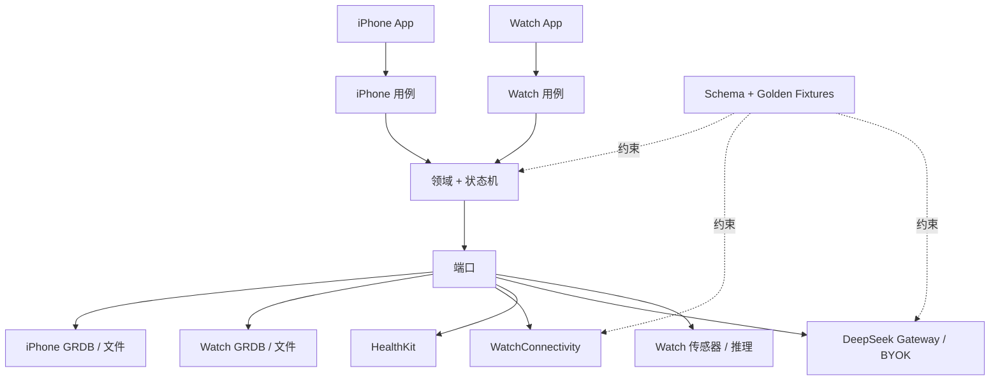

# Architecture Spine — FitnessAI

## 设计范式

FitnessAI 是一个**本地优先的六边形模块化单体**。领域核心通过端口拥有事实与修改政策；原生 SwiftUI 展示采用轻量 MVVM 与显式状态机；仅追加修订保留用户创作的事实。集成是适配器，绝不是其他状态所有者。

## 不变量与规则

### AD-1 — 依赖方向 [ADOPTED]

- **约束对象（Binds）：**两个 App targets、共享 package targets 与所有适配器。
- **防止（Prevents）：**UI、数据库、设备或服务商代码定义互不兼容的业务规则。
- **规则（Rule）：**展示层只调用应用用例。领域 targets 不依赖 SwiftUI、GRDB、HealthKit、WatchConnectivity、传感器或 AI 服务商框架。适配器实现端口，不得绕过领域校验、状态机、批准或修订政策。不得建立无归属的通用 Utils 汇集区。

### AD-2 — 持久事实与修订 [ADOPTED]

- **约束对象（Binds）：**Plans、Plan Revisions、Workout Sessions、Actual Sets、纠错、冲突、批准、outbox 与失效记录。
- **防止（Prevents）：**部分保存、静默覆盖、重复事实、过期批准及从临时状态重建事实。
- **规则（Rule）：**每次用户或已批准 AI 修改都是带稳定 ID 的仅追加修订，并与持久 outbox 和失效记录原子提交；UI 仅在提交后显示成功。Contracts 定义唯一规范的修订 DAG 与生效值 reducer：revision/event ID、object ID、规范 field path 或 operation kind、parent/head set、author device 与 resolution references。对同一规范字段或实体操作的不可比较写入构成冲突；解决修订必须引用全部已解决 heads。不同字段可合并，但有因果重叠的 split/merge、insert/delete、reorder、completion 或 Plan topology 分支绝不自动折叠：全部用户事实保持可见，直到确定性安全解决或 iPhone 明确选择。缺失父项保持 pending。设备时间和到达顺序不决定事实。进行中的 Workout Session 持有不可变 Plan 快照；规范 golden fixtures 绑定 iPhone、Watch、import 与未来 Kotlin reducer。

### AD-3 — 设备所有权与记录拓扑 [ADOPTED]

- **约束对象（Binds）：**纯手机训练、配对训练、离线记录、数据放置与设备更换。
- **防止（Prevents）：**Watch 变成长久档案库、纯手机使用成为第二套产品，或断线导致事实丢失。
- **规则（Rule）：**iPhone 拥有 Plans、长期记录、完整纠错/冲突解决、Analysis、AI、Apple Health 与文件交换。通常由 iPhone 创建全局唯一共享 session identity；断连但持有完整缓存 Plan 的 Watch 可以创建自己的全局唯一 identity，iPhone 随后原样接纳——绝不按时间合并 sessions。每个事实保留其来源 session ID 与不可变 Plan snapshot identity。Watch 拥有本地传感器采集、训练中恢复与离线事实；持续训练记录使用 active `HKWorkoutSession` 与 workout processing，不以 `WKExtendedRuntimeSession` 代替，并将 runtime 的 start/failure/pause/recovery/end 映射到持久 session states。两端均可发起符合 AD-2 的纠错。纯手机记录使用相同 ID、状态、持久化与 Analysis。Watch 只保留最新兼容 Plan、进行中/可恢复 session、待发送内容与最少推理资源。

### AD-4 — 有确认、具因果的 Watch 同步 [ADOPTED]

- **约束对象（Binds）：**Plan 传递、即时修改、训练事实、传感器分块、重试与清理。
- **防止（Prevents）：**把在线当作持久、部分 Plan 激活、重复、迟到回退与过早删除。
- **规则（Rule）：**重要待发送内容先进入本地 outbox。在线消息加速即时交互；排队 user-info 承载持久结构化事件；application context 只承载可替换最新状态；文件传输承载分块。持久 pairing epoch 隔离已过时设备；replay identity 为 `(pairingEpoch, sourceDeviceId, messageId)`，已撤销 epoch 的事实进入隔离区等待明确恢复。规范 transfer state machine 携带 manifest/chunk IDs、数量、大小与 digests、whole-object digest、因果及 dependency/support versions；acknowledgements 为 `received`、`durablyCommitted`、`applied` 或 `rejected(reason)`。Replay 返回先前结果；缺失 chunks 以有界 backoff 重试。只有幂等 whole-object `applied` 才允许清理。Plan 及所需 dependencies 仅在兼容性协商通过后，于同一事务提交并原子替换 active revision。Capability handshake 携带 app/schema/model/evidence/control versions；active-session automation set 除紧急禁用外保持冻结，Watch 对 sensor/model 可执行性拥有最终权威。

### AD-5 — 持久化、保护与恢复 [ADOPTED]

- **约束对象（Binds）：**两端数据库、WAL/sidecars、分块、迁移、秘密、启动与保留。
- **防止（Prevents）：**库耦合、不可读数据库被替换、备份泄漏、未发送事实丢失与秘密暴露。
- **规则（Rule）：**iPhone 与 Watch 各自拥有位于 GRDB 端口后的独立 SQLite。关键写入在同一事务中提交事实、修订、outbox 与失效记录。原始流是由数据库索引的受保护文件。数据库、sidecars、outbox 与分块使用 Apple Data Protection completeUntilFirstUserAuthentication，并排除 iCloud 和普通备份；秘密使用不参与同步的本机 Keychain。不可读数据库不替换为空库。未确认事实不自动删除。七天安全窗口只适用于收到 whole-object `applied` 后的 Watch 端冗余结构化传输副本；iPhone 权威 Plans、Sessions、Sets、corrections、approvals 与 revisions 只能由明确用户删除修订或另行绑定的 retention policy 移除。Watch 原始 chunks 也只能在 whole-object `applied` 后删除；file、index 与 manifest 清理是一次保留 replay tombstones 的幂等原子操作。空间不足时先降级可选原始/自动化数据，再考虑用户事实。

### AD-6 — 证据门控的训练辅助 [ADOPTED]

- **约束对象（Binds）：**设备资料、识别、RPE、遗忘结束提醒与手动降级。
- **防止（Prevents）：**不受支持的声明、静默模型标签、递归标签、不安全打断与错误结束。
- **规则（Rule）：**自动能力只在版本化设备/方向/动作/信号/模型证据行上启用；其他路径保持完整手动能力。Alpha 从 Series 11 46 mm、左手、表冠在屏幕右侧、右手为惯用手及以下准确 v1 候选动作开始：杠铃卧推、上斜哑铃卧推、辅助引体向上、杠铃划船、坐姿划船、侧平举、锤式弯举及杠铃罗马尼亚硬拉。动作分类、组边界与次数计数分别独立验证。自由训练只在安全休息时提示；30 秒无操作仅延后。动作、次数、负重与 RPE 共同使用同一预算：一次约 20 个正式组的代表性训练最多五次主动提示。RPE 为可选功能，在模型与个人五次估算 Gate 通过前只用于确认；只有确认/纠正标签参与校准，漂移后返回验证。遗忘结束提醒必须持续 15 分钟同时满足恢复和无力量活动，信号缺失时抑制，绝不自动结束，选择继续后冷却 15 分钟。Eligibility 冻结在 active-session snapshot 中，只有 fail-closed disable 可以中途改变；pending predictions 退回确认/手动。精确工作点和更广声明需要预注册真机证据。

### AD-7 — AI 提案、安全、批准与提交 [ADOPTED]

- **约束对象（Binds）：**AI Plan 创建/调整、安全评估、审核、批准、提交与 Watch 传递。
- **防止（Prevents）：**只有文字的导入、编造字段、不安全 Plans、隐藏修改、过期批准与逐项重录。
- **规则（Rule）：**AI 返回不可信的完整结构化草稿或字段 Diff，包含不可变 proposalId、base revision、来源、允许范围、假设、schema/model/rule-pack versions 与 canonical digest。确定性的平衡型 Safety Rule Pack 在生成后和提交前检查结构、单位、矛盾、规范 Exercise 支持、相对个人基线的容量/强度/负重渐进及警示信息。结果只有通过、需要澄清/纠正或受影响范围停止；未解决结果阻止提交，但不阻止如实记录。无障碍 approval view 展示每个变更/删除字段、旧/新值与单位、假设、警告、scope、Safety result 及 base revision。其事务校验 proposal 尚未消费、显示 digest 完全一致、当前 Plan head 与 policy versions 未变化，再以唯一 proposalId 作为 commit key；重试返回原结果。任何 base/content/scope/schema/model/rule-pack 变化都必须重新审阅批准。AI 永不修改进行中训练或历史。完成训练后可以出现一次非模态 Review/Later/Disable 邀请；仅展示不会发送数据、建立授权或创建提案。

### AD-8 — 远程 AI 路线与授权 [ADOPTED]

- **约束对象（Binds）：**内置 DeepSeek、BYOK DeepSeek、服务商适配器、远程健康上下文与审计。
- **防止（Prevents）：**产品 Key 内嵌、用户凭据中转、跨服务商泄漏、未授权健康传输与锁定。
- **规则（Rule）：**内置 DeepSeek 使用 FitnessAI gateway，产品 Key 只存在于其 secret store。任何内置 Alpha 流量开始前，必须固定并记录 gateway runtime provider 与 data-processing region，并具备环境隔离 endpoint、短期 owner-authenticated client/session credential、服务端 provider/model 与 egress allowlists、request/schema/time/rate/cost ceilings、key rotation、已脱敏 structured logs、rollback owner 与 kill switch；该 Gate 关闭前内置路线保持禁用。Alpha BYOK 只支持 DeepSeek：用户 Key 是仅本机 Keychain 数据并直连 DeepSeek，绝不进入 FitnessAI 服务器、SQLite、日志、备份、同步或 Watch。任意服务商 URL 不在范围内。每个 route × account 使用可轮换、不可逆且不含 PII 的 pseudonymous isolation ID；切换 route/account 创建新 identity，绝不复用 conversation history。每个远程请求创建一次性 `RemoteUseAuthorization`，绑定准确 provider/account/route、purpose、categories/window、canonical outbound-body digest、policy version、expiry 与 consumed state；发送时原子匹配并消费，任何变化都必须重新预览授权。OS/Health permission 与 proposal approval 均不能替代它。适配器声明能力并返回带类型的不可信输出。审计只保存 identifiers、政策版本、类别、digest、状态与时间，不保存内容或秘密。

### AD-9 — Apple Health 是可选上下文与副本 [ADOPTED]

- **约束对象（Binds）：**HealthKit 读取、训练写入、AI 摘要、断开与权限状态。
- **防止（Prevents）：**HealthKit 成为事实、重复训练、错误声称拒绝、静默重建与一揽子医疗访问。
- **规则（Rule）：**FitnessAI 本地记录保持权威。版本化 Alpha 读取允许清单包括：训练；心率、静息心率、一分钟恢复与 HRV；睡眠；活动/静息能量、步数与运动时间；体重、身高、体脂与瘦体重；设备支持时的 VO2 max、呼吸频率、血氧与睡眠手腕温度；以及明确允许的年龄/生理性别。临床、用药、化验、生育、原始 ECG、血糖、血压及疾病专属类别保持排除。读取状态只表达未请求、无可访问数据、可用、不可用或失败，绝不推断拒绝。训练副本使用 FitnessAI session ID 加一个仅在有意 create/update 时原子分配的本地单调递增 export generation。版本化 transition table 绑定 create/update/delete/detach/relink 与自身写入 retry；外部缺失/变化成为 healthKitDetached，绝不自动重建。远程使用遵守 AD-8，并发送本地摘要而非无限制原始流。

### AD-10 — 受限、只创建草稿的 Plan 交换 [ADOPTED]

- **约束对象（Binds）：**JSON 导入导出、Share Sheet、解析、映射与重复。
- **防止（Prevents）：**隐藏载荷、解析器滥用、静默遗漏、identity 冲突与覆盖。
- **规则（Rule）：**一个 Plan 交换为纯文本、不压缩的 UTF-8 .json，包含内部 FitnessAI 类型标记、format/catalog/source versions、来源 identity、完整 ledger、原始负重数值/单位与 digest。导出排除 sessions、健康、账号、秘密、AI 授权与传感器。导入拒绝超过 2 MB、嵌套超过 12 层、超过一个 Plan、366 个 Plan days、每日 30 个 Exercises、每个 Exercise 20 个 Sets、总计 10,000 Sets 或单条备注 2,000 个字符的文件；然后在完整预览前检查 syntax/schema/version/digest、重复、规范映射与 Safety Rules。规范的版本化 decision table 拒绝未知 required fields，确定性映射已知 aliases，并将可选未知字段保存为惰性的 round-trip metadata，或要求逐项明确确认忽略——绝不静默丢弃。重复 identity/fingerprint 必须披露，且确认后也只能创建另一份独立草稿。不允许可执行内容、外部引用、附件、部分导入、合并、激活或覆盖；确认只用新本地 ID 创建新草稿。

### AD-11 — 绑定修订的 Analysis [ADOPTED]

- **约束对象（Binds）：**History、Analysis、AI 摘要、纠错、不完整/冲突记录与重算。
- **防止（Prevents）：**把过期输出显示为当前、虚假精确及混合不兼容修订。
- **规则（Rule）：**Analysis 只从生效 Actual Set 修订派生。每次生效纠错原子产生范围明确的失效记录；iPhone 重算受影响 read models，并在等待时把旧输出标为过期。不完整、未解决、排除或冲突事实保持可见，不进入确定性汇总。派生产物记录输入修订与 algorithm/schema version。

### AD-12 — 模块化单体种子 [ADOPTED]

- **约束对象（Binds）：**初始仓库、targets、packages 与未来 Android 契约。
- **防止（Prevents）：**过早多仓库、共享 UI/数据库内部结构及 Swift 形状的跨平台契约。
- **规则（Rule）：**从一个仓库与 Xcode workspace、独立 iPhone/Watch App targets，以及一个包含明确 domain、persistence、sync-contract、safety-rule 与 analysis targets 的本地 Swift Package 开始。App 共享领域和 wire contracts，不共享 UI、数据库文件或 row types。平台无关 schema、IDs、units、revisions、error codes 与 golden fixtures 位于 Contracts，供未来 Kotlin 重新实现；Swift 与 GRDB 不是可移植产物。

### AD-13 — 环境与发布证据 [ADOPTED]

- **约束对象（Binds）：**fixture 开发、仅 Product Owner Alpha、未来 production、测试、日志与功能控制。
- **防止（Prevents）：**测试/真实数据混用、仅模拟器声明、意外公开发布及可选功能失败阻止记录。
- **规则（Rule）：**开发、私有 Alpha 与未来 production 分离数据、endpoints、identities 与 credentials。每次变更运行 compile/domain/schema/safety/persistence/sync/AI-contract 与秘密检查。Alpha 候选另加完整 iPhone/Watch 构建、迁移/故障注入、无障碍与配对真机训练测试。传感器、HealthKit、后台执行、文件传输、电量、恢复、识别、RPE 与结束辅助需要真机证据。独立 fail-closed 控制可以关闭每项高风险能力，而不删除事实或阻止手动本地记录。Operational logs 与 automatic diagnostics 只包含 structured IDs、state/error codes、versions 与 timing——绝不包含 secrets、bodies、free text、Health values、raw signals 或 Exercise/load/RPE content；私有 Alpha 的远程 telemetry 默认关闭，除非明确 opt in。体积验收使用 Xcode/App Store Connect thinning reports：内部 iPhone installed-variant 目标不超过 500 MB；Apple Watch uncompressed app 上限低于 75 MB，内部 installed-variant 目标不超过 25 MB；全部 Watch ML 资源不超过 6 MB，其中 RPE 不超过 2 MB。Public beta 在专业安全、当前服务商/subprocessor/region/retention/training-policy、中国数据治理、安全/用户权利、更广设备及成本/滥用 Gate 全部完成前保持阻止。

### AD-14 — 原生展示契约 [ADOPTED]

- **约束对象（Binds）：**所有 iPhone/Watch 页面、导航状态、设计 token 与无障碍实现。
- **防止（Prevents）：**独立开发功能偏离已接受视觉系统、丢失导航上下文或造成手腕交互不可访问。
- **规则（Rule）：**已接受的 native UI specification 与 Titanium Measure design system 是展示权威。iPhone 顶层为 Plan、History、Analysis、More，Plan 为 root；AI、授权、提案/批准、传递、复盘、Health 与交换保持 contextual routes。原生返回恢复 object identity、filters、scroll position 与未生效输入。组件使用 semantic tokens 而非原始样式，并实现 light/dark、Dynamic Type、VoiceOver、error、empty、loading、offline 与 recovery 状态。Watch 导航保持浅层且面向任务；Digital Crown 只是可选加速器，绝不是唯一输入或提交路径。

## 一致性约定

- 稳定 ID 在持久化前存在，并跨重试、同步、纠错、导出来源与服务商调用保持不变。
- 领域、持久化、wire、AI、HealthKit 与 UI 模型相互独立；映射发生在端口。
- 被外部解释的事实携带适用 app、schema、catalog、model、support-matrix、rule-pack 与 algorithm versions。
- 负重保留输入数值与 kg/lb；规范换算单独派生。
- 负重事实还保留 kind 与 basis：external、bodyweight、assisted、unloaded/timed/non-comparable，以及适用时的 total 与 per-side；Analysis 绝不折叠语义不可比的训练。
- Contracts 定义唯一 canonical serialization/digest profile，覆盖 encoding、Unicode、decimals、units、UTC/time-zone 含义、unknown fields、所覆盖 fields/bytes 及版本化 hash algorithm；跨端 golden vectors 绑定 display、approval、sync、import 与 commit。
- predicted、confirmed、corrected、auto-used 与 effective 保持不同。
- 离线、等待、过期、冲突、无效、不支持、失败与取消都是显式状态，绝不编造成功。
- 跨平台兼容使用版本化 schema 与 golden fixtures，而不是共享 Swift 实现。
- 来源文档发生冲突时，本次运行记录的较新 Product Owner 决定覆盖旧范围表述；其他情况的权威顺序为 PRD、EXPERIENCE、DESIGN/Titanium Measure、native-ui-spec、architecture-handoff。

## 技术栈

| 关注点 | 已绑定选择 |
|---|---|
| 工具链 | Xcode 26.6 (17F113)；Apple Swift 6.3.3 |
| 基线 | iPhone 11+/iOS 18+；Series 6+/watchOS 11+，受逐能力证据矩阵约束 |
| UI | 原生 SwiftUI、NavigationStack/TabView、轻量 MVVM、显式状态机 |
| 项目 | 一个仓库/workspace；iPhone 与 Watch targets；一个本地 Swift Package |
| 持久化 | 系统 SQLite，通过 GRDB 7.11.1；SwiftPM 精确锁定并提交 `Package.resolved` |
| 设备/健康 | Xcode 26.6 SDK 的 WatchConnectivity、HealthKit、Core Motion，位于端口之后 |
| 远程 AI | DeepSeek 位于服务商端口之后；gateway 与本机 BYOK 路线保持分离 |
| 交换 | 版本化、受限 UTF-8 JSON 与 golden fixtures |

## 结构种子

这是冷启动结构种子，不是永久目录强制。代码可以继续细化，但必须保留 AD-1 与 AD-3。

## 能力 → 架构映射

| 能力 | 事实所有者 | 适配器/证据 |
|---|---|---|
| Plan 创建/修订 | iPhone 修订存储 | 手动/AI → Safety Rules → digest 批准 |
| 配对训练 | 设备本地事实；iPhone 解决完整记录 | Watch 传感器 + WatchConnectivity |
| 纯手机训练 | iPhone 本地 session | iPhone 记录 |
| 识别/RPE/结束 | 版本化推理事实 | 合格 Watch 模型 + 真机 Gate |
| History/Analysis | iPhone read models | 生效修订 + 失效/重算 |
| Apple Health | FitnessAI 本地事实 | 可选 HealthKit 副本/上下文 |
| Plan 交换 | iPhone 新草稿 | 受限 JSON + Share Sheet |
| 远程 AI | 未生效提案 | 已授权 DeepSeek 适配器 + 本地校验 |

## 延后事项

- PRD 与 UX 已于 2026-09-10 完成对齐：纯手机记录是一等路径；Product Owner 已批准在逐请求一次性授权下远程使用用户所选本地 Apple Health 摘要。真实 Health 摘要传输继续受后续两个 fail-closed Gate 约束。
- 所有 HealthKit 派生值（包括摘要）的远程传输必须 fail closed，直到书面审核确认 Apple health/fitness purpose 合规、DeepSeek processor/法律及合同适配性、privacy/subprocessor/region/retention/training-use 披露，以及 deletion/revocation/user-rights 路径。本地 Health analysis 与不含 Health 数据的 AI 继续可用。
- 真实远程健康数据传输前，固定当时 DeepSeek 的法律主体、subprocessors、地区、retention/cache、模型训练用途、删除/撤回与披露；公开 API 材料不足以支持零保留声明。
- 第一条 AI Plan Story 前发布 Safety Rule Pack v1 数字边界与 fixtures；超出 Product Owner 测试的发布前取得 NFR-SAFE-001 专业审核。
- 自动能力扩展前，独立验证 Series 6–10、更多方向/动作、工作点、电量预算及 90 分钟存储证据；手动记录始终可用。
- Public beta 前选择并威胁建模中国区账号/同步基础设施、租户/账号隔离、切换账号不合并、导出范围、30 天删除执行、防止离线设备复活数据的删除墓碑、保留、用户权利运营、事件响应、部署与回滚。未来 application-cloud sync 必须继承 AD-2 而非仅按时钟 last-write-wins；auth/cloud failure 时本地记录继续工作；恢复进度/失败可见；sign-out 时对未同步数据警告并提供 retain/remove；破坏性隐私操作需要重新认证。私有 Alpha 不要求应用云恢复。
- Public beta 前威胁审核时，在测量密钥生命周期、后台写入、迁移与恢复成本后决定 SQLCipher 是否比 Apple Data Protection 提供净收益。
- Post-Alpha 的更多服务商、任意/自托管 endpoints、Android、更广分享格式与更广 HealthKit/医疗类别需要新适配器、契约、披露与证据，不得削弱这些 AD。
