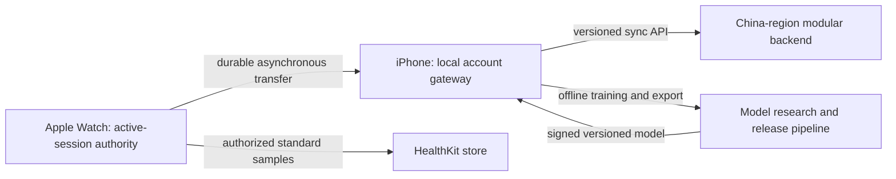

# Research Report: Technical

**Date:** 2026-07-19
**Author:** HP
**Research Type:** Technical

---

## Research Overview

This research evaluates whether FitnessAI can infer set-level actual RPE during strength training from Apple Watch data without creating more interaction than it removes. It separates three questions that are often conflated: whether RPE is a useful training construct, whether wrist heart rate covaries with exertion, and whether heart rate contains enough information to recover an individual's RPE for a particular set. Evidence supports the first two propositions, but does not establish the third as a reliable, general product capability.

The recommended path is therefore an evidence-gated multimodal system: Apple-processed heart rate, wrist motion, set structure, load/repetitions, recovery context, exercise identity, and confirmed personal history feed a small on-device model. The model suggests rather than records RPE, exposes uncertainty through abstention, and never replaces user-confirmed truth. The complete synthesis, decision framework, roadmap, and source limitations appear in **Research Synthesis: From Heart Rate Signal to Trustworthy Set-Level RPE Assistance** below.

## Technical Research Scope Confirmation

**Research Topic:** RPE estimation from heart rate for strength training

**Research Goals:** Determine whether heart rate alone, heart rate plus Apple Watch motion data, or personalized historical calibration can estimate set-level actual RPE accurately enough for FitnessAI product use.

**Technical Research Scope:**

- Construct validity for set RPE, session RPE, repetitions in reserve, and related exertion labels.
- Heart-rate-only estimation evidence and confounders in resistance training.
- Multimodal estimation using Apple Watch heart rate, motion, rep tempo, load, and personal history.
- Population models, personalized calibration, cold start, uncertainty, and abstention.
- Data availability, platform integration, validation metrics, and product reliability thresholds.
- Current product claims and the evidence required to present an estimate as a suggestion or recorded fact.

**Research Methodology:**

- Current web data with rigorous source verification through 2026-07-19.
- Priority for peer-reviewed systematic reviews, original research, official Apple documentation, and first-party product material.
- Multi-source validation for critical claims and explicit separation of set-level from session-level evidence.
- Confidence grading for uncertain, indirect, small-sample, or non-externally-validated findings.

**Scope Confirmed:** 2026-07-19

## Technology Stack Analysis

### Programming Languages and Platform Runtime

The production application should use **Swift and SwiftUI** across watchOS and iOS. The Watch target owns workout-session control, sensor capture, set segmentation, lightweight feature calculation, and accepted per-set inference; the iPhone target owns heavier recomputation, history, analysis, model management, and user-facing correction audit. Live inference must not depend on iPhone reachability.

Offline research and model training should use **Python**. NumPy, Pandas, and SciPy support cleaning, resampling, windowing, and signal features; scikit-learn supplies leakage-resistant baselines and grouped validation; XGBoost is useful as an offline tabular ceiling; PyTorch becomes relevant only after sufficient labeled time-series data exists.

_Confidence: High. The deployment and research ecosystems are mature; physiological label validity remains a separate question._

### Sensor Acquisition Frameworks

The recommended Watch acquisition stack is:

- `HKWorkoutSession + HKLiveWorkoutBuilder` for the strength-training session and Apple-processed heart-rate samples. Apple states that workout sessions produce high-frequency heart-rate samples, but publishes no fixed sampling rate or callback SLA. The app receives BPM samples, not raw PPG. [Apple: Running workout sessions](https://developer.apple.com/documentation/healthkit/running-workout-sessions)
- `CMMotionManager` for raw accelerometer, raw gyroscope, or fused device-motion signals. A practical MVP target is approximately 50 Hz accelerometer plus gyroscope/device motion, subject to runtime capability and real-device verification. [Apple: CMMotionManager](https://developer.apple.com/documentation/coremotion/cmmotionmanager)
- `CMBatchedSensorManager` is an optional hardware-specific path for much higher-frequency batched motion, not an MVP dependency. Apple documents 800 Hz acceleration and 200 Hz device motion for supported Watches during an active workout, delivered in batches rather than as a universal low-latency stream. [WWDC23: What's new in Core Motion](https://developer.apple.com/videos/play/wwdc2023/10179/)

Wrist PPG accuracy is activity dependent. A systematic review found a larger mean heart-rate error during resistance training than during rest or treadmill activity, and newer validation work still reports motion- and exercise-dependent variation. Heart-rate coverage and quality must therefore be model inputs and rejection conditions, not hidden assumptions. [Bent et al., systematic review](https://pubmed.ncbi.nlm.nih.gov/32552580/)

_Confidence: High for API availability; medium for per-set heart-rate completeness across exercises and Watch models._

### Development Frameworks and Machine-Learning Libraries

The recommended progression is deliberately simple:

1. **Feature-engineered tabular baseline:** one row per completed set; ElasticNet/Huber, random forest, or histogram gradient boosting in scikit-learn.
2. **Offline ceiling and uncertainty experiments:** XGBoost mean/median and quantile regression. XGBoost is valuable for research, but current direct Core ML conversion must be gated because public converter compatibility trails current XGBoost releases.
3. **Multimodal time-series model:** only after enough user-confirmed labels exist, train a fixed-shape lightweight 1D-CNN or TCN in PyTorch over HR/IMU windows and concatenate set context and personal history.
4. **Core ML deployment:** convert a supported PyTorch graph through coremltools, or use Create ML `MLRegressor` for the feature-engineered MVP. Apple currently describes the traced PyTorch conversion path as the more stable route. [Apple: PyTorch conversion workflow](https://apple.github.io/coremltools/docs-guides/source/convert-pytorch-workflow.html), [Apple: MLRegressor](https://developer.apple.com/documentation/createml/mlregressor)

The model should output a point estimate plus an uncertainty interval or calibrated acceptance score. Quantile regression or conformal calibration can support abstention, but thresholds must be selected on held-out users and later sessions, not on random windows. Evaluation must group by user and Workout Session to prevent overlapping samples from leaking across train and test. [scikit-learn: GroupKFold](https://scikit-learn.org/stable/modules/generated/sklearn.model_selection.GroupKFold.html)

_Confidence: High for tool feasibility; the best model class cannot be selected until strength-training labels exist._

### Personalization and Model Updating

The lowest-risk personal model is not full on-Watch retraining. Start with:

- a global model;
- user-specific offset and slope learned only from user-confirmed RPE;
- optionally a small residual model updated on iPhone and synchronized to Watch.

Core ML supports on-device model updates, but production support depends on model format and updateable layers. A safer MVP is Watch inference plus iPhone-side calibration, with versioned parameters returned to the Watch. Model predictions must never become their own training labels. [Apple: Model Personalization](https://developer.apple.com/documentation/coreml/model-personalization)

_Confidence: High for offset/residual personalization; medium for direct watchOS model updating until device gates are passed._

### Database and Storage Technologies

Use three distinct data layers:

1. **HealthKit:** standard Workout and heart-rate samples with user authorization. HealthKit effort types represent whole-workout effort, not FitnessAI's per-set RPE.
2. **Structured local application store:** SwiftData (or Core Data for an older deployment target) for Workout Session, Exercise, Actual Set, predicted RPE, uncertainty, model version, user-confirmed RPE, and correction history.
3. **Immutable local sensor chunks:** append-only binary files for raw or fine-grained HR/IMU time series, with checksums, measured sampling metadata, schema version, device/OS information, and monotonic-clock anchors.

Predicted and confirmed values must remain separate. A correction creates an auditable user truth; it must not erase the original prediction needed for validation and future model improvement.

_Confidence: High._

### Device Communication and Synchronization

Use Watch Connectivity by payload purpose:

- `sendMessage` only for currently reachable, non-critical live interaction;
- `transferUserInfo` for queued summaries and state;
- `transferFile` for reliable background delivery of immutable sensor chunks;
- `updateApplicationContext` for replaceable latest state such as the active Training Plan.

Reliable transfers are queued but have no real-time latency guarantee. Watch retains each chunk until iPhone validates its checksum and acknowledges receipt. [Apple: Transferring data with Watch Connectivity](https://developer.apple.com/documentation/watchconnectivity/transferring-data-with-watch-connectivity)

_Confidence: High._

### Cloud Infrastructure and Privacy

The MVP should be **local-first and account-synchronized**. Every workout event is committed durably on Watch/iPhone before network upload, so recording remains reliable when the phone or network is unavailable. After the local commit, FitnessAI synchronizes account-scoped plans, structured workout history, set records, user-confirmed RPE, analytics inputs, and compact personal-model summaries to a China-region application backend. Signing into another supported device restores these records and lets the user continue using the app.

This requirement is separate from Apple iCloud/CloudKit. Containers that include personal health information must not use CloudKit/iCloud synchronization, because Apple App Review Guideline 5.1.3(ii) says apps may not store personal health information in iCloud. FitnessAI therefore needs its own compliant account and synchronization service for the cross-device experience; this is not permission to upload data indiscriminately. Apple also requires explicit disclosure of the health data collected and restricts HealthKit-derived data to health/fitness purposes rather than advertising or unrelated data mining. [Apple App Review Guidelines 5.1.3](https://developer.apple.com/app-store/review/guidelines/) [Apple HealthKit: Protecting user privacy](https://developer.apple.com/documentation/healthkit/protecting-user-privacy)

Default cloud synchronization should minimize data. It includes the structured records needed for history, trends, plan adaptation, and continuity, while complete high-frequency HR/IMU streams remain local under the current product decision. Any future upload of raw sensor streams is a separate, explicit research or diagnostic opt-in with its own retention and consent design. Heart rate and linked RPE data should be treated as sensitive personal information, requiring explicit purpose limitation, separate consent where applicable, encryption, retention controls, deletion/export, and a China data path. [China Personal Information Protection Law](https://www.cac.gov.cn/2021-08/20/c_1631050028355286.htm)

_Confidence: High for the local-first/cross-device product requirement and Apple iCloud restriction; the final backend, consent, and data-residency implementation requires launch-time legal and App Review verification._

### Technology Adoption and Implementation Direction

The practical adoption sequence is:

- **Phase A:** collect user-confirmed set RPE with HR/IMU quality metadata; establish simple per-set baselines and grouped validation.
- **Phase B:** deploy a small Core ML regressor that offers a suggested RPE only when quality and calibrated uncertainty pass a threshold.
- **Phase C:** add personal offset/residual calibration on iPhone.
- **Phase D:** compare a lightweight multimodal time-series network only when it materially outperforms the simpler model under user- and session-held-out evaluation.

The technology stack can support automatic estimation. It does **not** establish that HR contains enough information to infer set RPE in resistance training. That validity question remains the dominant research risk for the following steps.

## Integration Patterns Analysis

### Integration Topology and Source-of-Truth Boundaries

The recommended topology is **Apple Watch local recorder → iPhone durable gateway → FitnessAI China-region account cloud**.

- Apple Watch is the sole writer for an active Workout Session. It captures sensors, detects sets, runs available RPE inference, and commits events locally before communication.
- iPhone mirrors control and presentation, receives durable Watch transfers, maintains the richer local application database, performs heavier personalization, and synchronizes the account cloud.
- The FitnessAI backend restores structured records across supported devices and distributes compatible model manifests. It is not in the real-time training loop.
- HealthKit is an Apple-ecosystem projection for standard Workout and authorized health samples. It is not the system of record for FitnessAI Training Plans, Actual Sets, per-set RPE, corrections, or raw IMU.

This topology keeps recording available when the phone, Bluetooth link, account service, or internet is unavailable. It also prevents ambiguous simultaneous editing: Watch owns the active session; iPhone becomes the primary editing surface after completion. [Apple: Running workout sessions](https://developer.apple.com/documentation/healthkit/running-workout-sessions) [Apple: About the HealthKit framework](https://developer.apple.com/documentation/healthkit/about-the-healthkit-framework)

_Confidence: High._

### API Design Patterns

For MVP, use a versioned **HTTPS JSON REST synchronization API**, not GraphQL, gRPC, or a per-set online inference API. The workload is dominated by offline mutation replication and new-device restoration rather than arbitrary graph queries or low-latency service-to-service RPC.

Recommended contract:

- `POST /v1/sync/push`: submit a batch of locally committed outbox operations;
- `GET /v1/sync/pull?cursor=<opaque>`: return changes and deletion tombstones after a server-issued cursor;
- `GET /v1/sync/snapshot`: restore a consistent account snapshot plus its continuation cursor on a new device;
- `GET /v1/models/manifest`: return compatible model/schema versions and signed download metadata when remote model delivery is enabled.

Each mutation should include `operationId`, `entityId`, `entityType`, `mutationType`, `baseRevision`, `payloadSchemaVersion`, `deviceId`, `capturedAt`, and a body hash. The server returns acknowledged operation IDs, assigned revisions, conflicts/rejections, server time, and the next opaque cursor. A unique constraint on `(accountId, operationId)` makes retry safe; reuse of the same ID with a different body hash is rejected. HTTP `PUT`/conditional updates may use `ETag` and `If-Match`; RFC 9110 defines idempotent methods and conditional request semantics. Errors should use RFC 9457 `application/problem+json`. [IETF RFC 9110: HTTP Semantics](https://datatracker.ietf.org/doc/html/rfc9110) [IETF RFC 9457: Problem Details for HTTP APIs](https://datatracker.ietf.org/doc/html/rfc9457)

The server cursor must be opaque and server-generated. Device timestamps are retained for user history and diagnostics but must not determine synchronization completeness because clocks can drift.

_Confidence: High for the pattern; endpoint names remain an implementation choice._

### Watch–iPhone Communication Protocols

HealthKit workout-session mirroring and Watch Connectivity serve different roles:

- **HealthKit mirroring:** workout lifecycle, control state, and small live summaries. The iPhone app can be launched in the background when mirroring starts, but remote data callbacks may be separated by several minutes while iOS is suspended; it is not a hard-real-time data plane.
- **`sendMessage` / `sendMessageData`:** immediate, non-critical control or UI queries only when the counterpart is reachable.
- **`updateApplicationContext`:** replaceable latest-state snapshots such as the current Training Plan revision; later updates overwrite earlier pending context.
- **`transferUserInfo`:** queued small immutable events, manifests, and completion notices.
- **`transferFile`:** asynchronous background delivery of immutable sensor chunks and larger diagnostics; the system may throttle delivery for performance and power.

The application must not continuously stream 50–100 Hz IMU to iPhone. Watch commits locally, queues transfer, retains the payload until iPhone validates `chunkId + checksum`, and deletes it only after an application-level acknowledgement. Each transfer includes `workoutId`, `sessionEpoch`, `eventId/chunkId`, `sequenceNumber`, `schemaVersion`, and checksum so duplicate delivery cannot double-count a set. [Apple: Building a multidevice workout app](https://developer.apple.com/documentation/healthkit/building-a-multidevice-workout-app) [Apple: Remote workout data delivery](https://developer.apple.com/documentation/healthkit/hkworkoutsessiondelegate/workoutsession(_:didreceivedatafromremoteworkoutsession:)) [Apple: Transferring data with Watch Connectivity](https://developer.apple.com/documentation/watchconnectivity/transferring-data-with-watch-connectivity) [Apple: `transferFile`](https://developer.apple.com/documentation/watchconnectivity/wcsession/transferfile(_:metadata:))

_Confidence: High._

### Data Formats, Time, and Schema Compatibility

- Use JSON for structured cloud operations and RFC 9457 errors.
- Use property-list-compatible dictionaries for small Watch Connectivity payloads.
- Store complete high-frequency sensor data as immutable, chunked binary files with a versioned header, measured sample rate, device/OS identifiers, compression/encryption metadata, and checksum. These files remain local under the current decision.
- Store cloud-synchronized RPE inputs as minimal set-level derived features rather than complete raw streams: for example HR baseline delta, peak, recovery slope, coverage/quality flags, rep count, tempo, exercise/load context, and missingness masks.
- Bind every prediction and personal calibration summary to `featureSchemaVersion`, `baseModelVersion`, and `personalizationVersion`; incompatible summaries are retained for audit but not silently reused.

Core Motion timestamps are monotonic time since device boot, not wall-clock dates. At session start, save a `(UTC Date, monotonic timestamp)` anchor. Each event preserves `capturedAtUTC`, `monotonicOffset`, and optionally `receivedAtUTC` for transport diagnostics; retransmission never changes capture time. [Apple: `CMLogItem.timestamp`](https://developer.apple.com/documentation/coremotion/cmlogitem/timestamp)

_Confidence: High._

### Cross-Device Synchronization and Conflict Resolution

Use a local transactional outbox on Watch and iPhone: the domain event and its pending-sync record commit atomically, then a background worker retries until acknowledged. Exactly-once transport is not assumed; business processing is idempotent.

Conflict rules are domain-specific:

- completed Actual Sets are immutable events; changes to exercise, reps, load, or RPE create correction revisions;
- `userConfirmedRPE` always outranks a model prediction, and a new model never overwrites confirmed truth;
- predictions keep their `modelVersion`, interval/confidence, feature version, and abstention reason;
- an active session has a Watch-owned write lease; iPhone issues idempotent commands but does not create competing set edits;
- Training Plan edits use optimistic revision checks; concurrent human edits to the same field are preserved as a visible conflict rather than averaged;
- deletion creates a tombstone so an offline device cannot resurrect old data; account deletion follows a separate irreversible erasure workflow;
- analytics are derived and rebuildable, so synchronized source events—not cached charts—are authoritative.

For FitnessAI-created HealthKit objects, use stable sync metadata and anchored queries to avoid duplicate import, but do not treat HealthKit as the cloud restore source. If a user deletes a Workout in Apple Health, FitnessAI should not silently recreate it; the application record can become `healthKitDetached`, with a clear choice about deleting the FitnessAI copy. [Apple: `HKMetadataKeySyncIdentifier`](https://developer.apple.com/documentation/healthkit/hkmetadatakeysyncidentifier) [Apple: `HKAnchoredObjectQuery`](https://developer.apple.com/documentation/healthkit/hkanchoredobjectquery)

_Confidence: High for application conflict rules; HealthKit deletion UX requires product validation._

### Model Distribution and Personalization Integration

RPE prediction remains on device. MVP does not require an online inference API.

- Bundle a last-known-good baseline Core ML model with the app.
- Update only a lightweight personal offset/slope or residual head on iPhone, then send compatible parameters to Watch through Watch Connectivity.
- If remote model delivery is later enabled, iPhone retrieves a manifest, verifies schema, minimum OS, model hash/signature, and compatibility, downloads and compiles the model, evaluates golden inputs, and only then atomically activates it.
- Every personal parameter set references its base model; incompatible personalization is reset or migrated explicitly.
- Activation failure keeps the bundled or prior verified model. Record `modelActivated` and `modelRollback` events without health payloads.

Apple documents device-side Core ML model compilation and recommends downloading models when appropriate. Apple-hosted managed Background Assets are not available on watchOS, so the lowest-risk Watch path is an iPhone-mediated download followed by Watch Connectivity or an app-release-bundled model. [Apple: Reducing the Size of Your Core ML App](https://developer.apple.com/documentation/coreml/reducing-the-size-of-your-core-ml-app) [Apple: `MLModel`](https://developer.apple.com/documentation/coreml/mlmodel) [Apple: Apple-hosted Background Assets platform availability](https://developer.apple.com/documentation/backgroundassets/downloading-apple-hosted-asset-packs)

_Confidence: High for bundled baseline and iPhone-mediated delivery; exact Watch model-transfer limits require device testing._

### Event-Driven and Service Integration

Event-driven behavior is useful locally and at the API boundary, but a distributed event platform is not justified for MVP. Use a modular monolith backend with one transactional account database, an operation log, background jobs, and an internal outbox. Kafka/RabbitMQ, service mesh, saga orchestration, and multiple independently deployed microservices add failure modes without helping the real-time Watch loop.

If scale later requires separation, domain events such as `setCompleted`, `rpeConfirmed`, `planCorrected`, `modelActivated`, and `accountDeletionRequested` can feed analytics or model-training pipelines. Health payloads must not appear in general logs, crash telemetry, push-notification bodies, or unrelated third-party analytics. This recommendation is an architectural inference from the small-team MVP scope, not an external platform requirement.

_Confidence: High for MVP; reassess after measured scale and organizational growth._

### Integration Security and Account Lifecycle

- Use Authorization Code with PKCE for any browser-based native login flow; native apps are public clients and must not embed a client secret. Store refresh credentials only in iPhone Keychain, issue short-lived access tokens, rotate/revoke refresh tokens, and do not place the cloud refresh token on Watch. [IETF RFC 8252: OAuth 2.0 for Native Apps](https://datatracker.ietf.org/doc/html/rfc8252) [IETF RFC 9700: OAuth 2.0 Security Best Current Practice](https://datatracker.ietf.org/doc/html/rfc9700) [Apple: Storing Keys in the Keychain](https://developer.apple.com/documentation/security/storing-keys-in-the-keychain)
- Use TLS for transport, database/object encryption at rest, per-account authorization filters, least privilege, key rotation, encrypted backups, and audit records. App Attest can help the server distinguish genuine app instances for sensitive or premium endpoints, but it is an abuse signal rather than an identity system. [Apple: Establishing your app's integrity](https://developer.apple.com/documentation/devicecheck/establishing-your-app-s-integrity)
- Cloud synchronization requires explicit disclosure and App Privacy reporting for Health/Fitness data. Personal health information must not be stored in iCloud/CloudKit. If the app creates accounts, account deletion must be available inside the app and revoke all device sessions. [Apple App Review Guidelines 5.1.1 and 5.1.3](https://developer.apple.com/app-store/review/guidelines/) [Apple App Privacy Details](https://developer.apple.com/app-store/app-privacy-details/)
- The China-region backend must implement sensitive-personal-information consent, purpose limitation, retention, access/export/correction/deletion, impact assessment where applicable, and controlled processors. [China Personal Information Protection Law](https://www.cac.gov.cn/2021-08/20/c_1631050028355286.htm)

Account login should be explained as enabling synchronization and recovery. Local recording should degrade gracefully when logged out or offline; cross-device restoration necessarily requires authentication.

_Confidence: High for platform requirements; legal implementation requires specialist review before launch._

### Cross-Integration Assessment and Research Gaps

The integration patterns reinforce one product invariant: **the critical training path ends at the Watch local commit**. Phone and cloud integrations improve control, recovery, analytics, and personalization but never determine whether a set is recorded.

Remaining integration gates are empirical:

1. mirror reconnect behavior and callback delay during a real strength workout;
2. Watch Connectivity queue delay, duplicate delivery, and storage pressure with representative chunks;
3. crash/restart recovery between local commit, iPhone acknowledgement, and cloud acknowledgement;
4. new-device snapshot restore followed by cursor-based incremental sync;
5. deterministic conflict tests for corrections, plan edits, tombstones, and model-version changes;
6. privacy/App Review validation of the exact cloud field inventory and account-deletion workflow.

_Overall confidence: High for the recommended topology and protocol roles; medium for unmeasured latency, power, and lifecycle behavior on the final supported device matrix._

## Architectural Patterns and Design

### System Architecture Patterns

FitnessAI should use an **edge-first companion architecture** with five explicit runtime boundaries:

1. **Watch runtime:** workout state machine, sensor adapters, set/rep segmentation, local journal, Core ML inference, uncertainty gate, and quiet Watch UI.
2. **iPhone companion:** full Training Plan/history UI, local structured database, synchronization engine, analytics projections, personal calibration, and model compatibility checks.
3. **HealthKit adapter:** authorized standard Workout/heart-rate interchange only; it does not own FitnessAI domain state.
4. **Application backend:** account, synchronization, structured restore, minimal derived-feature storage, and model manifest delivery.
5. **Offline model pipeline:** dataset curation, grouped evaluation, model conversion, signing, and release approval; it is isolated from production request processing.

The backend should begin as a **modular monolith**, with modules such as Identity, Training, Sync, Analytics, Model Registry, Consent, and Account Lifecycle in one deployable service and transactional database. Microservices are not justified: official architecture guidance notes their additional costs in discovery, distributed consistency, transactions, testing, and operations. [Microsoft: Microservices architecture trade-offs](https://learn.microsoft.com/en-us/azure/architecture/microservices/) [Microsoft: Microservices assessment](https://learn.microsoft.com/en-us/azure/architecture/guide/technology-choices/microservices-assessment)

Use **selective append-only domain history**, not full Event Sourcing. Actual Set creation, user correction, RPE confirmation, and deletion require an auditable history; ordinary profile, catalog, consent, and configuration data use conventional transactional CRUD. Full Event Sourcing constrains schema evolution and adds projection/replay complexity that its own pattern guidance says is rarely justified for an MVP. [Microsoft: Event Sourcing pattern and trade-offs](https://learn.microsoft.com/en-us/azure/architecture/patterns/event-sourcing)

_Confidence: High._

### Design Principles and Best Practices

The Apple clients should use a **ports-and-adapters boundary** around a pure domain core rather than allowing UI, HealthKit, Core Motion, persistence, connectivity, and Core ML callbacks to modify state directly.

Recommended modules:

- `TrainingDomain`: Workout Session, Training Plan, Actual Set, correction, RPE, and invariant rules;
- `WorkoutRuntime`: deterministic workout state machine and command handling;
- `SensorPipeline`: clock alignment, buffering, segmentation, feature extraction, and quality assessment;
- `RPEInference`: model interface, uncertainty/abstention, calibration, and model-version compatibility;
- `LocalPersistence`: SwiftData/Core Data repositories, immutable chunk files, and transactional Outbox;
- `DeviceBridge`: HealthKit mirroring and Watch Connectivity adapters;
- `AccountSync`: iPhone-only cloud synchronization and conflict resolution;
- `Analytics`: rebuildable weekly/monthly projections;
- platform UI targets that observe domain state but do not contain recording truth.

Use Swift protocols at external boundaries and inject implementations so sensor, clock, storage, network, HealthKit, and model behavior can be replaced with deterministic test doubles. Apple explicitly recommends dependency injection and protocol-oriented abstraction to decouple platform or external state for testing. [Apple: Adding tests to an Xcode project](https://developer.apple.com/documentation/xcode/adding-tests-to-your-xcode-project) [Apple: Updating code to accommodate unit tests](https://developer.apple.com/documentation/xcode/updating-your-existing-codebase-to-accommodate-unit-tests)

Concurrency ownership must be explicit:

- one actor owns the active Workout Session state;
- one writer/actor owns each local model context;
- sensor callbacks enqueue timestamped inputs rather than mutating UI state;
- synchronization reads committed events and never shares mutable model objects across actors.

SwiftData provides model-actor and serial-executor support for isolated storage access. [Apple: SwiftData concurrency support](https://developer.apple.com/documentation/swiftdata/concurrencysupport)

Architecturally significant choices—local-first authority, CloudKit prohibition, raw-data retention, Watch ownership, sync protocol, model release and abstention—should each become a short Architecture Decision Record containing context, decision, consequences, and supersession history. [AWS: Architectural decision record process](https://docs.aws.amazon.com/prescriptive-guidance/latest/architectural-decision-records/adr-process.html)

_Confidence: High._

### Scalability and Performance Patterns

The primary scalability mechanism is **data reduction before distribution**:

- process 50–100 Hz motion and irregular HR locally;
- keep only bounded ring buffers in memory and flush immutable chunks incrementally;
- run RPE inference once per detected/confirmed set or during rest, not continuously on every sample;
- synchronize set-level records and minimal derived features, not raw streams;
- batch cloud push/pull and use cursor-based incremental restore;
- compute common weekly/monthly analytics as local or server projections that can be rebuilt from source records.

This is necessary because active workout sessions can run in the background, but Apple warns that excessive background CPU can suspend the watchOS app. Scheduled background work is also budgeted and may be throttled, so correctness cannot depend on a future background wake. [Apple: Running workout sessions](https://developer.apple.com/documentation/healthkit/running-workout-sessions) [Apple: Using background tasks on watchOS](https://developer.apple.com/documentation/watchkit/using-background-tasks)

On the backend, use a stateless API tier over one transactional relational database, background workers for analytics/model-manifest tasks, and object storage only for explicitly approved large artifacts. Scale API replicas horizontally only after measured load; add read replicas, table partitioning, or separate analytical storage only when query measurements justify them. A full CQRS split is premature: official guidance notes that CQRS can improve asymmetric read/write scaling but adds synchronization and eventual-consistency complexity. A lightweight separation of command handlers and read DTOs within one database is sufficient initially. [Microsoft: CQRS pattern](https://learn.microsoft.com/en-us/azure/architecture/patterns/cqrs)

Remote failures use bounded exponential backoff with jitter and `Retry-After`; persistent failures open a circuit and leave local events pending. The circuit breaker surrounds cloud dependencies only—it never blocks local recording. [Microsoft: Transient fault guidance](https://learn.microsoft.com/en-us/azure/well-architected/design-guides/handle-transient-faults) [Microsoft: Circuit Breaker pattern](https://learn.microsoft.com/en-us/azure/architecture/patterns/circuit-breaker)

Performance acceptance is measured on physical target devices: workout CPU, memory high-water mark, energy per hour, sensor coverage, chunk-write latency, set-end inference latency, and Watch Connectivity backlog. Apple recommends a measure-change-observe cycle and provides Xcode Organizer/Instruments metrics for responsiveness, storage, memory, and energy. [Apple: Improving app performance](https://developer.apple.com/documentation/xcode/improving-your-app-s-performance/) [Apple: Watch Connectivity requires physical-device testing](https://developer.apple.com/documentation/watchconnectivity/transferring-data-with-watch-connectivity)

_Confidence: High for patterns; quantitative budgets remain Gate measurements._

### Integration and Communication Patterns

Use asynchronous boundaries to isolate failures:

- Watch domain commands produce committed local events;
- Watch Connectivity replicates those events to iPhone without transferring ownership of the active session;
- iPhone synchronization replicates committed operations to the backend;
- analytics and model calibration consume confirmed local/cloud records after the critical path;
- HealthKit export is an idempotent side effect, not part of the transaction that proves a FitnessAI set was saved.

This creates three independent acknowledgement levels: `watchCommitted`, `phoneReceived`, and `cloudAcknowledged`. UI may display synchronization state, but a set is considered recorded immediately after `watchCommitted`. Every boundary is at-least-once plus idempotent processing; no cross-device or cloud distributed transaction is attempted.

The active Workout Session should be modeled as an explicit state machine—`idle → preparing → active/resting → ending → locallyFinalized → phoneReplicated → cloudReplicated`—with recovery transitions from process termination and connectivity loss. Recording state and synchronization state remain orthogonal so a cloud error cannot move the workout back to an unsafe state.

_Confidence: High._

### Security Architecture Patterns

Threat boundaries are the Watch app container, iPhone app container, HealthKit, device-to-device transport, public API edge, backend services/database, model artifact store, and third-party processors. No boundary receives implicit trust based on network location; NIST Zero Trust guidance centers authorization on identities, assets, and resources rather than a trusted perimeter. [NIST SP 800-207: Zero Trust Architecture](https://csrc.nist.gov/pubs/sp/800/207/final)

Required architectural controls:

- least-privilege HealthKit types and purpose strings;
- sensitive local database/files inside the app container with Apple Data Protection; use `completeUnlessOpen` for sensor files that must continue writing after the wrist is lowered or the device locks;
- account refresh credentials and cryptographic keys in Keychain, with non-synchronizing accessibility appropriate to the device role;
- TLS, token-scoped account authorization, per-account data filtering, encryption at rest, KMS-backed key rotation, encrypted backups, and auditable administrative access;
- server-side validation of every account/entity relationship—never trust `accountId` supplied by the client;
- App Attest as a risk signal for sensitive endpoints, with recovery for unsupported/reinstalled devices rather than permanent lockout;
- no health payloads in APNs, general logs, crash reports, analytics SDKs, or model-download telemetry;
- separate consent and processor inventories for HealthKit-derived data, cloud synchronization, and any future research upload.

Apple documents `completeUnlessOpen` as encrypted after close while allowing an already-open file to remain usable after lock. OWASP MASVS provides the mobile control groups for storage, cryptography, authentication, network, platform, code, resilience, and privacy; use it as the client security verification baseline. [Apple: File protection `completeUnlessOpen`](https://developer.apple.com/documentation/foundation/urlfileprotection/completeunlessopen) [OWASP MASVS](https://mas.owasp.org/MASVS/)

_Confidence: High; launch configuration requires threat modeling and penetration testing._

### Data Architecture Patterns

Use four deliberately separate data forms:

1. **Operational current state:** normalized Session, Plan, Exercise, Set, RPE, consent, and account entities for ordinary product reads/writes.
2. **Selective immutable history:** Set-created, RPE-predicted, RPE-confirmed/corrected, plan-reconciled, and deletion records with actor, source, revision, model/schema versions, and timestamps.
3. **Derived projections:** weekly/monthly volume, intensity, duration, body-area distribution, primary-exercise trends, and sync dashboards; these are disposable and rebuildable.
4. **Local sensor artifacts:** chunked HR/IMU time series and quality metadata, excluded from default cloud sync.

Prediction, user truth, and plan target are separate fields/entities. Never overload one `rpe` column:

- `targetRPE` belongs to the Training Plan;
- `predictedRPE` plus interval/quality/model version belongs to a model observation;
- `userConfirmedRPE` belongs to an explicit user assertion;
- `effectiveActualRPE` is a read projection whose provenance remains visible.

The same rule applies to exercise/load: plan values, detected values, and confirmed Actual Set values retain provenance. This preserves auditability and prevents a model update from rewriting history.

Cloud backup policy follows data classification:

- restore structured plans, history, confirmations, consent state, sync metadata, and compatible compact personalization summaries;
- retain complete raw streams locally by default;
- apply explicit retention/deletion schedules to local chunks, operational cloud records, immutable audit history, backups, and model-development datasets separately;
- account deletion creates a deletion job with verifiable completion across primary data, derived projections, object artifacts, active tokens, and backup-expiry policy.

_Confidence: High._

### Deployment and Operations Architecture

Use one Xcode workspace with separate iOS and watchOS app targets plus shared Swift packages for pure domain, schemas, feature extraction, and model contracts. Platform adapters remain target-specific so unsupported APIs cannot leak into the shared domain.

Release units are independent but compatible:

- App Store bundle: iOS/watchOS binaries plus a verified baseline model;
- backend: versioned API and backward-compatible database migrations in a China-region environment;
- model: signed manifest, feature schema, conversion-tool versions, golden inputs/outputs, supported app/OS/device range, and rollback pointer;
- consent/privacy configuration: versioned policy identifiers tied to collected fields and processors.

Deployment rules:

- use expand/migrate/contract database changes; old app versions must continue syncing through an explicit support window;
- deploy backend changes before clients that depend on them;
- ship model changes dark, validate compatibility and shadow metrics, then activate gradually;
- feature flags must have safe local defaults and must never disable recording or correction because a flag service is unavailable;
- maintain bundled/last-known-good model rollback and server-side manifest revocation;
- production telemetry uses counts, latency, error categories, device/OS family, schema/model version, and queue depth without raw health values or training details.

Testing follows a pyramid: many deterministic domain/state-machine/schema tests, fewer persistence/connectivity/API integration tests, UI journey tests, and mandatory physical Watch+iPhone reliability/performance sessions. Apple recommends combining many isolated unit tests with fewer integration and UI tests; Watch Connectivity documentation explicitly requires paired physical-device testing. [Apple: Testing strategy](https://developer.apple.com/documentation/xcode/testing) [Apple: Transferring data with Watch Connectivity](https://developer.apple.com/documentation/watchconnectivity/transferring-data-with-watch-connectivity)

Operational readiness includes restore drills, duplicate/reorder/retry fault injection, cloud outage tests, schema rollback tests, account-erasure verification, and device storage-pressure tests. Cloud availability affects sync freshness, not workout availability.

_Confidence: High._

### Architectural Decision Summary

| Area | Adopt for MVP | Explicitly defer or reject | Main consequence |
|---|---|---|---|
| Client topology | Watch authority + iPhone gateway | Phone/cloud-dependent live recording | Reliable offline workouts |
| Backend | Modular monolith + one transactional database | Microservices/service mesh | Lower operational and consistency cost |
| History | Selective immutable training events | Full-system Event Sourcing | Auditability without replaying the whole product |
| Reads | Rebuildable analytics projections in the same system | Separate CQRS read database | Simpler consistency and deployment |
| Inference | On-device Core ML with abstention | Online per-set inference | Low latency and privacy; constrained model size |
| Personalization | iPhone lightweight calibration | Watch full-model training | Lower battery and compatibility risk |
| Sync | Local Outbox + idempotent cursor replication | Distributed transaction/exactly-once assumption | Eventual cloud consistency, no data loss on retry |
| Raw sensors | Local immutable chunks | Default raw cloud upload | Lower privacy and cloud cost; no raw cross-device restore |
| Operations | Versioned app/API/schema/model contracts | Unversioned coordinated release | More compatibility work, safer rollout |

### Architecture Validation Gates

Before implementation is considered ready, architecture tests must demonstrate:

1. an active set survives Watch process interruption without phone or cloud;
2. all three acknowledgement levels recover after duplicate, delayed, reordered, and lost transfers;
3. user corrections remain authoritative through model upgrade and cross-device restore;
4. storage pressure and retention cannot delete unacknowledged data;
5. performance stays within measured Watch CPU, memory, energy, and inference budgets;
6. cloud/API/model rollback preserves a usable bundled baseline;
7. account export/deletion and HealthKit detachment behave according to the selected scope;
8. collected production telemetry contains no sensitive health payload.

_Overall confidence: High for the architectural shape; medium until physical-device, synchronization-recovery, security, and compliance gates pass._

## Implementation Approaches and Technology Adoption

### Technology Adoption Strategies

Adopt the system through **evidence gates**, not a big-bang product build. Each gate must produce a reusable artifact and a stop/pivot decision:

1. **Device capability gate:** a minimal watchOS recorder proves active-workout HR/IMU access, timestamp alignment, local chunk durability, background behavior, power, and Watch-to-iPhone recovery on the intended Apple Watch/iPhone pair.
2. **Dataset gate:** a versioned per-set schema and labeling UI collect exercise, load, reps, target RPE, user-confirmed actual RPE, HR/IMU quality, device/OS, and session context without prediction-induced label contamination.
3. **Scientific validity gate:** compare HR-only, motion/context-only, HR+IMU, HR+IMU+exercise/load/reps, and personalized-history models against simple product baselines. If HR adds no stable user-held-out value, remove it from the RPE estimator rather than preserving it for narrative appeal.
4. **Deployment gate:** convert the winning simple model to Core ML, verify numerical parity, latency, memory, energy, size, missing-input behavior, uncertainty, and abstention on physical Watch hardware.
5. **Recording-product gate:** build the quiet plan/free-training recording loop, first-set correction, suggestions, and immutable Actual Set reconciliation around the validated sensing foundation.
6. **Continuity gate:** add account sync, new-device restore, conflict handling, export/deletion, and privacy controls after local durability is proven.
7. **Beta/release gate:** TestFlight field sessions, App Review/privacy readiness, device compatibility matrix, operational rollback, and published model/feature limitations.

This order preserves the most expensive UI/cloud work until the core biological and device assumptions survive testing. Apple requires active workout sessions to request HealthKit authorization and warns that excessive background CPU can suspend the app, so capability and power evidence must precede product promises. [Apple: Running workout sessions](https://developer.apple.com/documentation/healthkit/running-workout-sessions)

_Confidence: High._

### Development Workflows and Tooling

Maintain one version-controlled product repository with four traceable artifact families:

- Xcode workspace: iOS app, watchOS app, shared Swift packages, test plans, entitlements, privacy manifests, and baseline Core ML assets;
- Python research workspace: pinned data-processing/training/export dependencies, reproducible experiment configuration, and grouped evaluation scripts;
- backend/infrastructure: versioned API schema, migrations, deployment configuration, retention/deletion jobs, and restore procedures;
- evidence registry: dataset version, feature schema, model card, conversion environment, golden inputs/outputs, physical-device measurements, approvals, and rollback target.

Every model artifact records source commit, dataset snapshot/hash, preprocessing version, feature order/units, missing-value policy, training split, metrics by user/exercise/device, Core ML conversion versions, minimum OS, file hash, and release state. Automatic predictions are never reused as training truth without explicit user confirmation.

Use short feedback loops:

- local Swift unit/schema tests and Python experiment smoke tests on each change;
- full affected-target tests before integration;
- scheduled multi-configuration builds/tests through Xcode Cloud when the project is stable enough to justify CI;
- TestFlight groups for controlled physical-device field testing with explicit test instructions.

Xcode Cloud integrates building, parallel testing, TestFlight, and App Store Connect; it complements but cannot replace sensor and connectivity testing on paired physical hardware. [Apple: Xcode Cloud](https://developer.apple.com/xcode-cloud/) [Apple: TestFlight overview](https://developer.apple.com/help/app-store-connect/test-a-beta-version/testflight-overview/)

Use Architecture Decision Records for significant choices and supersede rather than rewrite accepted records. Treat model/feature schema changes like public API changes: review compatibility, migration, rollout, and rollback.

_Confidence: High._

### Testing and Quality Assurance

The test portfolio is layered:

1. **Domain/unit:** workout state machine, set corrections, RPE provenance, conflict rules, tombstones, size budgets, and model compatibility.
2. **Sensor replay:** deterministic recorded HR/IMU fixtures with missing samples, clock discontinuities, orientation changes, noisy motion, partial sets, and app restarts.
3. **Persistence/recovery:** crash at every boundary between domain commit, Outbox creation, chunk close, phone acknowledgement, cloud acknowledgement, and cleanup.
4. **ML validity:** user- and session-grouped splits; fold-local preprocessing/feature selection; comparison with target/previous-set/history baselines; per-user/exercise/device metrics; calibration and risk–coverage analysis. Group-aware cross-validation keeps the same user/group out of train and test. [scikit-learn: GroupKFold](https://scikit-learn.org/stable/modules/generated/sklearn.model_selection.GroupKFold.html) [scikit-learn: common leakage pitfalls](https://scikit-learn.org/stable/common_pitfalls.html)
5. **Conversion parity:** golden normal, missing, boundary, and out-of-distribution inputs compare Python and Core ML point estimates, intervals, and abstention decisions. Apple currently describes `torch.jit.trace` as the stable, more performant PyTorch conversion path and requires explicit input shapes. [Core ML Tools: PyTorch conversion workflow](https://apple.github.io/coremltools/docs-guides/source/convert-pytorch-workflow.html) [Core ML Tools: model inputs and outputs](https://apple.github.io/coremltools/docs-guides/source/model-input-and-output-types.html)
6. **Physical-device integration:** real workout background execution, wrist-down behavior, session mirroring, Watch Connectivity delays/duplicates, battery, thermal behavior, storage pressure, and reinstall/re-pair scenarios. Apple explicitly requires a physical iPhone/Watch for its Watch Connectivity sample. [Apple: Transferring data with Watch Connectivity](https://developer.apple.com/documentation/watchconnectivity/transferring-data-with-watch-connectivity)
7. **Journey/UI:** planned training, free training, first-set correction, unavailable equipment, suggestion rejection, session recovery, weekly review, logout/offline use, and new-device restore.
8. **Security/privacy:** OWASP MASVS client checks, API object-level authorization, token revocation, sensitive-log scanning, consent versioning, export/deletion, backup expiry, and App Privacy field inventory. [OWASP MASVS](https://mas.owasp.org/MASVS/)

No model is accepted only because aggregate correlation is high. Approval requires participant-held-out error distribution, calibrated uncertainty, adequate coverage after abstention, improvement over simple baselines, and acceptable user correction frequency.

_Confidence: High._

### Deployment and Operations Practices

Operate three compatible release tracks:

- **App release:** signed iOS/watchOS build with baseline model, schema readers for supported old versions, local safe defaults, and migration tests;
- **Backend release:** backward-compatible sync API and expand/migrate/contract database changes deployed before dependent clients;
- **Model release:** immutable signed model plus manifest, schema, conversion environment, golden results, compatibility range, staged activation, and rollback pointer.

The Watch never downloads an unverified model directly into the active session. iPhone validates and stages model artifacts; activation occurs outside a workout and only after compatibility checks. The bundled last-known-good model remains usable when download, compilation, or activation fails.

Operational telemetry is metadata-only: app/OS/device family, schema/model version, counts, latency buckets, queue depth, error categories, sensor coverage ratios, abstention count, and rollback events. Do not record raw HR, RPE values, exercises, loads, user-entered notes, tokens, or request bodies in general observability systems.

Run documented failure procedures for sync outage, corrupt chunks, model regression, credential compromise, consent withdrawal, and account deletion. App Store submission requires accurate privacy details for Health/Fitness data and third-party SDKs; in-app account creation requires in-app account deletion. [Apple: App Privacy Details](https://developer.apple.com/app-store/app-privacy-details/) [Apple: Offering account deletion](https://developer.apple.com/support/offering-account-deletion-in-your-app/)

Use NIST SSDF practices as a secure-development checklist: protect the software, produce well-secured releases, respond to residual vulnerabilities, and preserve provenance for code/model dependencies. [NIST SP 800-218 SSDF](https://csrc.nist.gov/pubs/sp/800/218/final)

_Confidence: High._

### Team Organization and Skills

For a solo developer assisted by AI, the limiting factor is context switching rather than parallel headcount. Work in vertical evidence slices and keep only one primary engineering Gate active:

- watchOS/HealthKit/Core Motion and physical-device debugging;
- Swift concurrency, persistence, deterministic state machines, and Watch Connectivity;
- time-series/subject-grouped ML evaluation and Core ML conversion;
- REST/SQL synchronization, account security, backups, and data-erasure workflows;
- App Store privacy/review and China personal-information compliance.

Specialist review is warranted before public launch for privacy/legal data mapping, penetration testing/API authorization, and any health-performance claims. Exercise-science review is useful for the RPE labeling protocol and interpretation of what constitutes a practically meaningful improvement.

AI-generated code may accelerate scaffolding and tests, but acceptance evidence must come from compiler/tests, versioned experiments, physical devices, and reviewed data contracts. It cannot substitute for participants, labels, or App Review/legal validation.

_Confidence: High._

### Cost Optimization and Resource Management

The lowest-cost path aligns with the architecture:

- use the already-owned iPhone/Apple Watch after obtaining a Mac capable of the supported Xcode version;
- perform inference and personal calibration locally; do not pay for per-set online inference;
- bundle one small baseline model and one compact recognition model rather than per-exercise models;
- keep raw HR/IMU local and synchronize only structured records/minimal derived features;
- begin with a modular monolith, one transactional database, and one China-region deployment rather than microservices/multi-region infrastructure;
- avoid sensitive third-party analytics SDKs and unnecessary processors;
- keep large exercise media off Watch and appropriately licensed media out of the initial bundle when it can be delivered from iPhone/application content storage;
- archive or expire research artifacts according to explicit value and consent instead of retaining every raw capture indefinitely.

Size budgets are product requirements: the thinned iPhone installed variant may be up to 500 MB by user preference, while watchOS has a 75 MB uncompressed platform limit. FitnessAI targets a 25 MB Watch installation, no more than 6 MB of Watch Core ML assets, and no more than 2 MB for the per-set RPE model. Apple recommends measuring release variants through App Thinning reports rather than debug archives and supports FP16/1–8-bit model compression subject to accuracy validation. [Apple: Maximum build file sizes](https://developer.apple.com/help/app-store-connect/reference/app-uploads/maximum-build-file-sizes/) [Apple: Reducing app size](https://developer.apple.com/documentation/xcode/reducing-your-app-s-size) [Apple: Reducing Core ML app size](https://developer.apple.com/documentation/coreml/reducing-the-size-of-your-core-ml-app)

_Confidence: High; exact cloud and hardware costs require vendor selection and current quotations._

### Risk Assessment and Mitigation

| Risk | Early evidence | Mitigation / stop rule |
|---|---|---|
| HR lacks stable set-level RPE information | HR-only fails to beat simple baselines or adds no held-out value | Do not ship HR-based inference; use context/personal confirmation instead |
| Wrist HR missing during lifting | low coverage concentrated in specific exercises/grips | quality masks, recovery features, abstention, and exercise-specific support matrix |
| Subjective RPE labels are noisy | poor repeated-label consistency and user-specific offsets | concise education, confirmation timing, personal calibration, robust losses; never treat prediction as label |
| Dataset leakage inflates performance | random split far exceeds user/session-held-out results | grouped/time-ordered splits and fold-local preprocessing as release requirement |
| Watch CPU/battery/storage is unacceptable | suspension, energy regression, backlog, or unclosed chunks | reduce sampling/feature/model workload; move noncritical work to rest/iPhone; preserve local correctness |
| Core ML conversion changes behavior | golden parity or missing-input tests fail | fixed export environment, supported ops/shapes, simpler model, block release |
| Recognition/RPE interaction compounds error | wrong exercise causes confident wrong RPE | propagate recognition uncertainty, first-set correction, preserve raw set facts, abstain |
| Sync duplicates/overwrites facts | fault injection creates duplicate sets or loses correction | immutable IDs, Outbox, revision checks, tombstones, deterministic merge, restore tests |
| Health/privacy review blocks launch | unclear field inventory, processor, consent, deletion, or iCloud usage | data inventory from first schema; own China backend; no CloudKit health store; preflight review |
| Scope delays feasibility | UI/cloud grows before sensor/model evidence | Gate order; defer beginner AI and nonessential analytics polish |
| App/model/media size grows | Watch artifacts approach internal budget | CI App Thinning report, per-artifact budget, shared models, media off Watch, explicit exception review |

## Technical Research Recommendations

### Implementation Roadmap

**Phase 0 — Development foundation**

- acquire/configure Mac, Xcode, signing, physical iPhone/Watch pairing, repository, Swift/Python pinned environments, and bilingual decision/evidence documentation;
- define supported minimum OS/device candidates and privacy-safe logging rules.

**Phase 1 — Watch capability recorder**

- `HKWorkoutSession`/`HKLiveWorkoutBuilder`, Core Motion, clock anchor, local structured events and chunk files;
- workout start/stop, background and wrist-down runs, crash recovery, battery/storage measurements;
- Watch-to-iPhone durable file/event replication with checksums and acknowledgement.

**Phase 2 — Labeled feasibility dataset**

- implement set boundary/rep capture and a minimal post-set RPE confirmation UI;
- freeze schema and collect representative exercises, loads, tempos, grips, session positions, and recovery windows;
- record signal quality and missingness, not just successful samples.

**Phase 3 — Offline validity and ablation**

- baseline rules, linear/robust regression, tree models, then lightweight time-series model only if justified;
- HR-only vs motion/context-only vs combined vs personalized-history comparisons;
- cold-start user-held-out and calibrated-user forward-time evaluation;
- uncertainty, abstention, subgroup/device/exercise reporting, and product stop/pivot decision.

**Phase 4 — On-device suggestion prototype**

- Core ML conversion, golden parity, physical latency/energy/size Gate;
- suggestion-only RPE with visible provenance and confidence/abstention;
- user-confirmed RPE remains authoritative and updates only lightweight personal calibration.

**Phase 5 — MVP recording journeys**

- planned and free training, automatic recognition, first-set correction, load/RPE capture, next-set suggestions, substitutes, history and essential analytics;
- validate quiet-interaction and correction frequency with real workouts.

**Phase 6 — Account continuity and launch**

- local-first China-region sync, new-device restore, export/deletion, privacy/consent, model manifest and rollback;
- TestFlight device/trainee matrix, App Review notes/demo path, compatibility and limitations publication.

### Technology Stack Recommendations

| Layer | Recommended MVP stack | Later only if evidence requires |
|---|---|---|
| Apple clients | Swift, SwiftUI, HealthKit, Core Motion, Watch Connectivity | high-frequency batched sensors on verified models |
| Local data | SwiftData/Core Data metadata + protected immutable binary chunks + Outbox | specialized time-series store |
| ML research | Python, NumPy/Pandas/SciPy, scikit-learn; XGBoost as offline ceiling | PyTorch 1D-CNN/TCN |
| Deployment | Create ML/Core ML; pinned coremltools conversion; bundled baseline | remote signed model delivery and updatable head |
| Backend | versioned HTTPS JSON REST, modular monolith, relational SQL, background jobs | separate analytics store/microservices after measured need |
| Identity/security | native OAuth/PKCE-compatible account flow, Keychain, App Attest risk signal | additional social login providers |
| CI/beta | Swift Testing/XCTest, Python tests, Xcode size/performance reports, Xcode Cloud/TestFlight | wider automated device matrix |

### Skill Development Requirements

Priority learning sequence:

1. watchOS workout lifecycle, HealthKit authorization, Core Motion timing, Instruments and physical-device diagnosis;
2. Swift concurrency/actors, SwiftData/Core Data recovery, file protection, and Watch Connectivity lifecycle;
3. wearable time-series preprocessing, grouped/temporal validation, label reliability, uncertainty and abstention;
4. Core ML conversion, input/schema design, numerical parity, profiling, compression and rollback;
5. local-first sync, OAuth/token lifecycle, SQL migrations, object-level authorization and deletion workflows;
6. Apple privacy/review requirements and China sensitive-personal-information governance.

### Success Metrics and KPIs

**Data integrity**

- zero lost or duplicated Actual Sets in the defined crash/duplicate/reorder/offline fault suite;
- all unacknowledged chunks survive restart and storage cleanup;
- user corrections retain provenance through restore and model upgrade.

**Signal feasibility**

- per-exercise HR/IMU sample coverage and quality, clock-alignment error, set/rep capture rate, and missingness reasons;
- physical-session energy, CPU, memory, chunk backlog, and local-write latency by device family.

**Model validity**

- per-user median/worst-quantile MAE/RMSE and fractions within ±0.5/±1.0/±1.5 RPE;
- improvement with confidence intervals over target-RPE, previous-set, and personal-history baselines;
- calibrated interval coverage/width and risk–coverage curve;
- cold-start versus personalized performance by exercise/device;
- abstention coverage and accepted-prediction error;
- Python/Core ML parity, latency, energy, size, and rollback success.

**Product quality**

- percentage of sets recorded without interaction, prompts/corrections per session, first-set error correction success, record completeness, and user rejection of suggestions;
- weekly review/history availability after offline use and new-device restore.

**Privacy and operations**

- synchronization freshness/error/backlog without sensitive payload telemetry;
- export/deletion completion and verified scope;
- zero unapproved processors/fields and no health content in logs or notifications;
- Watch app/model and iPhone thinned variant remain within approved size budgets.

The RPE feature advances from experiment to product only if it provides stable held-out benefit over simple baselines at an acceptable correction/abstention burden. No universal RPE accuracy threshold is assumed before label reliability and user-value testing; the release threshold is pre-registered after the pilot rather than selected after seeing test results.

---

## Research Synthesis: From Heart Rate Signal to Trustworthy Set-Level RPE Assistance

### Executive Summary

FitnessAI can technically collect the signals, run a compact model on Apple Watch, preserve a workout offline, and synchronize a confirmed record across devices. The unresolved question is scientific rather than computational: **heart rate alone is not an identifiable measurement of set-level RPE in resistance training**. RPE is affected by load relative to capacity, repetitions remaining, exercise and muscle mass, tempo, rest duration, accumulated fatigue, pain, heat, hydration, stimulants, stress, and user scale interpretation. Heart rate responds to only part of that state and wrist PPG quality also varies with motion and exercise. Research shows meaningful relationships between RPE and physiological intensity, but high heterogeneity and protocol dependence prevent treating a BPM-to-RPE mapping as universal. [Convergent validity meta-analysis](https://pubmed.ncbi.nlm.nih.gov/35000021/), [work-distribution study](https://pubmed.ncbi.nlm.nih.gov/24378665/)

The product opportunity remains strong if the problem is reframed. A **multimodal, personalized, uncertainty-aware assistant** can use heart rate as one feature among motion, exercise, repetitions, load, rest, previous sets, and confirmed history. Its output should be a next-set coaching suggestion or a proposed RPE, never an invisible overwrite of the workout record. Low-confidence cases should abstain; the user-confirmed RPE remains authoritative. Heart rate must earn its place through participant-held-out ablation tests against simple baselines such as target RPE, previous-set RPE, and personal exercise history.

The recommended decision is **proceed with data and product infrastructure, but gate the RPE model**. Build reliable recording, set segmentation, correction, local-first persistence, and synchronization first. Then run a labeled pilot comparing HR-only, context-only, HR+IMU+context, and personalized variants. Promote inference only if it delivers pre-registered, stable improvement at an acceptable prompt and correction burden. This preserves the near-zero-interaction product promise without making a claim the current evidence cannot support.

**Key Technical Findings**

- Apple Watch provides a feasible acquisition and inference platform through HealthKit, Core Motion, Swift, and Core ML; an active workout session produces frequent heart-rate samples, while motion provides the richer set/rep signal. [Apple HealthKit workout sessions](https://developer.apple.com/documentation/healthkit/hkworkoutsession), [Apple health and fitness technologies](https://developer.apple.com/health-fitness/)
- Apple Watch heart-rate validity is generally useful but activity dependent. Recent resistance-exercise validation is encouraging, yet agreement is not perfect and does not validate RPE inference. [2026 smartwatch validation](https://pubmed.ncbi.nlm.nih.gov/42076635/), [wearable validation study](https://pubmed.ncbi.nlm.nih.gov/32374274/)
- The target must be **set RPE**, not session-RPE. Labels must be collected immediately after sets with one stable scale and must not be silently substituted by heart-rate zones, calories, or workout-level effort.
- A small feature model or lightweight time-series model fits the Watch budget. The binding constraints are dataset quality, subject leakage, calibration, energy, and user trust—not model file size.
- Offline-first immutable workout events, idempotent synchronization, and user-confirmed truth are required independently of model accuracy.

**Technical Recommendations**

1. Do not ship HR-only automatic RPE recording; use it only as a benchmark and optional feature.
2. Start with a feature-engineered global model plus lightweight personal calibration; consider a 1D-CNN/TCN only after the pilot shows added value.
3. Pre-register participant-held-out evaluation, ablations, confidence intervals, subgroup reporting, and stop conditions before viewing final test results.
4. Keep inference on Watch and durable state local; use iPhone for calibration, model management, history, and account synchronization.
5. Treat correction burden, abstention coverage, and data integrity as release metrics equal to MAE.

### Table of Contents

1. Technical Research Introduction and Methodology
2. Technical Landscape and Architecture Analysis
3. Implementation Approaches and Best Practices
4. Technology Stack Evolution and Current Trends
5. Integration and Interoperability Patterns
6. Performance and Scalability Analysis
7. Security and Compliance Considerations
8. Strategic Technical Recommendations
9. Implementation Roadmap and Risk Assessment
10. Future Technical Outlook and Innovation Opportunities
11. Technical Research Methodology and Source Verification
12. Technical Appendices and Reference Materials

### 1. Technical Research Introduction and Methodology

#### Technical Research Significance

Strength training is a difficult environment for physiological inference. Two sets can produce similar heart-rate traces while differing materially in muscular proximity to failure, and two users can report different RPE for similar external work. The system must therefore distinguish correlation from recoverability: a variable may relate to exertion at the population level without containing enough information to infer a particular person's set RPE.

This distinction matters commercially. A suggested RPE that is often corrected adds interruption exactly where FitnessAI promises quiet automation; an incorrect value treated as fact corrupts progression advice, analytics, and user trust. Conversely, an honest assistant that knows when not to predict can reduce interaction while preserving a complete, inspectable record.

_Technical importance:_ The feasibility boundary determines sensor selection, data collection, model architecture, validation design, and product language.

_Business impact:_ The correct boundary prevents premature medical-like certainty, protects training data quality, and concentrates MVP effort on automatic recording that provides value even if RPE inference fails.

#### Technical Research Methodology

- **Technical scope:** construct validity; HR and wrist PPG limitations; multimodal modeling; personalization; watchOS/iOS acquisition; local-first data; synchronization; security; deployment; and release gates.
- **Sources:** peer-reviewed systematic reviews and original studies, Apple first-party documentation, standards bodies, and official security guidance.
- **Analysis framework:** separate scientific validity, device feasibility, model validity, product utility, and operational integrity; grade indirect evidence explicitly.
- **Time period:** sources were rechecked through 2026-07-19, with current platform limits and recently indexed research included.
- **Technical depth:** architecture and implementation recommendations are concrete; predictive accuracy remains a hypothesis pending a FitnessAI dataset.

#### Technical Research Goals and Objectives

The original goal was to determine whether HR alone, HR plus Watch motion, or personalized historical calibration could estimate set-level actual RPE accurately enough for product use. The achieved answer is conditional:

- **HR alone:** feasible to model, but insufficiently supported for automatic set-level recording.
- **HR plus IMU and context:** the strongest testable population-model candidate.
- **Personal history:** likely essential for calibration, cold-start reduction, and exercise-specific interpretation.
- **Product use:** appropriate as a confidence-gated suggestion if and only if it beats simple baselines on held-out people and sessions with tolerable interaction burden.

### 2. Technical Landscape and Architecture Analysis

#### Current Technical Architecture Patterns

The recommended architecture is a paired Apple client with a China-region application backend:

- **Apple Watch:** active-session authority, sensor capture, set segmentation, immediate durable event commit, lightweight inference, and minimal prompts.
- **iPhone:** durable synchronization gateway, correction/history UI, analytics, personal calibration, model catalog, and recovery coordination.
- **Backend:** account identity, encrypted structured workout synchronization, plan/history restore, model manifest, and operational metadata. It is not part of the live training control loop.
- **HealthKit:** ecosystem projection for authorized workout and health samples; it is not the source of truth for FitnessAI sets or RPE.

This is a modular monolith with one transactional relational database for MVP. Selective event history is used for actual sets, corrections, RPE provenance, and synchronization; ordinary CRUD is used for templates, preferences, and presentation data. Full Event Sourcing, Kafka, microservices, and a dedicated time-series database add complexity without solving the present validity risk.

#### System Design Principles and Best Practices

- **Local first:** a completed set is acknowledged only after durable local commit.
- **User truth over model truth:** retain `targetRPE`, `predictedRPE`, `userConfirmedRPE`, and `effectiveActualRPE` separately.
- **Idempotence:** stable event IDs and monotonic revisions make retries safe.
- **Uncertainty as behavior:** low confidence changes the UX through abstention, not merely a hidden score.
- **Graceful degradation:** recording continues when HR, iPhone, network, account backend, or model update is unavailable.
- **Data minimization:** high-frequency raw HR/IMU remains local by default; synchronize structured facts and compact calibration state only when required.

### 3. Implementation Approaches and Best Practices

#### Current Implementation Methodologies

Implementation should be gate-driven rather than feature-driven. A device spike first proves continuous workout lifecycle, real-device signal availability, timestamps, energy, persistence, and Watch Connectivity behavior. A data pilot then proves label reliability and signal coverage before a production model is selected.

The ML workflow must construct one canonical set example only after raw data is immutable. Windows and features are derived artifacts with dataset, code, feature, and label versions. Train/validation/test separation is grouped by participant and ordered by time so overlapping windows or later personal history cannot leak into evaluation. scikit-learn explicitly warns that preprocessing before splitting causes leakage, and `GroupKFold` provides non-overlapping group folds. [scikit-learn pitfalls](https://scikit-learn.org/stable/common_pitfalls.html), [GroupKFold](https://scikit-learn.org/stable/modules/generated/sklearn.model_selection.GroupKFold.html)

#### Implementation Framework and Tooling

- **Clients:** Swift, SwiftUI, HealthKit, Core Motion, Watch Connectivity, Swift concurrency, SwiftData/Core Data, file protection, and Keychain.
- **Research:** Python, NumPy, Pandas, SciPy, scikit-learn; XGBoost as an offline ceiling; PyTorch only for justified time-series models.
- **Deployment:** Core ML with pinned coremltools and golden-vector parity tests. Apple documents PyTorch conversion and model compression, including lower-precision and palettization paths. [Core ML PyTorch workflow](https://apple.github.io/coremltools/docs-guides/source/convert-pytorch-workflow.html), [Core ML model size reduction](https://developer.apple.com/documentation/coreml/reducing-the-size-of-your-core-ml-app)
- **Backend:** versioned HTTPS JSON REST, OAuth/PKCE-compatible native account flow, relational SQL, background jobs, object-level authorization, export, and deletion.
- **Quality:** XCTest/Swift Testing, sensor replay, fault injection, model evaluation, conversion parity, physical-device profiling, TestFlight, and staged rollback.

### 4. Technology Stack Evolution and Current Trends

#### Current Technology Stack Landscape

Apple's current health-and-fitness stack increasingly supports paired workout experiences and richer motion capture while retaining user authorization and platform privacy controls. HealthKit workout sessions can tune sensor collection and provide frequent HR samples, while Core Motion exposes motion data suitable for action segmentation. Core ML makes compact local inference practical without per-set network latency or inference cost. [HealthKit updates](https://developer.apple.com/documentation/updates/healthkit), [Apple health and fitness](https://developer.apple.com/health-fitness/)

The appropriate adoption pattern is conservative: use stable, public APIs and common device capabilities for MVP; treat high-frequency batched sensors, remote model delivery, and direct on-device model updating as optional capability gates. Do not make a newer Watch feature a hidden minimum unless measured product value justifies the compatibility loss.

#### Technology Adoption Patterns

FitnessAI should evolve through three model tiers:

1. deterministic and personal-history baselines;
2. a compact feature-engineered multimodal regressor with calibrated uncertainty;
3. a lightweight temporal model only when its held-out gain exceeds its energy, maintenance, and explainability costs.

This sequence prevents a deep model from masking label and split defects. It also keeps the Watch model budget small: the current internal target is at most 6 MB for all Core ML assets, with about 2 MB for the RPE component. Apple currently limits the uncompressed watchOS build to 75 MB, so the product budget is intentionally far below the platform ceiling. [Apple maximum build file sizes](https://developer.apple.com/help/app-store-connect/reference/app-uploads/maximum-build-file-sizes/)

### 5. Integration and Interoperability Patterns

#### Current Integration Approaches

Watch-to-phone communication uses the channel matching the payload semantics:

- reachable interactive commands may use `sendMessage`;
- replaceable current state may use `updateApplicationContext`;
- durable small events use queued background transfer with IDs and acknowledgments;
- larger immutable sensor chunks use file transfer and remain retryable until acknowledged.

Watch Connectivity is opportunistic transport, not durable storage. The Watch outbox is the recovery boundary. Apple documents that application context replaces pending context, user-info transfer is queued, and file transfer is asynchronous. [Apple Watch Connectivity](https://developer.apple.com/documentation/watchconnectivity/transferring-data-with-watch-connectivity)

The backend accepts idempotent batches with schema version, account/device/session IDs, event IDs, revisions, timestamps, and content hashes. API errors follow consistent machine-readable semantics; authentication uses authorization code with PKCE for a native client, aligned with current OAuth security guidance. [RFC 8252](https://datatracker.ietf.org/doc/html/rfc8252), [RFC 9700](https://datatracker.ietf.org/doc/html/rfc9700)

#### Interoperability Standards and Protocols

Use UTC instants plus monotonic local time for ordering within capture sessions; never rely on wall-clock time alone for sensor alignment. Version domain events, model input schema, feature code, label rules, and calibration parameters independently. Unknown optional fields must be tolerated; incompatible required changes require an explicit migration or model rejection.

Mirrored HealthKit workout messaging can improve paired UI but cannot be the sole persistence path because delivery may be delayed when the phone is suspended. HealthKit receives an authorized summary/projection after FitnessAI's own record is durable. [Apple multidevice workouts](https://developer.apple.com/documentation/healthkit/building-a-multidevice-workout-app)

### 6. Performance and Scalability Analysis

#### Performance Characteristics and Optimization

No defensible accuracy or latency benchmark exists before implementation on target Watch models and a representative exercise set. The release process must therefore measure:

- sensor coverage and gaps by exercise/device;
- set-completion-to-suggestion latency;
- p50/p95 local commit and inference time;
- CPU, peak memory, energy, thermal behavior, and storage growth over a full session;
- Python-to-Core ML numerical parity;
- model and App Thinning variant size.

Feature calculation should be incremental and bounded. Raw chunks are written sequentially; UI reads summaries rather than scanning signals. FP16 or 8-bit compression is accepted only after parity and held-out accuracy checks. Apple recommends using App Thinning reports/TestFlight or App Store Connect measurements rather than debug archives to assess shipped size. [Apple reducing app size](https://developer.apple.com/documentation/xcode/reducing-your-app-s-size)

#### Scalability Patterns and Approaches

Compute scales primarily with workouts, not continuous background monitoring. On Watch, backpressure drops or defers derived work before raw facts. On the backend, idempotent batch upload, bounded background jobs, indexed account/session queries, and lifecycle policies are sufficient for MVP. Analytics can be recomputed from structured sets; raw high-rate signals do not need central ingestion.

Scale services only after evidence: extract a model-delivery or analytics service when independent release cadence, load, or security isolation requires it. This avoids paying a distributed-systems tax before product-market and model validity are established.

### 7. Security and Compliance Considerations

#### Security Best Practices and Frameworks

Protect health and training data in transit and at rest; store access/refresh credentials in Keychain; use least privilege and object-level authorization; rotate server credentials; sign model manifests; verify hashes; redact logs and notifications; and test replay, duplication, cross-account access, deletion, and rollback. App Attest may provide an abuse-risk signal but must not become a single point of denial for legitimate users.

The secure-development baseline should map to OWASP MASVS for mobile controls and NIST SSDF for the delivery lifecycle. [OWASP MASVS](https://mas.owasp.org/MASVS/), [NIST SSDF](https://csrc.nist.gov/pubs/sp/800/218/final)

#### Compliance and Regulatory Considerations

Apple prohibits storing personal health information in iCloud. FitnessAI should therefore not use CloudKit/iCloud as its health-data backend; its own China-region service must have explicit consent, purpose limitation, minimization, retention, export, deletion, and processor governance. HealthKit authorization remains separate and user controlled. [Apple App Review Guidelines 5.1.3](https://developer.apple.com/app-store/review/guidelines/), [Apple HealthKit privacy](https://developer.apple.com/documentation/healthkit/protecting-user-privacy)

China's Personal Information Protection Law treats medical health information as sensitive personal information. Final launch design requires qualified Chinese legal review, especially for consent, cross-border transfer, third-party SDKs, and deletion. [Personal Information Protection Law](https://www.cac.gov.cn/2021-08/20/c_1631050028355286.htm)

The product must describe RPE output as training assistance, disclose limitations, and avoid diagnostic, injury-rehabilitation, or medical claims not supported by evidence and regulatory work.

### 8. Strategic Technical Recommendations

#### Technical Strategy and Decision Framework

The strategic decision is **conditional proceed**:

- Proceed unconditionally with quiet automatic recording, first-set correction, local-first integrity, history, analytics, substitute movements, and cross-device restore.
- Proceed experimentally with RPE labeling, feature collection, and baseline research.
- Proceed to user-facing RPE suggestions only after the model passes scientific, device, product, and privacy gates.
- Do not proceed with automatic final RPE insertion, diagnostic claims, or a universal BPM-to-RPE table.

The release candidate must beat the best non-sensor baseline on held-out participants and later sessions; demonstrate calibration or usable risk–coverage; maintain subgroup performance; survive missing HR; and keep prompt/correction burden below the value it creates. If HR adds no stable improvement in an ablation, remove it from the RPE model even though it remains valuable for workout display and analysis.

#### Competitive Technical Advantage

The defensible advantage is not a larger model. It is the integrated loop of low-interaction capture, immediate correction without data loss, explicit actual-versus-plan records, personal calibration, useful next-set suggestions, transparent abstention, and longitudinal analytics. Each confirmed workout improves the person's calibration while preserving their ownership of the record.

### 9. Implementation Roadmap and Risk Assessment

#### Technical Implementation Framework

1. **Gate 0 — device capability:** validate workout lifecycle, HR/IMU collection, timestamps, energy, Watch storage, recovery, and transfer on physical devices.
2. **Gate 1 — data and labels:** define one set-RPE protocol; collect diverse exercises/users; measure label repeatability and missingness.
3. **Gate 2 — scientific validity:** compare target, previous-set, personal-history, HR-only, context-only, HR+IMU+context, and personalized models with participant-held-out evaluation.
4. **Gate 3 — deployment:** convert the selected compact model, prove parity, latency, energy, memory, size, compatibility, and rollback.
5. **Gate 4 — product utility:** test suggestion timing, abstention, prompt burden, correction, trust, and record completeness in real sessions.
6. **Gate 5 — continuity:** validate offline use, account synchronization, new-device restore, export, deletion, and conflict behavior.
7. **Gate 6 — beta/release:** run TestFlight device and participant matrices, privacy/review checks, staged rollout, model manifest monitoring, and rollback drills.

#### Technical Risk Management

| Risk | Consequence | Primary mitigation | Stop/pivot trigger |
|---|---|---|---|
| HR is non-identifying for set RPE | false confidence and frequent correction | multimodal ablations and personal history | no stable held-out gain over context/history |
| Wrist PPG missing/noisy | bad suggestions for specific exercises | quality features, missingness model, abstention | accepted-prediction error remains high |
| Subject/session leakage | impressive but false validation | participant-grouped, temporal splits | any pipeline cannot reproduce leakage-free result |
| Inconsistent labels | model learns scale noise | immediate stable prompts, anchors, repeatability study | label reliability below pre-registered gate |
| Excess prompts | violates quiet-training promise | uncertainty threshold and passive confirmation | net interaction burden does not improve |
| Watch resource regressions | session interruption/data loss | real-device budgets, bounded queues, local commit first | fault suite loses or duplicates actual sets |
| Sync/privacy failure | trust and compliance harm | minimal structured sync, audit, export/deletion tests | unresolved critical privacy/security defect |
| Model drift | degraded advice across people/devices | versioning, monitoring, rollback, periodic reevaluation | subgroup or device threshold breach |

### 10. Future Technical Outlook and Innovation Opportunities

#### Emerging Technology Trends

In the next one to two years, the practical opportunity is better personal calibration, more reliable action/set segmentation, and richer confidence features—not a universal physiological oracle. Improvements in Watch motion access and on-device ML may reduce latency and energy, but they do not remove the need for valid labels and held-out human evaluation.

Over three to five years, larger consented datasets could support exercise-family embeddings, hierarchical personal models, active learning, and federated or privacy-preserving training. These remain research options, not MVP dependencies. Beyond five years, additional signals or instrumented equipment may improve identifiability, but product claims must follow external validation rather than sensor availability.

#### Innovation and Research Opportunities

- Compare set RPE with repetitions-in-reserve labels and determine which is more repeatable on-watch.
- Learn exercise-specific missingness and signal-quality models.
- Explore hierarchical calibration that shares strength across related exercises while retaining user offsets.
- Optimize risk–coverage so the assistant speaks only when the expected value exceeds interruption cost.
- Test whether a user's correction sequence predicts next-set load adjustment better than absolute RPE accuracy.
- Investigate chest-strap support as an optional research reference, not a consumer requirement.

### 11. Technical Research Methodology and Source Verification

#### Comprehensive Technical Source Documentation

Primary sources included Apple developer documentation for HealthKit, Core Motion, Watch Connectivity, Core ML, privacy, review, size, TestFlight, and account deletion; peer-reviewed PubMed-indexed research on resistance-exercise RPE and wearable HR validity; RFCs for HTTP/OAuth native-client behavior; NIST and OWASP security guidance; and the official text of China's PIPL.

Representative search families included: resistance exercise set RPE and heart rate; wrist PPG accuracy during strength training; multimodal wearable exertion estimation; Apple Watch workout HR and motion APIs; Core ML conversion/compression/watchOS size; local-first synchronization; OAuth native apps; health-data privacy; and participant-grouped ML validation.

#### Technical Research Quality Assurance

- **Source verification:** current platform facts were checked against first-party documentation; scientific claims favor systematic review or original study records.
- **Triangulation:** device measurement validity, construct validity, and product inference validity were treated as separate evidence layers.
- **Confidence:** high for platform feasibility and architecture; medium for usefulness of multimodal personalization; low-to-medium for any numerical RPE accuracy before a FitnessAI pilot.
- **Limitations:** available studies use heterogeneous exercises, devices, RPE scales, timing, and participant populations. Correlation is not individual prediction; recent smartwatch HR validation does not validate set-level RPE estimation.
- **Transparency:** the report does not invent a universal accuracy threshold. Gates will be pre-registered after label-reliability and user-value evidence, before final holdout evaluation.

### 12. Technical Appendices and Reference Materials

#### Decision Matrix

| Candidate | Scientific support today | Product role | MVP decision |
|---|---|---|---|
| HR-only RPE | indirect, heterogeneous | benchmark only | do not auto-record |
| Context/history baseline | directly available and interpretable | fallback and comparison | implement |
| HR + IMU + context | plausible, requires FitnessAI validation | primary experimental model | pilot |
| Personalized residual/calibration | plausible after confirmed history | improve accepted predictions | phase after cold start |
| Large deep model | no demonstrated need | research ceiling | defer |
| User-confirmed RPE | authoritative product fact | record, analytics, future labels | required |

#### Minimum Canonical Set Schema

Each set should retain stable IDs; account/device/session/exercise identity; planned and actual load/repetitions; set and rep boundaries; monotonic and UTC timestamps; rest context; HR/IMU quality summaries; model/version/feature schema; predicted value and interval; acceptance/abstention reason; user-confirmed RPE; correction provenance; and sync revision. Raw sensor chunks remain immutable local evidence with explicit lifecycle rules.

#### Evaluation Package

Report MAE/RMSE, fractions within ±0.5/±1.0/±1.5 RPE, per-user median and worst quantiles, confidence intervals versus baselines, calibration, interval width, risk–coverage, abstention coverage, cold-start versus personalized results, exercise/device/subgroup slices, missing-signal performance, and prompt/correction burden. Publish both aggregate and participant-level distributions; never rely on a single mean correlation.

#### Core Reference Set

- [Resistance-exercise RPE systematic review and meta-analysis](https://pubmed.ncbi.nlm.nih.gov/35000021/)
- [Resistance-training work distribution, HR, and RPE](https://pubmed.ncbi.nlm.nih.gov/24378665/)
- [Smartwatch HR validity during endurance and resistance exercise](https://pubmed.ncbi.nlm.nih.gov/42076635/)
- [Apple HealthKit workout sessions](https://developer.apple.com/documentation/healthkit/hkworkoutsession)
- [Apple Watch Connectivity transfers](https://developer.apple.com/documentation/watchconnectivity/transferring-data-with-watch-connectivity)
- [Apple Core ML conversion and deployment](https://apple.github.io/coremltools/docs-guides/source/convert-pytorch-workflow.html)
- [Apple App Review Guidelines](https://developer.apple.com/app-store/review/guidelines/)
- [OWASP MASVS](https://mas.owasp.org/MASVS/)
- [NIST Secure Software Development Framework](https://csrc.nist.gov/pubs/sp/800/218/final)

### Technical Research Conclusion

The research does not support a universal heart-rate-to-RPE formula for strength-training sets. It does support building the surrounding capability and testing a constrained, multimodal, personalized assistant. FitnessAI should make reliable automatic recording the unconditional MVP value, keep user-confirmed RPE as truth, and allow the model to earn the right to speak through held-out evidence and low interaction cost.

The immediate next step is a physical-device Gate 0 followed by a labeled pilot with pre-registered splits, baselines, ablations, and stop conditions. If multimodal inference fails, the architecture still delivers automatic exercise/rep/set recording, history, analytics, and plan coaching. If it succeeds, RPE suggestions become an evidence-backed enhancement rather than a fragile foundation.

---

**Technical Research Completion Date:** 2026-07-19  
**Research Period:** Current comprehensive technical analysis through 2026-07-19  
**Source Verification:** Peer-reviewed research, official platform documentation, standards, and regulatory primary sources  
**Technical Confidence:** High for implementation feasibility and architecture; medium for multimodal-product potential; insufficient evidence for HR-only automatic set-level RPE

<!-- Technical research workflow completed through Step 6. -->
