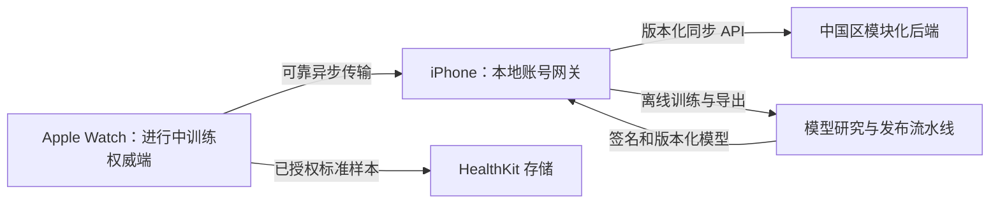

# 研究报告：技术研究

**日期：**2026-07-19
**作者：**HP
**研究类型：**技术研究

---

## 研究概述

本研究评估 FitnessAI 能否利用 Apple Watch 数据推断力量训练的逐组实际 RPE，同时避免新增的操作多于它所减少的操作。研究明确区分三个经常被混为一谈的问题：RPE 是否是有用的训练构念、腕部心率是否会随用力程度变化，以及心率是否包含足够信息来恢复某个人某一组的 RPE。证据支持前两点，但尚不能证明第三点是一项可靠、通用的产品能力。

因此，建议采用由证据 Gate 控制的多模态系统：将 Apple 处理后的心率、腕部运动、组结构、重量/次数、恢复情境、动作身份和已确认个人历史输入小型端侧模型。模型只提出建议而不直接写入 RPE，通过拒绝估算体现不确定性，并且绝不替代用户确认的事实。完整综合结论、决策框架、路线图和来源局限见下文 **研究综合：从心率信号到可信的逐组 RPE 辅助**。

## 技术研究范围确认

**研究主题：**力量训练中基于心率估算 RPE

**研究目标：**判断仅使用心率、心率结合 Apple Watch 运动数据，或结合个体历史校准，能否以足够的准确性估算逐组实际 RPE，供 FitnessAI 产品使用。

**技术研究范围：**

- 逐组 RPE、session-RPE、剩余重复次数及相关用力程度标签的构念有效性。
- 抗阻训练中仅使用心率估算的证据与混杂因素。
- 使用 Apple Watch 心率、运动数据、重复节奏、重量和个人历史进行多模态估算。
- 群体模型、个性化校准、冷启动、不确定性和拒绝估算机制。
- 数据可得性、平台集成、验证指标和产品可靠性门槛。
- 当前产品声明，以及将估算值呈现为建议或记录事实所需的证据。

**研究方法：**

- 使用截至 2026-07-19 的当前网络资料并进行严格来源核验。
- 优先使用同行评审系统综述、原始研究、Apple 官方文档和产品一手资料。
- 对关键结论进行多来源核验，明确区分逐组证据与整次训练证据。
- 对不确定、间接、小样本或缺少外部验证的发现标注置信度。

**范围确认日期：**2026-07-19

## 技术栈分析

### 编程语言与平台运行时

正式应用应在 watchOS 与 iOS 上统一使用 **Swift 和 SwiftUI**。手表端负责训练会话控制、传感器采集、训练组切分、轻量特征计算，以及满足接受条件的逐组推理；iPhone 端负责较重的复算、历史、分析、模型管理和用户纠错审计。实时推理不能依赖 iPhone 当前可达。

离线研究和模型训练应使用 **Python**。NumPy、Pandas 和 SciPy 用于清洗、重采样、窗口化和信号特征；scikit-learn 用于防止泄漏的基线与分组验证；XGBoost 用于探索表格数据的离线效果上限；只有在积累足够的带标签时序数据后，才需要引入 PyTorch。

_置信度：高。部署与研究生态已经成熟；生理标签是否有效是另一个独立问题。_

### 传感器采集框架

推荐的 Apple Watch 采集栈是：

- 使用 `HKWorkoutSession + HKLiveWorkoutBuilder` 管理力量训练会话并获取 Apple 处理后的心率样本。Apple 说明训练会话会生成高频心率样本，但没有公开固定采样率或回调 SLA。应用获得的是 BPM 样本，而不是 raw PPG。[Apple：运行训练会话](https://developer.apple.com/documentation/healthkit/running-workout-sessions)
- 使用 `CMMotionManager` 获取原始加速度计、原始陀螺仪或融合后的设备运动信号。MVP 可先以约 50 Hz 加速度计和陀螺仪/设备运动为目标，但必须运行时检查能力并通过真机验证。[Apple：CMMotionManager](https://developer.apple.com/documentation/coremotion/cmmotionmanager)
- `CMBatchedSensorManager` 是可选的特定硬件高频批量路径，不应成为 MVP 依赖。Apple 对支持的 Watch 在活动训练期间公开了 800 Hz 加速度和 200 Hz 设备运动，但它们以批次交付，并非通用的低延迟流。[WWDC23：Core Motion 更新](https://developer.apple.com/videos/play/wwdc2023/10179/)

腕部 PPG 准确性取决于活动。系统综述发现，抗阻训练中的平均心率误差大于休息或跑台运动，新研究仍显示误差会随动作和运动伪影变化。因此，心率覆盖率和质量必须成为模型输入与拒绝估算条件，不能作为隐藏假设。[Bent 等，系统综述](https://pubmed.ncbi.nlm.nih.gov/32552580/)

_置信度：API 可用性为高；不同动作和 Watch 型号下逐组心率完整性为中。_

### 开发框架与机器学习库

推荐按刻意简化的顺序推进：

1. **工程特征表格基线：**每个已完成训练组一行；使用 scikit-learn 的 ElasticNet/Huber、随机森林或直方图梯度提升。
2. **离线效果上限与不确定性实验：**使用 XGBoost 的均值/中位数与分位数回归。XGBoost 适合研究，但当前直接转换 Core ML 必须单独设门，因为公开转换器兼容性落后于当前 XGBoost 版本。
3. **多模态时序模型：**只有积累足够用户确认标签后，才使用 PyTorch 训练固定形状的轻量 1D-CNN 或 TCN，输入 HR/IMU 窗口，并拼接训练组上下文与个人历史。
4. **Core ML 部署：**通过 coremltools 转换受支持的 PyTorch 图，或者在工程特征 MVP 中直接使用 Create ML `MLRegressor`。Apple 目前仍将 traced PyTorch 转换路径描述为更稳定的路线。[Apple：PyTorch 转换流程](https://apple.github.io/coremltools/docs-guides/source/convert-pytorch-workflow.html)、[Apple：MLRegressor](https://developer.apple.com/documentation/createml/mlregressor)

模型应输出点估计与不确定区间或经过校准的接受分数。分位数回归或 conformal 校准可以支持拒绝估算，但阈值必须在留出的用户和后续训练会话上选择，不能在随机窗口上选择。评估必须按用户和训练会话分组，避免重叠样本同时出现在训练集和测试集。[scikit-learn：GroupKFold](https://scikit-learn.org/stable/modules/generated/sklearn.model_selection.GroupKFold.html)

_置信度：工具可行性为高；在获得力量训练标签之前无法选择最佳模型类型。_

### 个性化与模型更新

风险最低的个人模型不是在手表上训练完整模型，而是从以下组合开始：

- 全局模型；
- 只根据用户确认 RPE 学习的个人偏置和斜率；
- 可选的小型残差模型，在 iPhone 上更新后同步给 Watch。

Core ML 支持设备端模型更新，但生产支持取决于模型格式与可更新层。更稳妥的 MVP 是 Watch 推理、iPhone 完成校准，再把带版本的参数返回 Watch。模型预测绝不能成为自身的训练标签。[Apple：模型个性化](https://developer.apple.com/documentation/coreml/model-personalization)

_置信度：偏置/残差个性化为高；直接在 watchOS 上更新模型需要通过设备门禁，置信度为中。_

### 数据库与存储技术

采用三个相互分离的数据层：

1. **HealthKit：**保存经过用户授权的标准 Workout 与心率样本。HealthKit effort 类型表示整次训练的 effort，不是 FitnessAI 的逐组 RPE。
2. **应用本地结构化存储：**使用 SwiftData（低版本部署时使用 Core Data）保存训练会话、动作、实际训练组、预测 RPE、不确定性、模型版本、用户确认 RPE 和纠错历史。
3. **不可变本地传感器块：**使用追加式二进制文件保存原始或细粒度 HR/IMU 时序，并携带校验和、实测采样元数据、schema 版本、设备/系统信息和单调时钟锚点。

预测值与确认值必须分开保存。用户纠错形成可审计的真实值，不能擦除用于验证和未来模型改进的原始预测。

_置信度：高。_

### 设备通信与同步

按照载荷用途使用 Watch Connectivity：

- `sendMessage` 仅用于双方当前可达、且不关键的实时交互；
- `transferUserInfo` 用于排队的摘要和状态；
- `transferFile` 用于后台可靠交付不可变传感器块；
- `updateApplicationContext` 用于可覆盖的最新状态，例如当前训练计划。

可靠传输可以排队，但没有实时延迟保证。Watch 应保留每个数据块，直到 iPhone 验证校验和并确认接收。[Apple：使用 Watch Connectivity 传输数据](https://developer.apple.com/documentation/watchconnectivity/transferring-data-with-watch-connectivity)

_置信度：高。_

### 云基础设施与隐私

MVP 应当采用**本地优先、账号同步**。每个训练事件必须先在 Watch/iPhone 上可靠落盘，再进行网络上传；这样即使手机不在身边或网络中断，训练记录仍然可靠。本地提交成功后，FitnessAI 将账号范围内的训练计划、结构化训练历史、训练组记录、用户确认的 RPE、分析所需数据以及压缩个人模型摘要同步到中国区应用后端。用户在另一台受支持设备登录后，可以恢复这些记录并继续使用 App。

这项要求与 Apple 的 iCloud/CloudKit 是两回事。包含个人健康信息的容器不得使用 CloudKit/iCloud 同步，因为 Apple App Review Guideline 5.1.3(ii) 规定 App 不得把个人健康信息存入 iCloud。因此，FitnessAI 的跨设备体验需要使用自有且合规的账号与同步服务；这并不意味着可以不加区分地上传数据。Apple 还要求明确披露从设备收集的具体健康数据，并限制 HealthKit 来源数据只能用于健康/健身目的，不能用于广告或无关的数据挖掘。[Apple App Review Guidelines 5.1.3](https://developer.apple.com/app-store/review/guidelines/) [Apple HealthKit：保护用户隐私](https://developer.apple.com/documentation/healthkit/protecting-user-privacy)

默认云同步应遵循数据最小化原则：上传历史记录、趋势、计划调整和跨设备连续性所必需的结构化数据；按照当前产品决策，完整的高频 HR/IMU 原始流仍只保存在本地。未来如果要上传原始传感器流，必须作为独立、明确选择加入的研究或诊断路径，并单独设计保存期限和同意流程。心率以及与用户关联的 RPE 数据应按敏感个人信息处理，需要明确目的、适用时取得单独同意、加密、控制保存期限、支持删除/导出，并采用中国区数据路径。[《中华人民共和国个人信息保护法》](https://www.cac.gov.cn/2021-08/20/c_1631050028355286.htm)

_置信度：本地优先/跨设备产品需求及 Apple 的 iCloud 限制为高；最终后端、同意与数据驻留实现仍需在上线时进行法律和 App Review 复核。_

### 技术采用与实现方向

实际采用顺序为：

- **阶段 A：**采集用户确认的逐组 RPE，同时保存 HR/IMU 质量元数据；建立简单逐组基线和分组验证。
- **阶段 B：**部署小型 Core ML 回归器，只有质量和校准不确定性通过阈值时才提供建议 RPE。
- **阶段 C：**在 iPhone 上加入个人偏置/残差校准。
- **阶段 D：**只有轻量多模态时序网络在按用户和会话留出评估中明显优于简单模型时，才采用它。

该技术栈能够支持自动估算，但它并不能证明 HR 包含足够的信息来推算抗阻训练的逐组 RPE。这个有效性问题仍是后续步骤的首要研究风险。

## 集成模式分析

### 集成拓扑与事实来源边界

推荐拓扑为：**Apple Watch 本地记录器 → iPhone 可靠网关 → FitnessAI 中国区账号云端**。

- Apple Watch 是进行中训练会话的唯一写入方，负责传感器采集、组检测、可用的 RPE 推理，并在通信前先将事件写入本地。
- iPhone 负责镜像控制与展示、接收 Watch 的可靠传输、维护更完整的应用本地数据库、执行较重的个性化计算，以及同步账号云端。
- FitnessAI 后端负责在受支持设备间恢复结构化记录，并分发兼容的模型清单；它不参与实时训练闭环。
- HealthKit 是 Apple 生态中标准 Workout 和已授权健康样本的投影层，不是 FitnessAI 训练计划、实际训练组、逐组 RPE、纠错或原始 IMU 的事实来源。

该拓扑保证手机、蓝牙链路、账号服务或网络不可用时仍能记录训练，同时避免双端同时编辑造成歧义：进行中由 Watch 拥有训练会话，训练完成后 iPhone 成为主要编辑界面。[Apple：运行训练会话](https://developer.apple.com/documentation/healthkit/running-workout-sessions) [Apple：HealthKit 框架说明](https://developer.apple.com/documentation/healthkit/about-the-healthkit-framework)

_置信度：高。_

### API 设计模式

MVP 采用版本化的 **HTTPS JSON REST 同步 API**，不使用 GraphQL、gRPC，也不建设逐组在线推理 API。该负载的核心是离线变更复制和新设备恢复，而不是任意图查询或低延迟服务间 RPC。

推荐契约：

- `POST /v1/sync/push`：批量提交已经在本地落盘的 Outbox 操作；
- `GET /v1/sync/pull?cursor=<opaque>`：返回服务器游标之后的变更和删除 tombstone；
- `GET /v1/sync/snapshot`：在新设备上恢复一致性账号快照及其后续游标；
- `GET /v1/models/manifest`：启用远程模型发布后，返回兼容的模型/schema 版本和带签名的下载元数据。

每个变更至少包含 `operationId`、`entityId`、`entityType`、`mutationType`、`baseRevision`、`payloadSchemaVersion`、`deviceId`、`capturedAt` 和 body hash。服务器返回已确认操作 ID、分配的 revision、冲突/拒绝项、服务器时间和下一不透明游标。对 `(accountId, operationId)` 建唯一约束，使重试安全；同一 ID 对应不同 body hash 时必须拒绝。HTTP `PUT` 或条件更新可使用 `ETag` 与 `If-Match`；RFC 9110 定义了幂等方法和条件请求语义。错误统一使用 RFC 9457 的 `application/problem+json`。[IETF RFC 9110：HTTP Semantics](https://datatracker.ietf.org/doc/html/rfc9110) [IETF RFC 9457：Problem Details for HTTP APIs](https://datatracker.ietf.org/doc/html/rfc9457)

服务器游标必须由服务器生成且不透明。设备时间戳可用于用户历史和诊断，但不能决定同步完整性，因为设备时钟可能漂移。

_置信度：模式为高；端点名称仍属于实现选择。_

### Watch–iPhone 通信协议

HealthKit workout-session mirroring 与 Watch Connectivity 承担不同职责：

- **HealthKit mirroring：**训练生命周期、控制状态和少量实时摘要。镜像开始时可以在后台唤起 iPhone App，但 iOS 挂起期间远端数据回调可能相隔数分钟，因此它不是硬实时数据面。
- **`sendMessage` / `sendMessageData`：**仅在另一端可达时用于即时但非关键的控制或 UI 查询。
- **`updateApplicationContext`：**用于可覆盖的最新状态快照，例如当前训练计划 revision；后发送内容会覆盖管道中尚未交付的旧内容。
- **`transferUserInfo`：**用于排队的小型不可变事件、清单和完成通知。
- **`transferFile`：**用于后台异步传输不可变传感器块和较大诊断文件；系统可能因性能和功耗限制传输速度。

应用不得持续向 iPhone 流式发送 50–100 Hz IMU。Watch 应先本地落盘，再排队传输，并一直保留载荷，直到 iPhone 验证 `chunkId + checksum`；只有收到应用层确认后才删除。每次传输都携带 `workoutId`、`sessionEpoch`、`eventId/chunkId`、`sequenceNumber`、`schemaVersion` 和 checksum，确保重复交付不会重复计算训练组。[Apple：构建多设备训练 App](https://developer.apple.com/documentation/healthkit/building-a-multidevice-workout-app) [Apple：远端训练数据交付](https://developer.apple.com/documentation/healthkit/hkworkoutsessiondelegate/workoutsession(_:didreceivedatafromremoteworkoutsession:)) [Apple：使用 Watch Connectivity 传输数据](https://developer.apple.com/documentation/watchconnectivity/transferring-data-with-watch-connectivity) [Apple：`transferFile`](https://developer.apple.com/documentation/watchconnectivity/wcsession/transferfile(_:metadata:))

_置信度：高。_

### 数据格式、时间与 Schema 兼容

- 结构化云端操作和 RFC 9457 错误使用 JSON。
- 小型 Watch Connectivity 载荷使用 property-list 兼容字典。
- 完整高频传感器数据使用不可变分块二进制文件，带版本化 header、实测采样率、设备/系统标识、压缩/加密元数据和校验和；按照当前决策，这些文件仍只保存在本地。
- 云端同步的 RPE 输入使用最小化的组级派生特征，而不是完整原始流，例如 HR 相对基线变化、峰值、恢复斜率、覆盖率/质量标志、次数、节奏、动作/重量上下文和缺失掩码。
- 每个预测和个人校准摘要绑定 `featureSchemaVersion`、`baseModelVersion` 和 `personalizationVersion`；不兼容摘要为审计目的保留，但不得静默复用。

Core Motion 时间戳是设备启动后的单调时间，不是墙上时钟日期。训练开始时保存 `(UTC Date, monotonic timestamp)` 锚点；每个事件保留 `capturedAtUTC`、`monotonicOffset`，并可选保存 `receivedAtUTC` 用于传输诊断；重传不得改变采集时间。[Apple：`CMLogItem.timestamp`](https://developer.apple.com/documentation/coremotion/cmlogitem/timestamp)

_置信度：高。_

### 跨设备同步与冲突解决

Watch 和 iPhone 均使用本地事务性 Outbox：领域事件与待同步记录原子提交，后台任务持续重试直到确认。不假设传输层 exactly-once；业务处理必须幂等。

冲突规则按领域定义：

- 已完成的实际训练组是不可变事件；修改动作、次数、重量或 RPE 时创建纠错 revision；
- `userConfirmedRPE` 始终高于模型预测，新模型不得覆盖用户确认的真实值；
- 预测值保留 `modelVersion`、区间/置信度、特征版本和拒绝原因；
- 进行中的训练会话由 Watch 持有写租约；iPhone 可以发幂等命令，但不得创建相互竞争的组编辑；
- 训练计划编辑采用乐观 revision 检查；同一字段发生并发人工编辑时，保留为可见冲突，不进行平均；
- 删除创建 tombstone，避免离线设备把旧数据重新同步回来；账号删除采用独立的不可逆清除流程；
- 分析结果是可重建的派生数据，真正权威的是同步的源事件，而不是缓存图表。

FitnessAI 写入的 HealthKit 对象应使用稳定同步元数据和 anchored query 避免重复导入，但不得将 HealthKit 当作云端恢复来源。如果用户在 Apple Health 中删除 Workout，FitnessAI 不应静默重新创建；应用记录可以变为 `healthKitDetached`，并清晰询问是否同时删除 FitnessAI 副本。[Apple：`HKMetadataKeySyncIdentifier`](https://developer.apple.com/documentation/healthkit/hkmetadatakeysyncidentifier) [Apple：`HKAnchoredObjectQuery`](https://developer.apple.com/documentation/healthkit/hkanchoredobjectquery)

_置信度：应用冲突规则为高；HealthKit 删除 UX 需要产品验证。_

### 模型发布与个性化集成

RPE 预测继续在端侧完成，MVP 不需要在线推理 API。

- App 内置一个最后验证通过的 Core ML 基线模型。
- MVP 只在 iPhone 更新轻量个人 offset/slope 或 residual head，再通过 Watch Connectivity 把兼容参数传给 Watch。
- 后续如果启用远程模型发布，iPhone 先获取 manifest，验证 schema、最低 OS、模型 hash/签名和兼容性，再下载、编译并运行 golden inputs；全部通过后才能原子切换。
- 每份个人参数必须引用其基础模型；不兼容的个性化参数必须明确重置或迁移。
- 激活失败时继续使用内置或上一个已验证模型；记录不含健康载荷的 `modelActivated` 与 `modelRollback` 事件。

Apple 说明可以在设备端编译 Core ML 模型，并建议在合适时下载模型。Apple 托管的 Managed Background Assets 不支持 watchOS，因此风险最低的 Watch 路径是 iPhone 下载后通过 Watch Connectivity 传输，或者随 App 版本内置模型。[Apple：缩减 Core ML App 大小](https://developer.apple.com/documentation/coreml/reducing-the-size-of-your-core-ml-app) [Apple：`MLModel`](https://developer.apple.com/documentation/coreml/mlmodel) [Apple：Apple 托管 Background Assets 的平台可用性](https://developer.apple.com/documentation/backgroundassets/downloading-apple-hosted-asset-packs)

_置信度：内置基线和 iPhone 中转发布为高；具体 Watch 模型传输限制需真机测试。_

### 事件驱动与服务集成

事件驱动适用于本地和 API 边界，但 MVP 没有理由引入分布式事件平台。后端采用模块化单体、一个事务性账号数据库、操作日志、后台任务和内部 Outbox 即可。Kafka/RabbitMQ、service mesh、Saga 编排和多个独立部署微服务只会增加故障面，无法改善 Watch 实时闭环。

如果未来规模需要拆分，`setCompleted`、`rpeConfirmed`、`planCorrected`、`modelActivated` 和 `accountDeletionRequested` 等领域事件可以进入分析或模型训练流水线。健康载荷不得进入通用日志、崩溃遥测、推送通知正文或无关第三方分析。这是基于小团队 MVP 范围作出的架构推断，不是外部平台要求。

_置信度：MVP 为高；应在测得规模和团队增长后重新评估。_

### 集成安全与账号生命周期

- 任何基于浏览器的原生登录流程都采用 Authorization Code + PKCE；原生 App 属于 public client，不得嵌入 client secret。refresh 凭证只存 iPhone Keychain，access token 短期有效并轮换/撤销 refresh token；Watch 不保存云端 refresh token。[IETF RFC 8252：原生 App 的 OAuth 2.0](https://datatracker.ietf.org/doc/html/rfc8252) [IETF RFC 9700：OAuth 2.0 Security Best Current Practice](https://datatracker.ietf.org/doc/html/rfc9700) [Apple：将密钥存入 Keychain](https://developer.apple.com/documentation/security/storing-keys-in-the-keychain)
- 传输使用 TLS，数据库/对象存储静态加密，实施按账号授权过滤、最小权限、密钥轮换、加密备份和审计记录。App Attest 可以帮助服务器判断敏感或付费端点的请求是否来自真实 App 实例，但它只是滥用风险信号，不是身份系统。[Apple：验证 App 完整性](https://developer.apple.com/documentation/devicecheck/establishing-your-app-s-integrity)
- 云同步需要明确披露并在 App Privacy 中申报 Health/Fitness 数据；个人健康信息不得存入 iCloud/CloudKit。只要 App 支持创建账号，就必须在 App 内提供账号删除，并撤销所有设备会话。[Apple App Review Guidelines 5.1.1 与 5.1.3](https://developer.apple.com/app-store/review/guidelines/) [Apple App Privacy Details](https://developer.apple.com/app-store/app-privacy-details/)
- 中国区后端需要实施敏感个人信息同意、目的限制、保存期限、访问/导出/更正/删除，以及适用时的影响评估和受托处理方控制。[《中华人民共和国个人信息保护法》](https://www.cac.gov.cn/2021-08/20/c_1631050028355286.htm)

账号登录应明确解释为用于同步和恢复。本地记录在退出登录或离线时仍应降级可用；跨设备恢复则必然需要身份认证。

_置信度：平台要求为高；法律实现需在上线前由专业人士复核。_

### 跨集成评估与研究缺口

这些集成模式共同强化了一条产品不变量：**关键训练链路终止于 Watch 本地提交**。手机与云端集成提升控制、恢复、分析和个性化能力，但绝不能决定某一组训练是否被记录。

剩余集成 Gate 均需要实测：

1. 真实力量训练中的镜像重连行为和回调延迟；
2. 代表性数据块下 Watch Connectivity 的队列延迟、重复交付和存储压力；
3. 本地提交、iPhone 确认和云端确认之间发生崩溃/重启时的恢复；
4. 新设备先恢复 snapshot，再通过 cursor 增量同步；
5. 针对纠错、计划编辑、tombstone 和模型版本变化的确定性冲突测试；
6. 对准确云端字段清单和账号删除流程进行隐私/App Review 验证。

_总体置信度：推荐拓扑和协议分工为高；最终支持设备矩阵上的延迟、功耗和生命周期行为在实测前为中。_

## 架构模式与设计

### 系统架构模式

FitnessAI 应采用具有五个明确运行边界的**端侧优先配套架构**：

1. **Watch 运行时：**训练状态机、传感器适配器、组/次数分割、本地日志、Core ML 推理、不确定性门控和安静的 Watch UI。
2. **iPhone 配套端：**完整训练计划/历史 UI、本地结构化数据库、同步引擎、分析投影、个人校准和模型兼容性检查。
3. **HealthKit 适配器：**只用于已授权的标准 Workout/心率交换，不拥有 FitnessAI 领域状态。
4. **应用后端：**账号、同步、结构化恢复、最小派生特征存储和模型清单发布。
5. **离线模型流水线：**数据集整理、分组评估、模型转换、签名和发布审批；与生产请求处理隔离。

后端首先采用**模块化单体**：Identity、Training、Sync、Analytics、Model Registry、Consent 和 Account Lifecycle 等模块位于同一个可部署服务和事务数据库中。当前没有理由使用微服务；官方架构资料也指出微服务会增加服务发现、分布式一致性、事务、测试和运维成本。[Microsoft：微服务架构权衡](https://learn.microsoft.com/en-us/azure/architecture/microservices/) [Microsoft：微服务适用性评估](https://learn.microsoft.com/en-us/azure/architecture/guide/technology-choices/microservices-assessment)

采用**选择性追加式领域历史**，而不是完整 Event Sourcing。实际训练组创建、用户纠错、RPE 确认和删除需要可审计历史；普通个人资料、动作库、同意和配置数据使用传统事务 CRUD。完整 Event Sourcing 会约束 schema 演进并引入投影/回放复杂度，其模式指南也指出这类成本通常不适合 MVP。[Microsoft：Event Sourcing 模式与权衡](https://learn.microsoft.com/en-us/azure/architecture/patterns/event-sourcing)

_置信度：高。_

### 设计原则与最佳实践

Apple 客户端应围绕纯领域核心采用**端口与适配器边界**，不能让 UI、HealthKit、Core Motion、持久化、通信和 Core ML 回调直接修改状态。

推荐模块：

- `TrainingDomain`：训练会话、训练计划、实际训练组、纠错、RPE 和不变量规则；
- `WorkoutRuntime`：确定性训练状态机和命令处理；
- `SensorPipeline`：时钟对齐、缓冲、分割、特征提取和质量评估；
- `RPEInference`：模型接口、不确定性/拒绝、校准和模型版本兼容；
- `LocalPersistence`：SwiftData/Core Data repository、不可变数据块和事务性 Outbox；
- `DeviceBridge`：HealthKit mirroring 和 Watch Connectivity 适配器；
- `AccountSync`：仅 iPhone 端的云同步和冲突解决；
- `Analytics`：可重建的周/月投影；
- 平台 UI target 只观察领域状态，不承载记录事实。

在外部边界使用 Swift protocol 并注入实现，使传感器、时钟、存储、网络、HealthKit 和模型行为可以被确定性测试替身替换。Apple 明确建议使用依赖注入和面向协议的抽象，以解耦平台或外部状态并支持测试。[Apple：向 Xcode 项目添加测试](https://developer.apple.com/documentation/xcode/adding-tests-to-your-xcode-project) [Apple：调整现有代码以支持单元测试](https://developer.apple.com/documentation/xcode/updating-your-existing-codebase-to-accommodate-unit-tests)

并发所有权必须明确：

- 一个 actor 拥有进行中的训练会话状态；
- 每个本地 model context 由一个 writer/actor 拥有；
- 传感器回调只入队带时间戳输入，不直接修改 UI 状态；
- 同步只读取已提交事件，不能跨 actor 共享可变模型对象。

SwiftData 提供 model actor 和串行 executor，以隔离方式访问存储。[Apple：SwiftData 并发支持](https://developer.apple.com/documentation/swiftdata/concurrencysupport)

本地优先权威、CloudKit 禁止、原始数据留存、Watch 所有权、同步协议、模型发布和拒绝估算等重要选择，都应分别形成简短 Architecture Decision Record，记录上下文、决策、后果和取代历史。[AWS：架构决策记录流程](https://docs.aws.amazon.com/prescriptive-guidance/latest/architectural-decision-records/adr-process.html)

_置信度：高。_

### 可扩展性与性能模式

首要扩展手段是**在分发前减少数据**：

- 在本地处理 50–100 Hz 运动数据和不规则 HR；
- 内存中只保留有界 ring buffer，并增量刷入不可变数据块；
- 每个检测/确认训练组结束或休息时只运行一次 RPE 推理，而不是对每个样本持续推理；
- 同步组级记录和最小派生特征，不同步原始流；
- 批量执行云端 push/pull，并使用 cursor 增量恢复；
- 常用周/月分析通过本地或服务器投影计算，并可从源记录重建。

之所以必须这样设计，是因为活跃训练会话虽然可以在后台运行，但 Apple 警告后台 CPU 使用过高会导致 watchOS 暂停 App。计划性后台任务也受预算限制并可能被节流，因此正确性不能依赖未来某次后台唤醒。[Apple：运行训练会话](https://developer.apple.com/documentation/healthkit/running-workout-sessions) [Apple：watchOS 后台任务](https://developer.apple.com/documentation/watchkit/using-background-tasks)

后端采用无状态 API 层、一个事务型关系数据库、负责分析/模型清单任务的后台 worker；只有明确获批的大型产物才进入对象存储。只有实测负载需要时才横向扩展 API；读副本、表分区或独立分析存储也必须由查询测量推动。完整 CQRS 拆分过早：官方资料指出 CQRS 可以优化不对称读写扩展，但会增加同步和最终一致性复杂度。首版在同一数据库中区分 command handler 与 read DTO 即可。[Microsoft：CQRS 模式](https://learn.microsoft.com/en-us/azure/architecture/patterns/cqrs)

远端故障采用有上限的指数退避、jitter 和 `Retry-After`；持续失败时打开 circuit，让本地事件继续等待。Circuit Breaker 只包围云端依赖，绝不能阻止本地记录。[Microsoft：瞬时故障处理](https://learn.microsoft.com/en-us/azure/well-architected/design-guides/handle-transient-faults) [Microsoft：Circuit Breaker 模式](https://learn.microsoft.com/en-us/azure/architecture/patterns/circuit-breaker)

性能验收必须在目标真机上测量：训练 CPU、内存峰值、每小时能耗、传感器覆盖率、数据块写入延迟、组结束推理延迟和 Watch Connectivity 积压。Apple 建议采用“测量—修改—观察”的性能改进循环，并通过 Xcode Organizer/Instruments 查看响应、存储、内存和能耗指标。[Apple：提升 App 性能](https://developer.apple.com/documentation/xcode/improving-your-app-s-performance/) [Apple：Watch Connectivity 要求真机测试](https://developer.apple.com/documentation/watchconnectivity/transferring-data-with-watch-connectivity)

_置信度：模式为高；量化预算仍需 Gate 实测。_

### 集成与通信模式

使用异步边界隔离故障：

- Watch 领域命令产生已经在本地提交的事件；
- Watch Connectivity 将事件复制到 iPhone，但不转移进行中训练的所有权；
- iPhone 同步把已经提交的操作复制到后端；
- 分析和模型校准在关键链路之后消费已确认的本地/云端记录；
- HealthKit 导出是幂等副作用，不属于证明 FitnessAI 训练组已经保存的事务。

由此形成三个独立确认级别：`watchCommitted`、`phoneReceived` 和 `cloudAcknowledged`。UI 可以显示同步状态，但只要 `watchCommitted` 完成，该训练组就被视为已经记录。每个边界都采用 at-least-once 传输加幂等处理，不尝试跨设备或云端分布式事务。

进行中训练应建模为明确状态机：`idle → preparing → active/resting → ending → locallyFinalized → phoneReplicated → cloudReplicated`，并包含进程终止和连接丢失后的恢复迁移。记录状态与同步状态保持正交，云端错误不能让训练倒退到不安全状态。

_置信度：高。_

### 安全架构模式

信任边界包括 Watch App 容器、iPhone App 容器、HealthKit、设备间传输、公共 API 边缘、后端服务/数据库、模型产物存储和第三方处理方。任何边界都不能仅因网络位置获得隐式信任；NIST Zero Trust 指南强调围绕身份、资产和资源进行授权，而不是依赖可信网络边界。[NIST SP 800-207：Zero Trust Architecture](https://csrc.nist.gov/pubs/sp/800/207/final)

必需架构控制：

- 只申请最小 HealthKit 数据类型，并提供明确用途说明；
- 敏感本地数据库/文件位于 App 容器并使用 Apple Data Protection；需要在手腕放下或设备锁定后继续写入的传感器文件使用 `completeUnlessOpen`；
- 账号 refresh 凭证和加密密钥存入 Keychain，并使用符合设备角色且不跨设备同步的可访问性；
- 使用 TLS、token 范围内账号授权、按账号过滤、静态加密、KMS 密钥轮换、加密备份和可审计管理员访问；
- 服务端验证每一个账号与实体的关系，绝不信任客户端传来的 `accountId`；
- App Attest 仅作为敏感端点的风险信号，对不支持或重装设备提供恢复路径，不做永久封禁；
- APNs、通用日志、崩溃报告、分析 SDK 和模型下载遥测中不得出现健康载荷；
- HealthKit 来源数据、云同步和未来研究上传分别维护同意与处理方清单。

Apple 说明 `completeUnlessOpen` 会在文件关闭后加密，同时允许已打开文件在锁定后继续使用。OWASP MASVS 覆盖移动端存储、密码学、身份认证、网络、平台、代码、抗逆向和隐私控制，可作为客户端安全验证基线。[Apple：文件保护 `completeUnlessOpen`](https://developer.apple.com/documentation/foundation/urlfileprotection/completeunlessopen) [OWASP MASVS](https://mas.owasp.org/MASVS/)

_置信度：高；上线配置需要威胁建模和渗透测试。_

### 数据架构模式

明确分离四类数据形态：

1. **业务当前状态：**规范化的 Session、Plan、Exercise、Set、RPE、同意和账号实体，用于普通产品读写。
2. **选择性不可变历史：**训练组创建、RPE 预测、RPE 确认/纠错、计划对账和删除记录，携带操作者、来源、revision、模型/schema 版本和时间戳。
3. **派生投影：**周/月容量、强度、时长、身体部位分布、主练动作趋势和同步状态；这些数据可丢弃并重建。
4. **本地传感器产物：**分块 HR/IMU 时序与质量元数据，默认排除在云同步之外。

预测、用户事实和计划目标必须使用不同字段/实体，不能只使用一个 `rpe` 列：

- `targetRPE` 属于训练计划；
- `predictedRPE` 加区间/质量/模型版本属于模型观察；
- `userConfirmedRPE` 属于用户明确确认；
- `effectiveActualRPE` 是保留来源信息的读取投影。

动作/重量也遵循相同规则：计划值、检测值和用户确认的实际训练组值都保留来源。这能保持可审计性，并防止模型更新重写历史。

云备份策略跟随数据分类：

- 恢复结构化计划、历史、确认值、同意状态、同步元数据和兼容的压缩个性化摘要；
- 完整原始流默认只保存在本地；
- 本地数据块、云端业务记录、不可变审计历史、备份和模型开发数据集分别设置明确保存/删除周期；
- 账号删除创建可验证完成的删除任务，覆盖主数据、派生投影、对象产物、活跃 token 和备份到期策略。

_置信度：高。_

### 部署与运维架构

使用一个 Xcode workspace，包含独立 iOS/watchOS App target，并通过共享 Swift package 承载纯领域、schema、特征提取和模型契约。平台适配器留在各自 target，避免不支持的 API 泄漏到共享领域。

发布单元相互独立但保持兼容：

- App Store bundle：iOS/watchOS 二进制和已验证基线模型；
- 后端：版本化 API 和中国区环境中的向后兼容数据库迁移；
- 模型：签名 manifest、特征 schema、转换工具版本、golden inputs/outputs、受支持 App/OS/设备范围和 rollback 指针；
- 同意/隐私配置：与收集字段和处理方绑定的版本化政策标识。

部署规则：

- 数据库使用 expand/migrate/contract 变更；旧 App 版本在明确支持窗口内必须继续同步；
- 先部署后端兼容能力，再发布依赖它的客户端；
- 模型先暗发布，验证兼容性和 shadow 指标后再逐步激活；
- feature flag 必须有安全本地默认值，flag 服务不可用时绝不能禁用记录或纠错；
- 保留内置/最后可用模型回滚，以及服务端 manifest 撤销；
- 生产遥测只包含计数、延迟、错误类别、设备/OS 家族、schema/模型版本和队列深度，不包含原始健康值或训练详情。

测试遵循金字塔：大量确定性领域/状态机/schema 测试，较少持久化/通信/API 集成测试，UI 用户旅程测试，以及强制的真实 Watch+iPhone 可靠性与性能训练。Apple 建议组合大量隔离单元测试、较少集成和 UI 测试；Watch Connectivity 文档明确要求配对真机测试。[Apple：测试策略](https://developer.apple.com/documentation/xcode/testing) [Apple：使用 Watch Connectivity 传输数据](https://developer.apple.com/documentation/watchconnectivity/transferring-data-with-watch-connectivity)

运维就绪还包括恢复演练、重复/乱序/重试故障注入、云端中断测试、schema 回滚测试、账号清除验证和设备存储压力测试。云端可用性只影响同步新鲜度，不影响训练可用性。

_置信度：高。_

### 架构决策摘要

| 领域 | MVP 采用 | 明确推迟或拒绝 | 主要后果 |
|---|---|---|---|
| 客户端拓扑 | Watch 权威端 + iPhone 网关 | 依赖手机/云端的实时记录 | 离线训练可靠 |
| 后端 | 模块化单体 + 单事务数据库 | 微服务/service mesh | 降低运维与一致性成本 |
| 历史 | 选择性不可变训练事件 | 全系统 Event Sourcing | 保留审计而无需回放整个产品 |
| 读取 | 同系统内可重建分析投影 | 独立 CQRS 读取数据库 | 一致性和部署更简单 |
| 推理 | 端侧 Core ML + 拒绝估算 | 在线逐组推理 | 低延迟和隐私；模型大小受限 |
| 个性化 | iPhone 轻量校准 | Watch 完整模型训练 | 降低电量和兼容风险 |
| 同步 | 本地 Outbox + 幂等 cursor 复制 | 分布式事务/exactly-once 假设 | 云端最终一致，重试不丢数据 |
| 原始传感器 | 本地不可变数据块 | 默认原始数据上云 | 降低隐私与云成本；原始数据无法跨设备恢复 |
| 运维 | 版本化 App/API/schema/模型契约 | 无版本协调发布 | 兼容工作增加，发布更安全 |

### 架构验证 Gate

在架构可以视为实现就绪前，测试必须证明：

1. 没有手机和云端时，Watch 进程中断后进行中的训练组仍能恢复；
2. 重复、延迟、乱序和丢失传输后，三个确认级别都能恢复；
3. 模型升级和跨设备恢复后，用户纠错仍是权威事实；
4. 存储压力和留存策略不会删除尚未确认的数据；
5. 性能满足实测 Watch CPU、内存、能耗和推理预算；
6. 云端/API/模型回滚后仍能使用内置基线；
7. 账号导出/删除和 HealthKit 脱离按照用户选择的范围工作；
8. 生产遥测不包含敏感健康载荷。

_总体置信度：架构形态为高；在真机、同步恢复、安全和合规 Gate 通过前为中。_

## 实现方式与技术采用

### 技术采用策略

系统应通过**证据 Gate** 逐步采用，而不是一次性构建完整产品。每个 Gate 都必须产出可复用产物和停止/转向决策：

1. **设备能力 Gate：**最小 watchOS 记录器在计划使用的 Apple Watch/iPhone 组合上证明活跃训练期间 HR/IMU 访问、时间戳对齐、本地数据块可靠性、后台行为、功耗和 Watch→iPhone 恢复。
2. **数据集 Gate：**版本化逐组 schema 和标注 UI 采集动作、重量、次数、目标 RPE、用户确认的实际 RPE、HR/IMU 质量、设备/OS 和训练上下文，避免预测结果污染标签。
3. **科学有效性 Gate：**比较仅 HR、仅运动/上下文、HR+IMU、HR+IMU+动作/重量/次数，以及加入个人历史的模型与简单产品基线。如果 HR 在用户留出评估中没有稳定增益，就应从 RPE 估算器移除，而不是为了产品叙事而保留。
4. **部署 Gate：**将胜出的简单模型转换为 Core ML，在真实 Watch 上验证数值一致性、延迟、内存、能耗、体积、缺失输入、不确定性和拒绝估算。
5. **记录产品 Gate：**在已经验证的采集基础上构建安静的计划/自由训练记录、第一组纠错、建议和不可变实际训练组对账。
6. **连续性 Gate：**只有本地可靠性得到证明后，才加入账号同步、新设备恢复、冲突处理、导出/删除和隐私控制。
7. **公测/发布 Gate：**TestFlight 真实训练、App Review/隐私就绪、设备兼容矩阵、运维回滚，以及公开模型/特征限制。

该顺序把最昂贵的 UI/云端工作推迟到核心生理和设备假设通过验证之后。Apple 要求活跃训练会话申请 HealthKit 授权，并警告后台 CPU 过高可能导致 App 被暂停，因此能力与功耗证据必须早于产品承诺。[Apple：运行训练会话](https://developer.apple.com/documentation/healthkit/running-workout-sessions)

_置信度：高。_

### 开发工作流与工具

维护一个版本控制的产品仓库，并追踪四类产物：

- Xcode workspace：iOS App、watchOS App、共享 Swift package、测试计划、entitlement、privacy manifest 和基线 Core ML 产物；
- Python 研究空间：固定版本的数据处理/训练/导出依赖、可复现实验配置和分组评估脚本；
- 后端/基础设施：版本化 API schema、migration、部署配置、保存/删除任务和恢复流程；
- 证据注册表：数据集版本、特征 schema、model card、转换环境、golden inputs/outputs、真机测量、审批和 rollback 目标。

每个模型产物都记录源代码 commit、数据集 snapshot/hash、预处理版本、特征顺序/单位、缺失值策略、训练划分、按用户/动作/设备指标、Core ML 转换版本、最低 OS、文件 hash 和发布状态。没有用户明确确认时，自动预测不得作为训练真值复用。

采用短反馈循环：

- 每次修改运行本地 Swift 单元/schema 测试和 Python 实验 smoke test；
- 合入前运行所有受影响 target 测试；
- 项目稳定后，使用 Xcode Cloud 定时执行多配置构建/测试；
- 使用带明确测试说明的 TestFlight 分组进行受控真机现场测试。

Xcode Cloud 集成构建、并行测试、TestFlight 和 App Store Connect；它能够补充但不能替代配对真机上的传感器与通信测试。[Apple：Xcode Cloud](https://developer.apple.com/xcode-cloud/) [Apple：TestFlight 概览](https://developer.apple.com/help/app-store-connect/test-a-beta-version/testflight-overview/)

重要选择使用 Architecture Decision Record，并通过新记录取代旧记录，而不是改写已接受记录。模型/特征 schema 变化按公共 API 变化管理：评审兼容、迁移、发布和回滚。

_置信度：高。_

### 测试与质量保证

测试组合分层如下：

1. **领域/单元：**训练状态机、训练组纠错、RPE 来源、冲突规则、tombstone、体积预算和模型兼容。
2. **传感器回放：**使用确定性 HR/IMU 固件覆盖缺样、时钟跳变、方向变化、运动噪声、不完整组和 App 重启。
3. **持久化/恢复：**在领域提交、Outbox 创建、数据块关闭、手机确认、云端确认和清理之间的每个边界注入崩溃。
4. **ML 有效性：**按用户和会话分组划分；预处理/特征选择仅在 fold 内执行；与目标/上一组/历史基线比较；报告按用户/动作/设备指标、校准和 risk–coverage。分组交叉验证确保同一用户/组不会同时进入训练与测试。[scikit-learn：GroupKFold](https://scikit-learn.org/stable/modules/generated/sklearn.model_selection.GroupKFold.html) [scikit-learn：常见数据泄漏问题](https://scikit-learn.org/stable/common_pitfalls.html)
5. **转换一致性：**正常、缺失、边界和分布外 golden inputs 比较 Python 与 Core ML 的点预测、区间和拒绝决策。Apple 当前将 `torch.jit.trace` 描述为稳定且性能更好的 PyTorch 转换路径，并要求明确输入 shape。[Core ML Tools：PyTorch 转换流程](https://apple.github.io/coremltools/docs-guides/source/convert-pytorch-workflow.html) [Core ML Tools：模型输入输出](https://apple.github.io/coremltools/docs-guides/source/model-input-and-output-types.html)
6. **真机集成：**真实训练后台运行、落腕、session mirroring、Watch Connectivity 延迟/重复、电量、热状态、存储压力，以及重装/重新配对。Apple 明确要求 Watch Connectivity 示例使用真实 iPhone/Watch。[Apple：使用 Watch Connectivity 传输数据](https://developer.apple.com/documentation/watchconnectivity/transferring-data-with-watch-connectivity)
7. **旅程/UI：**计划训练、自由训练、第一组纠错、器械不可用、拒绝建议、会话恢复、周复盘、退出/离线和新设备恢复。
8. **安全/隐私：**OWASP MASVS 客户端检查、API 对象级授权、token 撤销、敏感日志扫描、同意版本、导出/删除、备份到期和 App Privacy 字段清单。[OWASP MASVS](https://mas.owasp.org/MASVS/)

模型不能只因总体相关系数较高而通过。批准要求用户留出误差分布、校准不确定性、拒绝后的足够覆盖、相对简单基线的提升，以及可接受的用户纠错频率。

_置信度：高。_

### 部署与运维实践

运行三个相互兼容的发布轨道：

- **App 发布：**签名 iOS/watchOS 构建，包含基线模型、受支持旧版本 schema reader、本地安全默认值和 migration 测试；
- **后端发布：**向后兼容同步 API 和 expand/migrate/contract 数据库变化，在依赖它的客户端之前部署；
- **模型发布：**不可变签名模型和 manifest、schema、转换环境、golden 结果、兼容范围、分阶段激活和 rollback 指针。

Watch 不在进行中训练里直接下载未验证模型。iPhone 验证并暂存模型产物；只在训练之外且兼容检查通过后激活。下载、编译或激活失败时，内置的最后可用模型仍可使用。

运维遥测仅含元数据：App/OS/设备家族、schema/模型版本、计数、延迟桶、队列深度、错误类别、传感器覆盖率、拒绝数量和 rollback 事件。通用可观测系统不得记录原始 HR、RPE 数值、动作、重量、用户备注、token 或请求正文。

为同步中断、损坏数据块、模型回归、凭证泄漏、撤回同意和账号删除建立故障流程。App Store 提交要求准确申报 Health/Fitness 数据和第三方 SDK；支持 App 内创建账号就必须支持 App 内删除账号。[Apple：App Privacy Details](https://developer.apple.com/app-store/app-privacy-details/) [Apple：在 App 内提供账号删除](https://developer.apple.com/support/offering-account-deletion-in-your-app/)

使用 NIST SSDF 作为安全开发检查表：保护软件、生成安全发布、响应残余漏洞，并保存代码/模型依赖来源。[NIST SP 800-218 SSDF](https://csrc.nist.gov/pubs/sp/800/218/final)

_置信度：高。_

### 团队组织与技能

对于 AI 辅助的单人开发者，限制因素是上下文切换而不是并行人数。应按纵向证据切片工作，并且一次只保持一个主要工程 Gate：

- watchOS/HealthKit/Core Motion 和真机调试；
- Swift concurrency、持久化、确定性状态机和 Watch Connectivity；
- 时序/按受试者分组的 ML 评估和 Core ML 转换；
- REST/SQL 同步、账号安全、备份和数据清除；
- App Store 隐私/审核和中国个人信息合规。

公开上线前需要专业复核隐私/法律数据映射、渗透测试/API 授权，以及任何健康性能宣传。运动科学专业人士可帮助评审 RPE 标注协议和何种提升具有实际意义。

AI 生成代码可以加速脚手架和测试，但验收证据必须来自编译器/测试、版本化实验、真实设备和经过评审的数据契约；AI 不能代替参与者、标签或 App Review/法律验证。

_置信度：高。_

### 成本优化与资源管理

最低成本路径与架构一致：

- 购买能够运行受支持 Xcode 的 Mac 后，优先利用现有 iPhone/Apple Watch；
- 推理和个人校准留在本地，不为逐组在线推理付费；
- 内置一个小基线模型和一个紧凑识别模型，不为每个动作分别打包模型；
- 原始 HR/IMU 留在本地，只同步结构化记录/最小派生特征；
- 从模块化单体、一个事务数据库和一个中国区部署开始，不建设微服务/多区域；
- 避免敏感第三方分析 SDK 和不必要处理方；
- 大型动作媒体不进入 Watch，获得适当授权的媒体可由 iPhone/应用内容存储提供；
- 按明确价值和同意归档/到期研究产物，而不是无限保存所有原始采集。

体积预算已成为产品需求：用户可接受的 iPhone App Thinning 设备变体安装上限为 500 MB，而 watchOS 平台未压缩硬上限为 75 MB。FitnessAI 的 Watch 安装目标为 25 MB、Watch Core ML 总产物不超过 6 MB、逐组 RPE 模型不超过 2 MB。Apple 建议通过 App Thinning 报告测量发布变体，而不是查看调试归档；同时支持 FP16 和 1–8 bit 模型压缩，但必须验证准确率。[Apple：最大构建体积](https://developer.apple.com/help/app-store-connect/reference/app-uploads/maximum-build-file-sizes/) [Apple：缩减 App 体积](https://developer.apple.com/documentation/xcode/reducing-your-app-s-size) [Apple：缩减 Core ML App 体积](https://developer.apple.com/documentation/coreml/reducing-the-size-of-your-core-ml-app)

_置信度：高；准确云端和硬件成本需要在选定供应商后获取当前报价。_

### 风险评估与缓解

| 风险 | 早期证据 | 缓解/停止规则 |
|---|---|---|
| HR 缺少稳定逐组 RPE 信息 | HR-only 无法击败简单基线，或在留出用户上无增益 | 不上线 HR 推理；改用上下文/个人确认 |
| 力量训练时腕部 HR 缺失 | 低覆盖集中在特定动作/握法 | 质量 mask、恢复特征、拒绝估算和动作支持矩阵 |
| 主观 RPE 标签噪声 | 重复标签一致性低、个人偏置明显 | 简洁教学、确认时机、个人校准、鲁棒损失；预测绝不当标签 |
| 数据泄漏夸大性能 | 随机划分远高于用户/会话留出 | 分组/时间划分和 fold 内预处理作为发布硬要求 |
| Watch CPU/电量/存储不可接受 | 暂停、能耗回归、积压或数据块未关闭 | 降低采样/特征/模型工作量；非关键工作移至休息/iPhone；本地正确性不变 |
| Core ML 转换改变行为 | golden 一致性或缺失输入测试失败 | 固定导出环境、支持算子/shape、简化模型、阻止发布 |
| 动作识别和 RPE 错误叠加 | 错动作造成高置信错误 RPE | 传播识别不确定性、第一组纠错、保留训练组事实、拒绝估算 |
| 同步重复/覆盖事实 | 故障注入产生重复训练组或丢纠错 | 不可变 ID、Outbox、revision、tombstone、确定性合并和恢复测试 |
| 健康/隐私审核阻止上线 | 字段、处理方、同意、删除或 iCloud 用途不清 | 从首个 schema 建数据清单；自有中国后端；不用 CloudKit 健康存储；预审 |
| 范围膨胀拖延可行性 | 传感器/模型证据前扩张 UI/云端 | Gate 顺序；推迟新手 AI 和非必要分析打磨 |
| App/模型/媒体体积增长 | Watch 产物接近内部预算 | CI App Thinning 报告、按产物预算、共享模型、媒体不上 Watch、例外评审 |

## 技术研究建议

### 实施路线图

**阶段 0——开发基础**

- 获取/配置 Mac、Xcode、签名、真实 iPhone/Watch 配对、代码仓库、固定 Swift/Python 环境和双语决策/证据文档；
- 定义最低 OS/候选设备和隐私安全日志规则。

**阶段 1——Watch 能力记录器**

- `HKWorkoutSession`/`HKLiveWorkoutBuilder`、Core Motion、时钟锚点、本地结构化事件和数据块；
- 训练开始/结束、后台/落腕、崩溃恢复、电量/存储测量；
- Watch→iPhone 带校验和与确认的可靠文件/事件复制。

**阶段 2——标注可行性数据集**

- 实现组边界/次数采集和最小组后 RPE 确认 UI；
- 冻结 schema，采集代表动作、重量、节奏、握法、训练位置和恢复窗口；
- 保存信号质量和缺失原因，而不仅是成功样本。

**阶段 3——离线有效性与消融**

- 基线规则、线性/鲁棒回归、树模型；只有确有价值时才加入轻量时序模型；
- 比较 HR-only、运动/上下文-only、组合和个人历史；
- 冷启动用户留出和已校准用户的时间向前评估；
- 不确定性、拒绝、子组/设备/动作报告和产品停止/转向决策。

**阶段 4——端侧建议原型**

- Core ML 转换、golden 一致性、真机延迟/能耗/体积 Gate；
- 只提供带来源和置信/拒绝的建议 RPE；
- 用户确认 RPE 始终权威，只更新轻量个人校准。

**阶段 5——MVP 记录旅程**

- 计划/自由训练、自动识别、第一组纠错、重量/RPE、下一组建议、替代动作、历史和必要分析；
- 通过真实训练验证安静交互和纠错频率。

**阶段 6——账号连续性与上线**

- 本地优先的中国区同步、新设备恢复、导出/删除、隐私/同意、模型 manifest 和回滚；
- TestFlight 设备/训练者矩阵、App Review 说明/demo 路径，以及公开兼容性与限制。

### 技术栈建议

| 层 | MVP 推荐技术栈 | 仅在证据需要时采用 |
|---|---|---|
| Apple 客户端 | Swift、SwiftUI、HealthKit、Core Motion、Watch Connectivity | 已验证型号上的高频 batched sensor |
| 本地数据 | SwiftData/Core Data 元数据 + 受保护不可变二进制块 + Outbox | 专用时序存储 |
| ML 研究 | Python、NumPy/Pandas/SciPy、scikit-learn；XGBoost 作离线上限 | PyTorch 1D-CNN/TCN |
| 部署 | Create ML/Core ML；固定 coremltools 转换；内置基线 | 远程签名模型发布和可更新 head |
| 后端 | 版本化 HTTPS JSON REST、模块化单体、关系 SQL、后台任务 | 实测需要后的独立分析存储/微服务 |
| 身份/安全 | 原生 OAuth/PKCE 兼容账号流程、Keychain、App Attest 风险信号 | 更多社交登录方 |
| CI/公测 | Swift Testing/XCTest、Python 测试、Xcode 体积/性能报告、Xcode Cloud/TestFlight | 更宽自动化设备矩阵 |

### 技能发展要求

优先学习顺序：

1. watchOS 训练生命周期、HealthKit 授权、Core Motion 时间、Instruments 和真机诊断；
2. Swift concurrency/actor、SwiftData/Core Data 恢复、文件保护和 Watch Connectivity 生命周期；
3. 可穿戴时序预处理、分组/时间验证、标签可靠性、不确定性和拒绝估算；
4. Core ML 转换、输入/schema、数值一致性、profiling、压缩和回滚；
5. 本地优先同步、OAuth/token 生命周期、SQL migration、对象级授权和删除；
6. Apple 隐私/审核要求和中国敏感个人信息治理。

### 成功指标与 KPI

**数据完整性**

- 在既定崩溃/重复/乱序/离线故障套件中，实际训练组零丢失、零重复；
- 所有未确认数据块在重启和存储清理后仍保留；
- 用户纠错在恢复和模型升级后仍保留来源。

**信号可行性**

- 按动作统计 HR/IMU 覆盖与质量、时钟对齐误差、组/次数捕获率和缺失原因；
- 按设备统计真实训练的能耗、CPU、内存、数据块积压和本地写入延迟。

**模型有效性**

- 每用户中位/最差分位 MAE/RMSE，以及误差在 ±0.5/±1.0/±1.5 RPE 内的比例；
- 相比目标 RPE、上一组和个人历史基线的提升及其置信区间；
- 区间覆盖/宽度和 risk–coverage；
- 按动作/设备的冷启动与个性化性能；
- 拒绝覆盖和已接受预测误差；
- Python/Core ML 一致性、延迟、能耗、体积和回滚成功。

**产品质量**

- 无操作记录的训练组比例、每次训练提示/纠错次数、第一组纠错成功、记录完整度和用户拒绝建议比例；
- 离线使用和新设备恢复后的周复盘/历史可用性。

**隐私与运维**

- 不含敏感载荷的同步新鲜度/错误/积压；
- 导出/删除完成及范围验证；
- 零未批准处理方/字段，日志和通知无健康内容；
- Watch App/模型和 iPhone App Thinning 变体保持在已批准体积预算内。

RPE 功能只有在可接受纠错/拒绝负担下，相对简单基线提供稳定的留出增益，才能从实验进入产品。在测得标签可靠性和用户价值前，不假设通用 RPE 准确率阈值；发布阈值应在 pilot 后预注册，而不是看过测试结果后再挑选。

---

## 研究综合：从心率信号到可信的逐组 RPE 辅助

### 执行摘要

FitnessAI 在技术上可以采集信号、在 Apple Watch 上运行小型模型、离线保存训练，并在设备之间同步已确认记录。未解决的是科学问题而不是计算问题：**仅凭心率无法唯一确定抗阻训练的逐组 RPE**。RPE 会受到相对个人能力的负重、剩余次数、动作与参与肌群、节奏、休息时长、累积疲劳、疼痛、温度、水合、兴奋剂、压力和用户对量表理解的影响。心率只响应其中一部分状态，腕部 PPG 质量还会随运动与动作变化。研究证明 RPE 与生理强度存在有意义的关系，但高度异质且依赖训练协议，不能把 BPM 到 RPE 的映射视为通用公式。[聚合效度 Meta 分析](https://pubmed.ncbi.nlm.nih.gov/35000021/)、[训练量分配研究](https://pubmed.ncbi.nlm.nih.gov/24378665/)

如果重新定义问题，产品机会仍然很强。一个**多模态、个性化、感知不确定性的助手**可以把心率作为运动数据、动作、次数、重量、休息、前序组和已确认历史之外的一项特征。输出应当是下一组指导建议或候选 RPE，而不是无提示地覆盖训练记录。低置信度时应拒绝估算；用户确认的 RPE 始终是权威事实。心率必须在按参与者留出的消融实验中，相比目标 RPE、上一组 RPE 和个人动作历史等简单基线证明自身价值。

建议的决策是：**继续建设数据和产品基础设施，但对 RPE 模型设置 Gate**。先实现可靠记录、组切分、纠错、本地优先持久化和同步，再开展带标签 pilot，对比 HR-only、context-only、HR+IMU+context 和个性化版本。只有模型在预注册条件下提供稳定增益，且提示与纠错负担可接受，才将推理升级为用户功能。这既能保留“接近零操作”的产品承诺，又不会作出当前证据无法支撑的声明。

**关键技术发现**

- Apple Watch 通过 HealthKit、Core Motion、Swift 和 Core ML 提供可行的采集与推理平台；活跃训练会话会产生较频繁的心率样本，而运动数据才是组/次数识别的更丰富信号。[Apple HealthKit 训练会话](https://developer.apple.com/documentation/healthkit/hkworkoutsession)、[Apple 健康与健身技术](https://developer.apple.com/health-fitness/)
- Apple Watch 心率测量整体可用，但取决于活动。近期抗阻训练验证结果令人鼓舞，但一致性并非完美，而且并未验证 RPE 推断。[2026 年智能手表验证](https://pubmed.ncbi.nlm.nih.gov/42076635/)、[可穿戴设备验证研究](https://pubmed.ncbi.nlm.nih.gov/32374274/)
- 目标必须是**逐组 RPE**，而不是 session-RPE。标签应在每组后立即用同一稳定量表采集，不能被心率区间、热量或整次训练用力程度静默替代。
- 小型特征模型或轻量时序模型符合 Watch 预算。真正约束是数据集质量、参与者泄漏、校准、能耗和用户信任，而不是模型文件体积。
- 无论模型是否准确，都必须实现本地优先的不可变训练事件、幂等同步和用户确认事实。

**技术建议**

1. 不发布 HR-only 自动记录 RPE；它仅作为基线和可选特征。
2. 从特征工程全局模型加轻量个人校准开始；只有 pilot 证明额外价值后才考虑 1D-CNN/TCN。
3. 在查看最终测试结果前，预注册按参与者留出的评估、消融、置信区间、分组报告和停止条件。
4. 推理与训练持久状态留在 Watch；iPhone 负责校准、模型管理、历史和账号同步。
5. 将纠错负担、拒绝覆盖率和数据完整性视为与 MAE 同等重要的发布指标。

### 目录

1. 技术研究引言与方法
2. 技术格局与架构分析
3. 实现方式与最佳实践
4. 技术栈演进与当前趋势
5. 集成与互操作模式
6. 性能与可扩展性分析
7. 安全与合规考虑
8. 战略技术建议
9. 实施路线图与风险评估
10. 未来技术展望与创新机会
11. 技术研究方法与来源核验
12. 技术附录与参考资料

### 1. 技术研究引言与方法

#### 技术研究意义

力量训练是一个难以进行生理推断的环境。两组训练可能产生相似的心率轨迹，但肌肉接近力竭的程度显著不同；两名用户也可能对相似的外部功报告不同 RPE。因此，系统必须区分“相关”与“可恢复”：一个变量可能在群体层面与用力程度相关，却不包含足够信息来推断某个人某一组的 RPE。

这一差别具有直接商业意义。一个经常需要纠正的候选 RPE，会在 FitnessAI 承诺安静自动化的地方增加打断；把错误值当作事实，则会污染渐进负重建议、分析与用户信任。相反，一个诚实且知道何时不预测的助手，可以在保留完整、可检查记录的同时减少操作。

_技术重要性：_可行性边界决定传感器选择、数据采集、模型架构、验证设计和产品措辞。

_业务影响：_正确边界可以避免过早作出近似医疗级确定性的声明，保护训练数据质量，并把 MVP 精力集中在即使 RPE 推断失败仍然有价值的自动记录上。

#### 技术研究方法

- **技术范围：**构念有效性；HR 与腕部 PPG 局限；多模态建模；个性化；watchOS/iOS 采集；本地优先数据；同步；安全；部署和发布 Gate。
- **来源：**同行评审系统综述和原始研究、Apple 一手文档、标准组织和官方安全指南。
- **分析框架：**分别评估科学有效性、设备可行性、模型有效性、产品效用和运维完整性；明确标注间接证据。
- **时间范围：**资料复核至 2026-07-19，包含当前平台限制和近期收录研究。
- **技术深度：**架构与实现建议是具体的；预测准确性仍是假设，必须通过 FitnessAI 数据集验证。

#### 技术研究目标与结果

最初目标是判断 HR-only、HR 加 Watch 运动数据或个人历史校准，能否以足够准确性估算逐组实际 RPE 供产品使用。最终答案是有条件的：

- **HR-only：**技术上可以建模，但证据不足以支持自动写入逐组 RPE。
- **HR 加 IMU 与情境：**最值得测试的群体模型候选方案。
- **个人历史：**很可能是校准、减轻冷启动和动作特异性解释的必要条件。
- **产品使用：**只有在按人员和会话留出的数据上击败简单基线，且交互负担可容忍时，才适合作为置信度门控建议。

### 2. 技术格局与架构分析

#### 当前技术架构模式

建议架构是 Apple 双端客户端加中国区应用后端：

- **Apple Watch：**训练中权威端、传感器采集、组切分、即时持久事件提交、轻量推理和极少提示。
- **iPhone：**持久同步网关、纠错/历史 UI、分析、个人校准、模型目录和恢复协调。
- **后端：**账号身份、加密结构化训练同步、计划/历史恢复、模型清单和运维元数据；不参与实时训练控制闭环。
- **HealthKit：**在用户授权后投影训练与健康样本的生态层；不是 FitnessAI 训练组或 RPE 的事实来源。

MVP 采用模块化单体和一个事务型关系数据库。实际训练组、纠错、RPE 来源与同步使用选择性事件历史；模板、偏好和展示数据使用普通 CRUD。完整 Event Sourcing、Kafka、微服务和专用时序数据库会增加复杂度，却不能解决当前的有效性风险。

#### 系统设计原则与最佳实践

- **本地优先：**只有在本地持久提交后才确认一组完成。
- **用户事实优先于模型事实：**分别保留 `targetRPE`、`predictedRPE`、`userConfirmedRPE` 和 `effectiveActualRPE`。
- **幂等：**稳定事件 ID 与单调 revision 使重试安全。
- **不确定性转化为行为：**低置信度通过拒绝估算改变 UX，而不只是隐藏的分数。
- **优雅降级：**HR、iPhone、网络、账号后端或模型更新不可用时，记录仍继续。
- **数据最小化：**高频原始 HR/IMU 默认留在本地；只在需要时同步结构化事实和紧凑校准状态。

### 3. 实现方式与最佳实践

#### 当前实现方法

实现应由 Gate 驱动，而不是由功能清单驱动。首先通过设备 spike 证明连续训练生命周期、真机信号可用性、时间戳、能耗、持久化和 Watch Connectivity 行为。随后通过数据 pilot 证明标签可靠性和信号覆盖率，再选择生产模型。

ML 工作流必须在原始数据不可变后，才构造规范的训练组样本。窗口和特征属于派生物，必须携带数据集、代码、特征和标签版本。训练/验证/测试按参与者分组并按时间排序，避免重叠窗口或未来个人历史泄漏进评估。scikit-learn 明确警告，先预处理再划分会造成泄漏，`GroupKFold` 可提供互不重叠的分组折。[scikit-learn 常见陷阱](https://scikit-learn.org/stable/common_pitfalls.html)、[GroupKFold](https://scikit-learn.org/stable/modules/generated/sklearn.model_selection.GroupKFold.html)

#### 实现框架与工具

- **客户端：**Swift、SwiftUI、HealthKit、Core Motion、Watch Connectivity、Swift concurrency、SwiftData/Core Data、文件保护和 Keychain。
- **研究：**Python、NumPy、Pandas、SciPy、scikit-learn；XGBoost 作为离线效果上限；只有时序模型被证明确有必要时才使用 PyTorch。
- **部署：**Core ML、固定版本 coremltools 和黄金向量一致性测试。Apple 文档覆盖 PyTorch 转换与低精度、palettization 等模型压缩路径。[Core ML PyTorch 工作流](https://apple.github.io/coremltools/docs-guides/source/convert-pytorch-workflow.html)、[Core ML 模型瘦身](https://developer.apple.com/documentation/coreml/reducing-the-size-of-your-core-ml-app)
- **后端：**版本化 HTTPS JSON REST、兼容 OAuth/PKCE 的原生账号流程、关系型 SQL、后台任务、对象级授权、导出和删除。
- **质量：**XCTest/Swift Testing、传感器回放、故障注入、模型评估、转换一致性、真机性能分析、TestFlight 和分阶段回滚。

### 4. 技术栈演进与当前趋势

#### 当前技术栈格局

Apple 当前健康与健身技术栈正在增强双端训练体验和更丰富的运动采集，同时保留用户授权与平台隐私控制。HealthKit 训练会话可调整传感器采集并提供较频繁的 HR 样本，Core Motion 则提供适合动作切分的运动数据。Core ML 使紧凑型本地推理无需逐组网络延迟或推理费用。[HealthKit 更新](https://developer.apple.com/documentation/updates/healthkit)、[Apple 健康与健身](https://developer.apple.com/health-fitness/)

合适的采用方式应当保守：MVP 使用稳定公开 API 和常见设备能力；高频批量传感器、远程模型下发和端侧直接训练都作为可选 capability Gate。除非实测产品价值足以补偿兼容性损失，否则不能把新款 Watch 功能变成隐藏最低要求。

#### 技术采用模式

FitnessAI 应按三个模型层级演进：

1. 确定性规则与个人历史基线；
2. 具有校准不确定性的紧凑型特征工程多模态回归器；
3. 只有当留出增益超过能耗、维护和可解释性成本时，才使用轻量时序模型。

这一顺序可防止深度模型掩盖标签和数据划分缺陷，也能保持 Watch 模型预算很小：当前内部目标是全部 Core ML 资源不超过 6 MB，其中 RPE 组件约 2 MB。Apple 当前对 watchOS 未压缩构建的限制为 75 MB，因此产品预算有意远低于平台上限。[Apple 最大构建文件体积](https://developer.apple.com/help/app-store-connect/reference/app-uploads/maximum-build-file-sizes/)

### 5. 集成与互操作模式

#### 当前集成方式

Watch 到手机的通信应按载荷语义选择通道：

- 可达时的交互命令可用 `sendMessage`；
- 可替换当前状态可用 `updateApplicationContext`；
- 持久小事件使用带 ID 和确认的排队后台传输；
- 较大的不可变传感器数据块使用文件传输，并在确认前保持可重试。

Watch Connectivity 是机会式传输，不是持久存储；Watch Outbox 才是恢复边界。Apple 文档说明 application context 会替换待处理 context，user-info 会排队，文件传输则是异步的。[Apple Watch Connectivity](https://developer.apple.com/documentation/watchconnectivity/transferring-data-with-watch-connectivity)

后端接收带 schema 版本、账号/设备/会话 ID、事件 ID、revision、时间戳和内容哈希的幂等批次。API 错误保持一致的机器可读语义；原生客户端身份验证采用带 PKCE 的授权码流程，与当前 OAuth 安全指南一致。[RFC 8252](https://datatracker.ietf.org/doc/html/rfc8252)、[RFC 9700](https://datatracker.ietf.org/doc/html/rfc9700)

#### 互操作标准与协议

使用 UTC 时刻加本地单调时间排列采集会话内事件，不能仅靠墙上时钟对齐传感器。领域事件、模型输入 schema、特征代码、标签规则和校准参数应独立版本化。未知可选字段应被容忍；不兼容的必需变更必须显式迁移或拒绝加载模型。

HealthKit 镜像训练消息可增强双端 UI，但在手机挂起时可能延迟，不能成为唯一持久化路径。FitnessAI 自有记录持久化后，再向 HealthKit 写入授权后的摘要/投影。[Apple 多设备训练](https://developer.apple.com/documentation/healthkit/building-a-multidevice-workout-app)

### 6. 性能与可扩展性分析

#### 性能特征与优化

在目标 Watch 和代表性动作上完成实现前，不存在可辩护的准确率或延迟基准。因此，发布流程必须测量：

- 按动作/设备统计传感器覆盖与缺口；
- 从组结束到建议出现的延迟；
- 本地提交与推理 p50/p95；
- 完整训练的 CPU、峰值内存、能耗、热状态和存储增长；
- Python 到 Core ML 数值一致性；
- 模型和 App Thinning 变体体积。

特征计算应增量且有界。原始数据块顺序写入，UI 读取摘要而不是扫描信号。FP16 或 8-bit 压缩只有通过一致性和留出准确率检查后才接受。Apple 建议使用 App Thinning 报告、TestFlight 或 App Store Connect 测量发布体积，而不是调试归档。[Apple 减小 App 体积](https://developer.apple.com/documentation/xcode/reducing-your-app-s-size)

#### 可扩展模式与方式

计算量主要随训练次数扩展，而不是持续后台监控。Watch 端出现背压时，先丢弃或延后派生工作，不能丢原始事实。后端在 MVP 使用幂等批量上传、有界后台任务、按账号/会话建立索引的查询和生命周期策略即可。分析可从结构化训练组重算，不需要集中摄取高频原始信号。

只有出现证据后才拆分服务：当模型发布或分析确实需要独立发布节奏、负载或安全隔离时再抽取。这样可以避免在产品市场与模型有效性尚未建立前，承担分布式系统成本。

### 7. 安全与合规考虑

#### 安全最佳实践与框架

健康与训练数据在传输中和静态存储时都要受保护；访问/刷新凭据保存在 Keychain；采用最小权限和对象级授权；轮换服务器凭据；签名模型 manifest 并验证哈希；日志和通知脱敏；测试重放、重复、跨账号访问、删除和回滚。App Attest 可作为滥用风险信号，但不能成为拒绝合法用户的单点。

安全开发基线应映射到移动端控制的 OWASP MASVS 和交付生命周期的 NIST SSDF。[OWASP MASVS](https://mas.owasp.org/MASVS/)、[NIST SSDF](https://csrc.nist.gov/pubs/sp/800/218/final)

#### 合规与监管考虑

Apple 禁止在 iCloud 存储个人健康信息。因此 FitnessAI 不应使用 CloudKit/iCloud 作为健康数据后端；自有中国区服务必须具备明确同意、目的限制、最小化、保留、导出、删除和处理方治理。HealthKit 授权仍然独立并由用户控制。[Apple App Review Guidelines 5.1.3](https://developer.apple.com/app-store/review/guidelines/)、[Apple HealthKit 隐私](https://developer.apple.com/documentation/healthkit/protecting-user-privacy)

中国《个人信息保护法》将医疗健康信息列为敏感个人信息。最终上线设计需要合格的中国法律审查，尤其是同意、跨境传输、第三方 SDK 和删除。[《个人信息保护法》](https://www.cac.gov.cn/2021-08/20/c_1631050028355286.htm)

产品必须把 RPE 输出描述为训练辅助、披露局限，并避免未经证据与监管工作支持的诊断、伤病康复或医疗声明。

### 8. 战略技术建议

#### 技术战略与决策框架

战略决策是**有条件继续**：

- 无条件推进安静自动记录、第一组纠错、本地优先完整性、历史、分析、备选动作和跨设备恢复。
- 以实验方式推进 RPE 标签、特征采集和基线研究。
- 只有通过科学、设备、产品和隐私 Gate 后，才推进面向用户的 RPE 建议。
- 不推进自动写入最终 RPE、诊断性声明或通用 BPM-to-RPE 表。

候选发布模型必须在留出参与者和后续会话上击败最佳非传感器基线；表现出校准或可用 risk–coverage；保持分组表现；在 HR 缺失时仍可工作；并让提示/纠错负担低于它创造的价值。如果消融实验中 HR 没有稳定增益，就从 RPE 模型移除 HR，即便它仍可用于训练展示和分析。

#### 竞争性技术优势

可防御优势不是更大的模型，而是低操作采集、即时纠错且数据不丢、计划与实际显式分离、个人校准、有用的下一组建议、透明拒绝估算和长期分析组成的闭环。每次确认训练都改善个人校准，同时保留用户对记录的所有权。

### 9. 实施路线图与风险评估

#### 技术实施框架

1. **Gate 0 — 设备能力：**在真机上验证训练生命周期、HR/IMU 采集、时间戳、能耗、Watch 存储、恢复和传输。
2. **Gate 1 — 数据与标签：**定义一种逐组 RPE 协议；采集多样动作/用户；测量标签可重复性和缺失情况。
3. **Gate 2 — 科学有效性：**采用按参与者留出的评估，对比目标、上一组、个人历史、HR-only、context-only、HR+IMU+context 和个性化模型。
4. **Gate 3 — 部署：**转换所选小型模型，证明一致性、延迟、能耗、内存、体积、兼容性和回滚。
5. **Gate 4 — 产品效用：**在真实训练中测试建议时机、拒绝估算、提示负担、纠错、信任和记录完整度。
6. **Gate 5 — 连续性：**验证离线使用、账号同步、新设备恢复、导出、删除和冲突行为。
7. **Gate 6 — Beta/发布：**执行 TestFlight 设备与参与者矩阵、隐私/审核检查、分阶段发布、模型清单监控和回滚演练。

#### 技术风险管理

| 风险 | 后果 | 主要缓解措施 | 停止/转向触发条件 |
|---|---|---|---|
| HR 不能唯一识别逐组 RPE | 虚假置信和频繁纠错 | 多模态消融和个人历史 | 相比情境/历史无稳定留出增益 |
| 腕部 PPG 缺失/噪声 | 特定动作建议错误 | 质量特征、缺失模型、拒绝估算 | 接受预测的误差仍高 |
| 参与者/会话泄漏 | 漂亮但虚假的验证结果 | 按参与者分组、时间划分 | 任一管线不能复现无泄漏结果 |
| 标签不一致 | 模型学习量表噪声 | 组后立即提问、稳定锚点、重复性研究 | 标签可靠性低于预注册 Gate |
| 提示过多 | 违反安静训练承诺 | 不确定性阈值和被动确认 | 净交互负担没有改善 |
| Watch 资源退化 | 会话中断/数据丢失 | 真机预算、有界队列、本地提交优先 | 故障套件丢失或重复实际组 |
| 同步/隐私失败 | 信任与合规伤害 | 最小结构化同步、审计、导出/删除测试 | 存在未解决的严重隐私/安全缺陷 |
| 模型漂移 | 不同人群/设备建议退化 | 版本、监控、回滚、定期复评 | 分组或设备阈值失守 |

### 10. 未来技术展望与创新机会

#### 新兴技术趋势

未来一到两年的实际机会是更好的个人校准、更可靠的动作/组切分和更丰富的置信度特征，而不是通用生理“神谕”。Watch 运动数据访问与端侧 ML 的提升可能降低延迟和能耗，但不会消除有效标签和按人员留出评估的必要性。

未来三到五年，更大的授权数据集可能支持动作族 embedding、分层个人模型、主动学习，以及联邦或隐私保护训练。这些是研究选项，不是 MVP 依赖。五年以上，额外信号或智能器械可能提高可识别性，但产品声明必须跟随外部验证，而不是跟随传感器可用性。

#### 创新与研究机会

- 比较逐组 RPE 与剩余次数标签，判断哪种更适合在 Watch 上稳定采集。
- 学习动作特异的缺失与信号质量模型。
- 探索在相关动作之间共享信息、同时保留用户偏移的分层校准。
- 优化 risk–coverage，使助手只在预期价值高于打断成本时说话。
- 测试用户纠错序列能否比绝对 RPE 准确性更好地预测下一组重量调整。
- 将胸带作为可选研究参考，而不是消费者使用要求。

### 11. 技术研究方法与来源核验

#### 完整技术来源说明

一手来源包括 Apple 关于 HealthKit、Core Motion、Watch Connectivity、Core ML、隐私、审核、体积、TestFlight 和账号删除的开发者文档；PubMed 收录的抗阻训练 RPE 与可穿戴心率有效性研究；HTTP/OAuth 原生客户端行为 RFC；NIST 与 OWASP 安全指南；以及中国 PIPL 官方文本。

代表性检索主题包括：抗阻训练逐组 RPE 与心率；力量训练腕部 PPG 准确性；多模态可穿戴用力程度估算；Apple Watch 训练 HR 与运动 API；Core ML 转换/压缩/watchOS 体积；本地优先同步；OAuth 原生 App；健康数据隐私；以及按参与者分组的 ML 验证。

#### 技术研究质量保证

- **来源核验：**当前平台事实以第一方文档核验；科学声明优先采用系统综述或原始研究记录。
- **交叉验证：**设备测量有效性、构念有效性和产品推断有效性被视为不同证据层。
- **置信度：**平台可行性与架构为高；多模态个性化的效用为中；在 FitnessAI pilot 前，任何数值化 RPE 准确率都为低到中。
- **局限：**现有研究的动作、设备、RPE 量表、提问时机和人群存在异质性。相关性不是个人预测；近期智能手表 HR 验证也不等于逐组 RPE 推断验证。
- **透明性：**报告不虚构通用准确率阈值。Gate 将在标签可靠性与用户价值证据出现后、最终留出评估前预注册。

### 12. 技术附录与参考资料

#### 决策矩阵

| 候选方案 | 当前科学支持 | 产品角色 | MVP 决策 |
|---|---|---|---|
| HR-only RPE | 间接且异质 | 仅基线 | 不自动写入 |
| 情境/历史基线 | 直接可用且可解释 | 回退与对比 | 实现 |
| HR + IMU + 情境 | 合理但需 FitnessAI 验证 | 主要实验模型 | pilot |
| 个性化残差/校准 | 有确认历史后合理 | 改善被接受预测 | 冷启动后阶段 |
| 大型深度模型 | 尚无必要性证据 | 研究上限 | 推迟 |
| 用户确认 RPE | 权威产品事实 | 记录、分析、未来标签 | 必须 |

#### 最小规范训练组 Schema

每组应保留稳定 ID；账号/设备/会话/动作身份；计划与实际重量/次数；组和次数边界；单调与 UTC 时间戳；休息情境；HR/IMU 质量摘要；模型/版本/特征 schema；预测值与区间；接受/拒绝原因；用户确认 RPE；纠错来源和同步 revision。原始传感器数据块作为不可变本地证据，并具有明确生命周期规则。

#### 评估包

报告 MAE/RMSE、误差在 ±0.5/±1.0/±1.5 RPE 内的比例、每用户中位数与最差分位、相对基线的置信区间、校准、区间宽度、risk–coverage、拒绝覆盖、冷启动与个性化结果、动作/设备/分组切片、信号缺失表现和提示/纠错负担。同时发布汇总和参与者级分布，绝不只依赖一个平均相关系数。

#### 核心参考资料

- [抗阻训练 RPE 系统综述与 Meta 分析](https://pubmed.ncbi.nlm.nih.gov/35000021/)
- [抗阻训练工作量分配、HR 与 RPE](https://pubmed.ncbi.nlm.nih.gov/24378665/)
- [耐力与抗阻训练中的智能手表 HR 有效性](https://pubmed.ncbi.nlm.nih.gov/42076635/)
- [Apple HealthKit 训练会话](https://developer.apple.com/documentation/healthkit/hkworkoutsession)
- [Apple Watch Connectivity 传输](https://developer.apple.com/documentation/watchconnectivity/transferring-data-with-watch-connectivity)
- [Apple Core ML 转换与部署](https://apple.github.io/coremltools/docs-guides/source/convert-pytorch-workflow.html)
- [Apple App Review Guidelines](https://developer.apple.com/app-store/review/guidelines/)
- [OWASP MASVS](https://mas.owasp.org/MASVS/)
- [NIST Secure Software Development Framework](https://csrc.nist.gov/pubs/sp/800/218/final)

### 技术研究结论

研究不支持为力量训练组建立通用的心率到 RPE 公式，但支持建设外围能力并测试受约束的多模态个性化助手。FitnessAI 应把可靠自动记录作为无条件 MVP 价值，坚持用户确认 RPE 是事实，并让模型通过留出证据和低交互成本赢得“开口建议”的权利。

立即下一步是真机 Gate 0，随后开展带预注册划分、基线、消融和停止条件的标签 pilot。如果多模态推断失败，该架构仍能交付自动动作/次数/组数记录、历史、分析与计划指导；如果成功，RPE 建议将成为有证据支撑的增强功能，而不是脆弱的产品地基。

---

**技术研究完成日期：**2026-07-19  
**研究周期：**截至 2026-07-19 的当前综合技术分析  
**来源核验：**同行评审研究、官方平台文档、标准和监管一手来源  
**技术置信度：**实现可行性与架构为高；多模态产品潜力为中；HR-only 自动估算逐组 RPE 的证据不足

<!-- 技术研究工作流已完成至第 6 步。 -->
