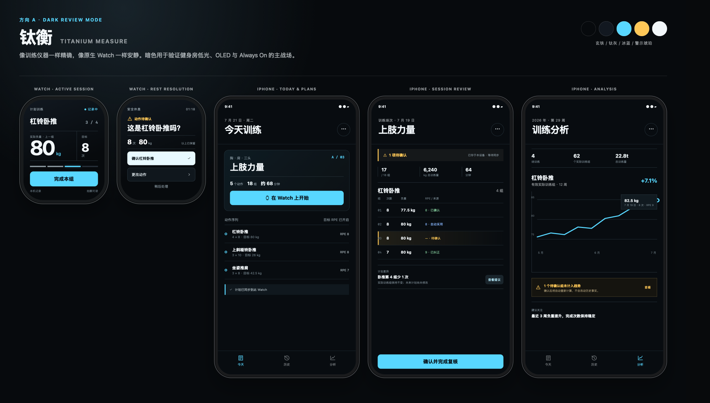
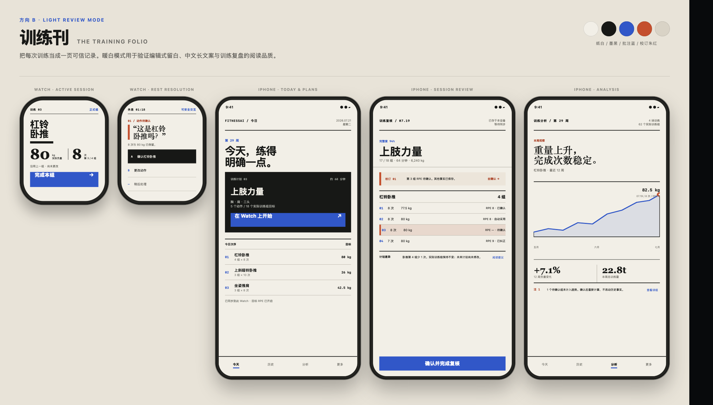
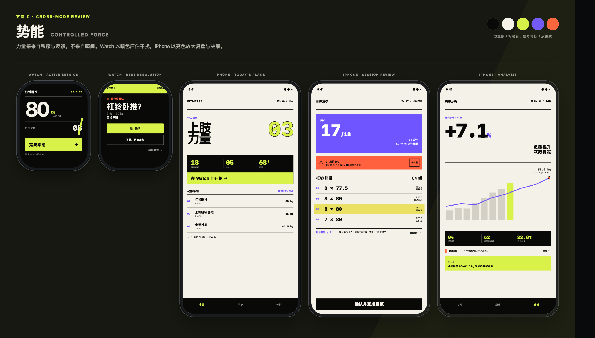

# FitnessAI UI UX Pro Max — Phase 1 Visual Directions

## 1. Status and Scope

This is a direction-selection artifact, not the final visual system and not app implementation. It contains three independent visual directions based on the same confirmed product and experience boundaries. No direction is selected automatically.

This phase does **not** create or modify `design-system/fitnessai/MASTER.md`, final page specifications, SwiftUI production views, Architecture, Epics, or Stories. The HTML/CSS files in `previews/` are static review carriers only. They are not Web implementation guidance; their geometry, type roles, symbols, states, and motion intent are designed to map to SwiftUI.

Existing PRD, Addendum, `EXPERIENCE.md`, `DESIGN.md`, review, validation, and `.working/` files were treated as read-only. The old `DESIGN.md` and `.working/` files were not used as visual templates.

## 2. Confirmed Product Boundaries Applied to All Directions

- Apple Watch is the local-first active Workout Session authority. It must remain useful without iPhone, backend, or network reachability.
- Active-set silence is the default. Proactive correction appears only in `restSafeForInteraction`, withdraws before the next active set, and always offers Later without losing the pending fact.
- Digital Crown is an optional accelerator. Touch and native accessibility-adjustable actions are equivalent, and draft changes do not commit without explicit confirmation.
- External load is planned, historical, previous-set, or user-entered; it is never presented as sensed by Apple Watch.
- Target, predicted, user-confirmed, auto-used, corrected, and effective Actual RPE remain visually and semantically distinct.
- Local durable commit is the saved boundary. Saved locally, phone received, sync pending, synchronized, conflict, and failed are separate states.
- Recognition uncertainty preserves sibling facts. Unknown, pending, unsupported, and manual-only are truthful outcomes, not visual failures to hide.
- iPhone owns complete field correction, split/merge/insert/delete, revision conflicts, long explanations, and recovery coordination.
- Manual Finish is authoritative. Forgotten-Finish remains unavailable until its two-signal physical-device release gate passes.
- State is never conveyed by color alone. Every state combines structure, symbol, wording, and accessibility value.
- Minimum frequent or consequential touch region is 44 × 44 pt with at least 8 pt between adjacent targets. Dense ten-button Watch RPE controls are prohibited.
- Dynamic Type, VoiceOver, Reduce Motion, Increase Contrast, light/dark appearances, and Watch Always On are system-level requirements, not later polish.

## 3. UI UX Pro Max and Platform Synthesis

The Skill was run with three independent `--design-system` searches and explicit `swiftui` stack validation. Supplemental searches covered fitness/wearables, precision instrument styling, editorial grids, controlled kinetic sports styling, Simplified Chinese typography, dark/light fitness palettes, time-series charts, status icons, touch interaction, loading, offline recovery, and accessibility.

Useful database matches were deliberately redesigned:

| Database signal | Adopted judgment | Rejected default |
|---|---|---|
| Fitness/Gym App: vibrant blocks + OLED dark mode | Strong contrast and clear training energy | Generic orange/green fitness semantics |
| Modern Dark + Swiss Modernism | Precision grid, restrained atmosphere, mathematical hierarchy | Cinematic ambient blobs, decorative blur, Web horizontal journeys |
| Editorial Grid / Magazine | Asymmetric composition, direct annotation, typographic evidence | Page-flip effects, long-form Web layout, Traditional Chinese font defaults |
| Kinetic Brutalism | Bold scale, hard sectional rhythm, decisive press feedback | Marquees, parallax, constant motion, haptic on every tap |
| Chinese Simplified + data typography | Native Simplified Chinese system typography and tabular numerals | Bundled Google Fonts or non-native font dependencies |
| Trend-over-time charts | Directly labeled line charts, shape/line-style redundancy, data summary | Color-only series and decorative chart effects |

Current Apple platform guidance was also used to keep Watch interactions glanceable and single-purpose, preserve layout and legibility in Always On, supply appearance-specific and increased-contrast colors, use Dynamic Type, and map icons to SF Symbols. Reference: [Designing for watchOS](https://developer.apple.com/design/human-interface-guidelines/designing-for-watchos/), [Always On](https://developer.apple.com/design/human-interface-guidelines/always-on), [Accessibility](https://developer.apple.com/design/human-interface-guidelines/accessibility/), [Color](https://developer.apple.com/design/human-interface-guidelines/color), [SF Symbols](https://developer.apple.com/design/human-interface-guidelines/sf-symbols), and [Charts](https://developer.apple.com/design/human-interface-guidelines/charts).

## 4. Direction A — Titanium Measure / 钛衡

### 4.1 Core Design Concept

FitnessAI becomes a high-precision training instrument: matte, calm, measurable, and explicit about every boundary. The interface behaves like a calibrated tool rather than a traditional dashboard. Fine rails, aligned readouts, and bounded status fields give facts a place without enclosing every section in a card.

### 4.2 Brand Keywords and Inspiration

- Keywords: calibrated, quiet, technical, trustworthy, durable, exact.
- Inspiration: precision measurement tools, modern industrial controls, Swiss information systems, OLED sports instruments.
- FitnessAI-specific reinterpretation: no faux hardware skeuomorphism, no glowing sci-fi HUD, and no sensor-capability theater.

### 4.3 Light and Dark Color Strategy

- Review appearance: dark, because Apple Watch training, gym low light, OLED behavior, and Always On are the hardest primary conditions.
- Dark foundation: `Instrument Black #070A0D`, `Titanium #121820`, `Primary Text #F2F7FA`, `Action Ice #58D7FF`, `Attention Amber #FFC857`.
- Light partner: `Quartz #F4F7F8`, `Graphite #0B1115`, `Action Deep Cyan #007D9A`, `Attention Ochre #875B00`, with surface separation created mainly by tonal steps and rules.
- Increase Contrast: secondary rails become solid 2 pt rules, muted text rises to primary-adjacent contrast, and state chips receive symbol + label + border changes.

### 4.4 Typography and Training Numerals

- Native `Font` styles only. Chinese resolves through the system Simplified Chinese face; Latin and numbers use San Francisco.
- Watch training figures use `monospacedDigit()` and tabular alignment, with weight as the dominant value and repetitions as a separate subordinate readout.
- Labels are compact and literal; no all-caps Chinese. Technical English appears only in review-board annotations, never in product copy.
- Dynamic Type reflows metric grids into one vertical sequence before any fact is truncated.

### 4.5 Information Density

High but disciplined. Density comes from alignment, narrow state rails, and data rows rather than more containers. The Watch remains one-task-per-screen; iPhone supports dense review without resembling a financial dashboard.

### 4.6 Watch Hierarchy Strategy

1. Current Exercise and set position.
2. User-authoritative Actual Load, then repetitions.
3. Local capture state and progress rail.
4. One primary action.

Rest Resolution replaces the active readout with one uncertainty question, retained facts, the shortest confirmation, Change, and Later. Always On preserves the layout and essential Exercise/load/set context, dims secondary rails, and makes actions visibly unavailable instead of removing them.

### 4.7 iPhone Composition Strategy

- Today & Plans uses a calibrated plan field followed by a vertical Exercise timeline.
- Session Review uses a ledger: session boundary status, metrics, field-aligned Actual Set rows, provenance text, and one plan-diff block.
- Analysis uses a large evidence plot with exact annotation, a dashed pending segment, an exclusion notice, and a decision-oriented interpretation.
- Hairlines and baseline alignment create grouping; raised surfaces are reserved for the current plan, actionable error, or chart detail.

### 4.8 Components and Chart Language

- Components: state rail, instrument readout, source label, bounded warning row, precision set ledger, plan-diff strip, local/sync boundary indicator.
- Charts: line and point marks with direct values, restrained gridlines, solid confirmed segments, dashed pending/excluded segments, and a text summary/data-table alternative.
- Pending, auto-used, confirmed, and corrected values use different label text and line/shape treatment in addition to color.

### 4.9 SF Symbols Strategy

- Outline symbols for toolbar and status context; fill variants only for selected tab or primary emphasis.
- Intended mappings include `applewatch`, `checkmark`, `exclamationmark.triangle`, `arrow.triangle.2.circlepath`, `chart.xyaxis.line`, `clock.arrow.circlepath`, `ellipsis`, and `chevron.right`.
- Symbol weight matches adjacent system text. Enclosed variants are preferred when a small Watch status needs more silhouette.
- SF Symbols never form the app logo or a custom brand mark.

### 4.10 Material, Layering, Motion, and Haptics

- Matte opaque surfaces; blur is reserved for native sheets or modal separation.
- Radius is restrained (approximately 8–14 pt by scale), with no universal pill/card treatment.
- Motion: 160–220 ms crossfade or short edge sweep for committed state changes; no continuous ambient animation and no formal-set celebration.
- Reduce Motion replaces spatial movement with a short crossfade or immediate state update.
- Haptics: selection feedback for explicit adjustable steps; success only after local commit; one coalesced warning for required attention; capture-threatening failure uses the stronger multimodal priority already defined by `EXPERIENCE.md`.

### 4.11 Advantages, Risks, and Fit

- Advantages: strongest Watch glanceability; clearest truth/provenance semantics; excellent dark-gym continuity; scalable to sync/recovery states; low risk of visual noise.
- Risks: can feel overly technical if body copy and empty states are not humanized; fine rails require physical-device Increase Contrast testing; light mode must avoid becoming sterile.
- FitnessAI fit: **9.2 / 10**. Best match for Watch-first authority, trustworthy data, and long-lived native implementation.

## 5. Direction B — The Training Folio / 训练刊

### 5.1 Core Design Concept

Every session is treated as an authored, correctable training record. Typography, long rules, margin notes, issue numbers, and direct annotation replace most rounded cards. The product feels like a contemporary training publication whose facts can be reviewed, corrected, and cited.

### 5.2 Brand Keywords and Inspiration

- Keywords: editorial, reflective, intelligent, personal, credible, composed.
- Inspiration: modern Chinese editorial design, training notebooks, annotated scientific figures, high-quality periodicals.
- FitnessAI-specific reinterpretation: no nostalgia, paper texture gimmicks, page-flip transitions, or handwriting metaphors.

### 5.3 Light and Dark Color Strategy

- Review appearance: light, because warm paper contrast, Chinese copy, annotation hierarchy, and post-session reading are the central test.
- Light foundation: `Paper #F2EFE7`, `Ink #171816`, `Annotation Blue #3157C8`, `Correction Vermilion #C44F2D` for blocks and rules, `Correction Ink #A83B1F` for small text, and `Rule #D9D3C6`.
- Dark partner: `Charcoal Paper #151613`, `Bone #F2EFE7`, `Annotation Blue #8EAAFF`, `Correction Coral #FF8A66`, and clearly stepped matte surfaces.
- Color is editorial emphasis, never the only state cue; numbered notes, rules, wording, and source lines carry the same meaning.

### 5.4 Typography and Training Numerals

- Chinese titles and body use native system roles. Editorial Latin/numeric emphasis may use `Font.system(design: .serif)`; training values remain tabular system sans for fast reading.
- Strong headline/body/meta contrast, with long Chinese phrases allowed to wrap intentionally.
- Training values never use decorative serif when a quick comparison or Crown adjustment is required.
- Dynamic Type collapses columns into linear log entries while preserving note references.

### 5.5 Information Density

Medium. Generous top-level whitespace and typographic pauses coexist with efficient log rows. It is the least dashboard-like direction and the most comfortable for longer explanations.

### 5.6 Watch Hierarchy Strategy

Exercise name behaves like a headline, followed by a two-column facts sentence and one action band. Rest Resolution behaves like a margin correction: one numbered issue, a quoted literal question, retained facts, and three indexed actions. Always On keeps Exercise, weight, repetitions, and set index while removing shadows and reducing the paper field to high-contrast ink.

### 5.7 iPhone Composition Strategy

- Today & Plans uses date/issue framing, one full-bleed featured Training Plan, then an editorial sequence list.
- Session Review reads like a corrected record: cover facts, a redline-style note, actual-set log, and plan footnote.
- Analysis begins with the conclusion in plain Chinese, then shows an annotated trend and footnoted data limitation.
- Navigation is still native Tab Bar in implementation; the preview uses text-forward labels to demonstrate the direction's typographic hierarchy.

### 5.8 Components and Chart Language

- Components: issue marker, editorial action band, margin correction, folio log, source footnote, plan annotation, conclusion-first analysis header.
- Charts: directly annotated line/area marks with sparse axes, explicit dates and values, a narrative conclusion, and footnoted exclusions.
- Cards are reserved for a featured plan or modal boundary, not repeated for every section.

### 5.9 SF Symbols Strategy

- Symbols are secondary to language and are used sparingly in toolbars, tabs, and consequence-bearing status.
- Default mappings match Direction A, but icons never replace numbered notes or explicit action labels.
- Small outline symbols pair with text; active navigation may use the system-preferred fill variant.

### 5.10 Material, Layering, Motion, and Haptics

- Opaque matte paper fields, 0–4 pt corner radius for content sections, and strong rules instead of shadows.
- Motion: 160–200 ms crossfade and line/annotation reveal only after user action; no page flip, parallax, or ornamental scrolling motion.
- Reduce Motion removes line drawing and uses immediate content replacement.
- Haptics remain semantic and identical in meaning to Direction A; the visual equivalent is a note insertion, rule change, or explicit committed label.

### 5.11 Advantages, Risks, and Fit

- Advantages: strongest Chinese reading quality; highly distinctive without non-native controls; excellent Session Review and Analysis storytelling; naturally avoids card overload.
- Risks: light Watch presentation may be less comfortable in dark gyms; editorial hierarchy needs careful compression on smaller Watch sizes; reflective tone may feel slower during active training.
- FitnessAI fit: **8.5 / 10**. Strongest iPhone review identity, with moderate Watch execution risk.

## 6. Direction C — Controlled Force / 势能

### 6.1 Core Design Concept

FitnessAI expresses strength as controlled potential: oversized numbers, hard sectional bands, abrupt but orderly contrast, and decisive feedback. Energy is contained inside layout and action states rather than released as decorative animation.

### 6.2 Brand Keywords and Inspiration

- Keywords: forceful, controlled, confident, kinetic, direct, contemporary.
- Inspiration: performance equipment markings, modern sports publishing, weight-room wayfinding, constructivist sectional rhythm.
- FitnessAI-specific reinterpretation: no aggression toward the user, no countdown pressure, no moving marquee, and no celebration during formal sets.

### 6.3 Light and Dark Color Strategy

- Review appearance: cross-mode. Watch is dark to suppress gym distraction; iPhone is light to amplify review and planning. The split demonstrates shared identity across appearance modes.
- Core pair: `Force Black #090A08` and `Chalk #F4F1E8`.
- Brand action: `Signal Lime #D8F24A`; decision/analysis: `Decision Violet #6F55FF`; attention: `Boundary Coral #FF603D`.
- Dark iPhone and light Watch invert the same blocks without changing semantic roles. Increase Contrast removes low-contrast gray bars and strengthens all dividers.

### 6.4 Typography and Training Numerals

- Native system typography at Black/Bold weights, not a bundled geometric font.
- Oversized tabular numbers act as compositional anchors. Chinese headings remain literal and wrap in deliberate blocks.
- Labels stay short, but no meaning is reduced to an unexplained abbreviation.
- Dynamic Type changes oversized compositions into stacked bands; display numbers yield space before consequence text.

### 6.5 Information Density

Medium-high with large visual anchors. Fewer simultaneous concepts are shown, but each occupies more area. Density is lower cognitively than the bold appearance suggests.

### 6.6 Watch Hierarchy Strategy

Exercise/set position sits in a hard top rule, Actual Load dominates the center, repetitions occupy a separate band, and the primary action becomes a full-width signal block. Rest Resolution uses a lime safe-rest band, a coral uncertainty label, retained facts, and explicit Yes / Change / Later choices. Always On converts filled accents to outline/low-fill equivalents while maintaining the same layout.

### 6.7 iPhone Composition Strategy

- Today & Plans uses a poster-like title field and one black/lime execution block, followed by flat list rows.
- Session Review uses a violet completion block, coral pending boundary, large actual-set equations, and a hard plan-diff rule.
- Analysis uses a conclusion-scale number, contextual volume bars, a load trend line, a black metric strip, and a lime decision block.
- Sections touch and align; rounded cards are almost entirely absent.

### 6.8 Components and Chart Language

- Components: force header, signal action block, safe-rest band, pending boundary block, actual-set equation row, hard diff rule, decision block.
- Charts: direct labels, bar + line distinction, endpoint shape, explicit metric strip, and text summary. No interpretation relies on lime/violet alone.
- Pending rows use highlight fill, index, and literal status text; auto-used and corrected values keep provenance wording.

### 6.9 SF Symbols Strategy

- Symbols are compact punctuation inside bold text blocks, never the primary brand expression.
- Hierarchical or palette rendering is limited to two semantic colors. Variable-color animation is not used during training.
- Outline icons sit beside literal labels; active tabs use fill only when the system provides it.

### 6.10 Material, Layering, Motion, and Haptics

- Flat opaque blocks, 0–4 pt radius, hard rules, and no ambient blur.
- Motion: 100–180 ms color inversion, boundary insertion, or short directional edge movement; no marquee, bounce, parallax, or overshoot.
- Reduce Motion uses immediate inversion/crossfade.
- Haptics are selective: committed primary action, safe-pause required attention, and capture-threatening failure. There is no “haptic on every press.”

### 6.11 Advantages, Risks, and Fit

- Advantages: strongest immediate brand recognition; excellent large-numeral Watch reading; clear action confidence; avoids generic Apple-card aesthetics.
- Risks: strongest Dynamic Type and localization reflow burden; lime must be monitored across P3/sRGB and bright gym light; large color blocks may overstate low-priority states if hierarchy is not rigorously governed.
- FitnessAI fit: **8.1 / 10**. Best brand impact, with the highest accessibility and implementation tuning cost.

## 7. Direction Comparison

| Criterion | A — Titanium Measure | B — Training Folio | C — Controlled Force |
|---|---:|---:|---:|
| Two-second Watch comprehension | Excellent | Good | Excellent |
| Active-set calm | Excellent | Good | Good–Excellent |
| Chinese long-form review | Good | Excellent | Good |
| Provenance/state scalability | Excellent | Excellent | Good |
| Distinctive brand expression | Good–Excellent | Excellent | Excellent |
| Dark-gym and Always On resilience | Excellent | Moderate | Excellent |
| Dynamic Type implementation risk | Low–Moderate | Moderate | High |
| SwiftUI/native mapping risk | Low | Low–Moderate | Moderate |
| Risk of becoming a traditional dashboard | Low | Very low | Very low |
| Overall FitnessAI fit | **9.2** | **8.5** | **8.1** |

## 8. Recommendation

**Recommended direction: A — Titanium Measure / 钛衡.**

It best protects the product's hardest constraint: Apple Watch must be immediately readable, quiet, truthful, and locally authoritative while the user is moving. It also offers the cleanest scalable grammar for provenance, incomplete facts, sync boundaries, recovery, unsupported states, and chart exclusions. Its visual identity is distinctive through calibration, typography, and instrument structure rather than decorative effects.

Direction B is the strongest alternative if the product should lead with reflective training history and iPhone review quality. Direction C is the strongest alternative if early brand memorability is worth greater Dynamic Type, contrast, and physical-device tuning cost.

The recommendation is not a selection. Formal design-system generation and full-page production remain blocked until the user explicitly chooses A, B, C, or requests a specific hybrid.

## 9. Preview Inventory

Each direction contains the same five surfaces and the same representative data:

| Preview | Surface | Behavioral evidence shown |
|---|---|---|
| 01 | Watch Active Session | Exercise, set position, Actual Load source, repetitions, local capture, single primary action |
| 02 | Watch Rest Resolution | `restSafeForInteraction`, uncertainty, retained sibling facts, confirm/change/Later |
| 03 | iPhone Today & Plans | selected Training Plan, Watch start path, Exercise sequence, target RPE enabled, device sync status |
| 04 | iPhone Session Review | Complete/incomplete boundary, pending RPE, confirmed/auto-used/corrected provenance, plan diff |
| 05 | iPhone Analysis | Actual Set-based trend, direct values, excluded pending fact, stale/recalculation consequence, decision insight |

Files:

- `previews/direction-a-review.png`
- `previews/direction-b-review.png`
- `previews/direction-c-review.png`
- `previews/preview-board.html` — static review carrier, not implementation
- `previews/preview-board.css` — static review carrier styles, not SwiftUI tokens
- `previews/standalone-direction-a.html`
- `previews/standalone-direction-b.html`
- `previews/standalone-direction-c.html`

## 10. Selection Gate and Next Step

Stop here. After explicit direction selection only, Phase 2 may:

1. Generate `design-system/fitnessai/MASTER.md` and `MASTER.zh-CN.md`.
2. Define semantic light/dark/increased-contrast tokens.
3. Design every Watch and iPhone MVP surface and critical state.
4. Produce SwiftUI component specifications, accessibility semantics, motion/haptic mappings, and page-level bilingual Markdown.
5. Produce final high-fidelity previews and `HANDOFF.md` / `HANDOFF.zh-CN.md`.

No Architecture, Epic, Story, or app development begins from this phase.
